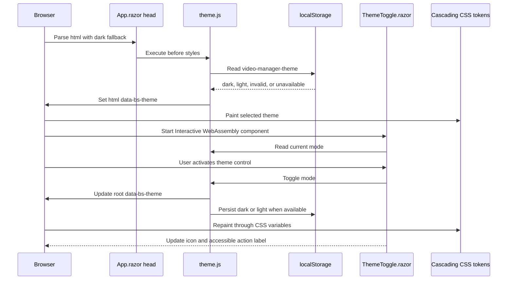

# Plan: Dark Mode

## Table of Contents

- [Summary](#summary)
- [Technical Approach](#technical-approach)
- [Component Breakdown](#component-breakdown)
- [Dependencies](#dependencies)
- [External / Vendor Documentation Evidence](#external--vendor-documentation-evidence)
- [Flow](#flow)
- [Risk Assessment](#risk-assessment)

## Summary

Extend the existing Bootstrap-based Blazor shell with a dark-default, two-mode theme system. A tiny early browser script owns root-theme application and `localStorage`; an Interactive WebAssembly `ThemeToggle` owns user interaction; global CSS variables supply semantic colors to the existing isolated component styles.

## Technical Approach

### Early root-theme bootstrap and persistence (FR2, FR4-FR6, FR9, FR11-FR12)

Set `data-bs-theme="dark"` on the root `<html>` in `WebApp/WebApp/Components/App.razor` as the markup-level fallback. Add `<meta name="color-scheme" content="dark light">` before styles and load a small classic script from `WebApp/WebApp.Client/wwwroot/js/theme.js` before the Bootstrap and application stylesheets. Loading it before CSS is intentional: an ES module imported after WebAssembly startup would apply a saved light preference too late and permit a dark-to-light flash.

The script owns a single key such as `video-manager-theme`. During initial execution it reads `localStorage`, accepts only `dark` or `light`, defaults to `dark`, and sets both `document.documentElement.dataset.bsTheme` and the document's effective `color-scheme`. Storage access is wrapped because browsers can deny it. The same narrow API exposes `getTheme` and `toggleTheme` for Blazor JS interop; toggling sets the DOM first and then attempts persistence, so a write failure never prevents the visible change. It performs no network or server calls.

Use Bootstrap's existing root `data-bs-theme` attribute as the single source of truth instead of maintaining a second theme attribute. This activates the vendored Bootstrap 5.3.3 dark variables for framework controls while custom application variables layer the green/gold palette on top. No vendored file is edited.

### Interactive header control (FR1, FR3, FR10, FR13)

Create `WebApp/WebApp.Client/Components/ThemeToggle.razor` as a focused Interactive WebAssembly component and place it in the existing `NavMenu.razor` header. Add the client-components namespace to the server `_Imports.razor` so the static server layout can host the client component without making the whole layout interactive.

On first interactive render, `ThemeToggle` reads the already-applied theme through `IJSRuntime`. Activating its button asks the script to toggle the root value and updates only the control's icon/accessibility label. Since the theme is a root DOM concern and CSS variables cascade, the library list, selected video, playback state, and C# crop state remain untouched. The button is always keyboard-native, has a visible focus state, and announces the next action rather than relying on a sun/moon icon alone.

Update `NavMenu.razor.css` with a compact right-side action group containing the existing local-only status and the toggle. At handheld widths, the secondary privacy copy may remain hidden as it is today, but the theme control remains visible and meets an approximately 44-by-44-pixel target.

### Semantic application color tokens (FR7-FR9, FR13)

Refactor hard-coded application colors in `WebApp/WebApp/wwwroot/app.css` into semantic CSS custom properties for canvas, header, surface, elevated surface, stage, border, text, muted text, primary/accent, selection, error, shadow, and focus colors. Define dark values as the root/default set and light overrides under `[data-bs-theme="light"]`; explicitly declare the matching `color-scheme` in each mode.

Update the existing isolated CSS files rather than changing component structure or introducing a new styling system:

- `MainLayout.razor.css` consumes canvas/header/error tokens.
- `NavMenu.razor.css` consumes header, brand, muted, accent, and toggle tokens.
- `Home.razor.css` consumes heading, eyebrow, and muted text tokens.
- `VideoLibrary.razor.css` consumes surface, border, status, row hover/selection, and error tokens.
- `VerticalVideoEditor.razor.css` consumes surface, stage, text, border, shadow, and playback-error tokens while retaining the intentionally near-black video viewport.

Bootstrap button custom properties in `app.css` receive green/gold-aware values for both modes, including the existing primary Scan button and the outline Reset button. Focus, selected, scanning, empty, playback-error, and scan-error states remain distinguishable without color alone. Theme changes use no mandatory animation; any optional color transition is restricted by `prefers-reduced-motion: no-preference` and must not animate layout.

### Testability and existing boundaries (FR1-FR13)

The server, filesystem service, endpoints, video DTOs, and framing model remain unchanged. Theme persistence is necessarily behind a focused browser script because `localStorage`, the root document attribute, and pre-paint execution are browser responsibilities. The Blazor component depends only on that narrow JS API and owns presentation state.

Add an xUnit integration test following the existing `WebApplicationFactory<Program>` pattern to request `/` with temporary `VideoLibrary:Path` configuration and assert that the server HTML contains the dark fallback, color-scheme metadata, and early theme script in the correct order before styles. Existing xUnit tests continue through `make test`. Actual CSS paint, storage persistence, keyboard interaction, no-flash behavior, responsive layout, and native controls remain manual browser checks because the repository intentionally has no browser automation framework.

## Component Breakdown

**Existing files to modify:**

- `WebApp/WebApp/Components/App.razor` — declare the dark root fallback, color-scheme metadata, and pre-style bootstrap script.
- `WebApp/WebApp/Components/_Imports.razor` — import the client component namespace for the header toggle.
- `WebApp/WebApp/Components/Layout/NavMenu.razor` — host the Interactive WebAssembly theme control beside the local-only status.
- `WebApp/WebApp/Components/Layout/NavMenu.razor.css` — style the header action group and responsive toggle placement.
- `WebApp/WebApp/Components/Layout/MainLayout.razor.css` — replace shell/error hard-coded colors with shared theme tokens.
- `WebApp/WebApp/wwwroot/app.css` — define dark-default/light semantic tokens, browser color schemes, and mode-aware Bootstrap button/focus styling.
- `WebApp/WebApp.Client/Pages/Home.razor.css` — theme the workspace heading and supporting copy through tokens.
- `WebApp/WebApp.Client/Components/VideoLibrary.razor.css` — theme every library state and selection style through tokens.
- `WebApp/WebApp.Client/Components/VerticalVideoEditor.razor.css` — theme editor surfaces, stage, instructions, and playback errors through tokens.

**New files to create:**

- `WebApp/WebApp.Client/Components/ThemeToggle.razor` — accessible Interactive WebAssembly light/dark control.
- `WebApp/WebApp.Client/Components/ThemeToggle.razor.css` — isolated sizing, icon, hover, and focus presentation.
- `WebApp/WebApp.Client/wwwroot/js/theme.js` — early dark fallback, root attribute application, safe `localStorage`, and narrow toggle interop.
- `WebApp.Tests/Client/ThemeBootstrapTests.cs` — server-HTML integration coverage for dark fallback and pre-style script ordering.

## Dependencies

- Existing vendored Bootstrap 5.3.3 color-mode variables.
- Existing .NET 10 Blazor Web App and Interactive WebAssembly runtime.
- Browser DOM and Web Storage APIs; denied storage is a supported fallback state rather than a startup dependency.
- Existing Docker Compose and `make test` workflow.
- No new NuGet, JavaScript, CSS, or infrastructure dependency.

## External / Vendor Documentation Evidence

- [ASP.NET Core Blazor JavaScript location](https://learn.microsoft.com/aspnet/core/blazor/javascript-interoperability/location-of-javascript?view=aspnetcore-10.0) documents external JavaScript files, interactive render-mode requirements, module loading, and disposal expectations. This supports keeping browser-only theme behavior behind a focused client interop boundary while deliberately using an early classic bootstrap script for pre-paint application.
- [Call JavaScript from .NET in ASP.NET Core Blazor](https://learn.microsoft.com/aspnet/core/blazor/javascript-interoperability/call-javascript-from-dotnet?view=aspnetcore-10.0) documents `IJSRuntime`, including client-side interop behavior and disposal considerations. This supports the Interactive WebAssembly toggle calling the narrow theme API.
- [Bootstrap 5.3 color modes](https://getbootstrap.com/docs/5.3/customize/color-modes/) documents global light/dark modes through `data-bs-theme` on `<html>`, root CSS-variable overrides, custom toggles, and placing theme JavaScript near the top of the page to reduce flicker. This directly supports the root attribute and early script design.
- [MDN `color-scheme`](https://developer.mozilla.org/en-US/docs/Web/CSS/Reference/Properties/color-scheme) and [color-scheme metadata](https://developer.mozilla.org/en-US/docs/Web/HTML/Reference/Elements/meta/name/color-scheme) document how browser-provided controls and page chrome follow declared schemes and recommend metadata before CSS to reduce unwanted flashes. This supports declaring `dark light` in the head and setting the active CSS property.
- [MDN Web Storage API](https://developer.mozilla.org/en-US/docs/Web/API/Web_Storage_API) documents origin-scoped `localStorage` persistence. This supports keeping the two-value preference entirely in the browser.

## Flow

## Risk Assessment

| Risk | Evidence | Mitigation |
| --- | --- | --- |
| Saved light mode flashes dark during reload | The header toggle runs in WebAssembly and therefore starts after initial HTML/CSS paint. | Apply storage synchronously with a small head script before styles; keep dark on `<html>` as the no-script/error fallback. |
| Custom surfaces remain light or lose contrast | Current isolated CSS contains many literal light colors across five files. | Centralize semantic tokens, inventory every literal color, and manually validate every existing UI state in both modes. |
| Bootstrap and custom styles disagree | The app uses vendored Bootstrap 5.3.3 plus custom isolated CSS. | Use Bootstrap's root `data-bs-theme` as the single mode value and layer application tokens without editing vendor output. |
| Storage denial breaks startup or toggling | Browsers may throw on storage access in restricted contexts. | Wrap reads/writes, accept only two known values, default dark, and apply the DOM change even when persistence fails. |
| Theme switching resets editor work | Re-rendering the workspace or navigating would discard current client state. | Change only the root attribute and toggle presentation; do not pass theme state through `Home`, library, or editor parameters. |
| Toggle disappears or crowds the handheld header | The current header hides only the privacy note below 32rem and has no action group. | Preserve the toggle at all widths, allow secondary copy to hide, and validate narrow widths and long accessibility text. |
| Native media controls conflict with the page palette | Native video controls are browser-rendered rather than controlled by isolated CSS. | Set the matching `color-scheme` at the document root and manually verify controls in supported browsers. |
