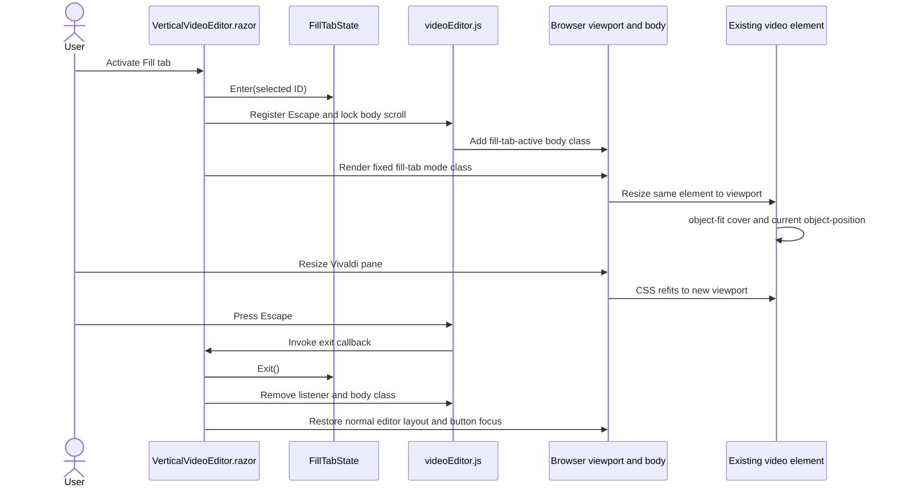

# Plan: Fill-Tab Video Mode

## Table of Contents

- [Summary](#summary)
- [Technical Approach](#technical-approach)
- [Component Breakdown](#component-breakdown)
- [Dependencies](#dependencies)
- [External / Vendor Documentation Evidence](#external--vendor-documentation-evidence)
- [Flow](#flow)
- [Risk Assessment](#risk-assessment)

## Summary

Extend the existing Interactive WebAssembly `VerticalVideoEditor` with an application-owned Fill tab state. A fixed, isolated-CSS overlay will fill the current page viewport while the existing `videoEditor.js` module provides scoped Escape handling and document-scroll cleanup; the browser Fullscreen API and native control behavior remain untouched.

## Technical Approach

### Component-owned presentation state (FR1, FR5-FR6, FR9-FR12)

Add a focused `FillTabState` client model with explicit `Enter`, `Exit`, and selection-reset behavior. `VerticalVideoEditor.razor` remains the high-level owner: it groups the crop position and drag instruction into one bottom copy block, displays an icon-only Fill tab button vertically centered beside that block only in the normal selected-video state, applies a mode class to the existing editor markup, and handles the state transition returned from Escape. A small state object keeps transition rules independently unit-testable without adding a Razor test framework.

Do not conditionally replace or re-key the `<video>` when the mode changes. Only the containing element's class and non-video chrome visibility change. This preserves the live media element and therefore its current time, play/pause state, volume/mute state, native controls, and existing `VideoFrameState`. Selection changes exit Fill tab before the new keyed video is rendered, preventing a stale full-pane presentation.

The external button uses a dependency-free inline arrows-fullscreen SVG with `bi bi-arrows-fullscreen` classes because Bootstrap Icons are not installed. Its accessible name and hover/focus tooltip identify Fill tab and explain that Escape exits. It remains distinct from the browser-rendered native fullscreen button. The native `controls` attribute stays in place, and the feature neither invokes the Fullscreen API nor modifies the browser's control implementation.

### Viewport overlay and cover behavior (FR2-FR4, FR7-FR8, FR13)

Update `VerticalVideoEditor.razor.css` so the active editor becomes a fixed overlay with `inset: 0`, an explicit stacking context above the sticky application header, square corners, and a full-width/full-height stage and video viewport. Remove the normal `9 / 16` aspect-ratio and maximum-width constraint only for the active mode. Keep `video { width: 100%; height: 100%; object-fit: cover; }`; this fills any pane while preserving source proportions and clipping the overflow. Keep the existing computed `object-position` so the current crop remains visible.

Hide the editor header, position readout, drag hint, and other normal workspace chrome while active, leaving the video and its native controls to occupy the viewport. Existing drag handlers continue to work because `measureAndCapture` reads live geometry at the start of every drag; no resize callback or duplicated crop formula is needed. Fixed viewport sizing responds through CSS when a Vivaldi pane or browser window changes dimensions.

Add one global `body.fill-tab-active` overflow rule to `WebApp/WebApp/wwwroot/app.css`, because a component-isolated stylesheet cannot target the document body. The JavaScript boundary adds that class on entry and removes it on all exits, preventing background scroll while the fixed overlay is active.

### Escape and DOM lifecycle bridge (FR6, FR8-FR10, FR12)

Extend the existing isolated `WebApp/WebApp.Client/wwwroot/js/videoEditor.js` module rather than creating a second global script. On entry, register one `window` `keydown` listener associated with this component instance. When `KeyboardEvent.key` is `Escape`, prevent duplicate handling, call a `[JSInvokable]` instance method through a `DotNetObjectReference`, and remove the listener and body class as part of the exit operation. On normal exit, selection change, and component disposal, invoke the same idempotent cleanup path and dispose both JavaScript and .NET object references.

After the C# state returns to normal, restore focus to the Fill tab button using its `ElementReference`. This makes the Escape transition understandable to keyboard and assistive-technology users even though the user explicitly chose not to expose an on-screen exit button inside the mode. A failed or interrupted interop cleanup must not leave the state model active; disposal and selection changes still clear C# state, while JavaScript cleanup remains idempotent.

No server endpoint, DTO, persistence mechanism, stream behavior, or dependency changes. The existing Interactive WebAssembly boundary keeps every transition local and avoids high-frequency resize interop.

### Validation strategy (FR1-FR13)

Add small xUnit tests for `FillTabState` entry, Escape/explicit exit, idempotent exit, and selection reset. Do not introduce bUnit, Playwright, Selenium, or another package. Layout, Vivaldi split-pane containment, native controls, media-state continuity, Escape focus restoration, themes, and resize behavior require real browser rendering, so the authoritative acceptance pass is the documented manual QA flow in Vivaldi. Run the complete suite through `make test` to guard existing framing, endpoint, service, and theme behavior.

## Component Breakdown

**Existing files to modify:**

- `WebApp/WebApp.Client/Components/VerticalVideoEditor.razor` - add the bottom crop-helper Fill tab icon and tooltip, mode class/state coordination, Escape callback, focus restoration, and lifecycle cleanup while retaining one mounted video element.
- `WebApp/WebApp.Client/Components/VerticalVideoEditor.razor.css` - style the icon and hover/focus tooltip, plus the fixed full-viewport layout, full-area cover behavior, mode-specific chrome visibility, and overlay stacking.
- `WebApp/WebApp.Client/wwwroot/js/videoEditor.js` - add idempotent Escape-listener registration/removal and document body-class cleanup alongside the existing geometry bridge.
- `WebApp/WebApp/wwwroot/app.css` - lock document scrolling while the JavaScript-managed `fill-tab-active` body class is present.

**New files to create:**

- `WebApp/WebApp.Client/Models/FillTabState.cs` - narrow client-only state and transition rules for the selected video's presentation mode.
- `WebApp.Tests/Client/FillTabStateTests.cs` - simple xUnit coverage for entry, exit, repeat exit, and selection-change behavior.

## Dependencies

- The existing .NET 10 Interactive WebAssembly runtime and `IJSRuntime`/JavaScript-module support.
- Standard browser CSS positioning, media sizing, keyboard events, and native HTML video controls.
- A selected, browser-decodable video for the complete manual playback test.
- Vivaldi's tab tiling/split-screen feature for authoritative pane-boundary QA.
- No new runtime, test, JavaScript, or infrastructure dependency.

## External / Vendor Documentation Evidence

- [Call JavaScript functions from .NET in ASP.NET Core Blazor](https://learn.microsoft.com/aspnet/core/blazor/javascript-interoperability/call-javascript-from-dotnet?view=aspnetcore-10.0) documents `IJSRuntime`, isolated module/object-reference disposal, and the requirement to use rendered `ElementReference` values only after rendering. This supports extending the existing module, retaining focused ownership, restoring focus after render, and disposing listener references.
- [ASP.NET Core Blazor CSS isolation](https://learn.microsoft.com/aspnet/core/blazor/components/css-isolation?view=aspnetcore-10.0) documents component-scoped `.razor.css` authoring. This supports keeping overlay presentation in `VerticalVideoEditor.razor.css` while reserving only the document-body scroll rule for global CSS.
- [MDN `position`](https://developer.mozilla.org/en-US/docs/Web/CSS/Reference/Properties/position) documents that a fixed element is positioned relative to the viewport and creates a stacking context. This supports `position: fixed` plus `inset: 0` for tab-content coverage without browser fullscreen.
- [MDN `object-fit`](https://developer.mozilla.org/en-US/docs/Web/CSS/Reference/Properties/object-fit) documents that `cover` preserves intrinsic aspect ratio, fills the element's content box, and clips mismatched overflow. This directly supports the required all-aspect-ratio crop behavior.
- [MDN `KeyboardEvent.key`](https://developer.mozilla.org/en-US/docs/Web/API/KeyboardEvent/key) documents the standardized `Escape` value and window-level `keydown` handling. This supports the single Escape exit listener.
- [MDN window `resize`](https://developer.mozilla.org/en-US/docs/Web/API/Window/resize_event) confirms that the document view changes when the browser window is resized. The design intentionally relies on responsive fixed CSS rather than forwarding each resize through Blazor or JavaScript.

## Flow

## Risk Assessment

| Risk | Evidence | Mitigation |
| --- | --- | --- |
| Overlay covers only the editor's layout ancestor instead of the viewport | Fixed positioning can use a transformed ancestor as its containing block; the current ancestors do not set transforms, but future CSS could. | Keep the fixed mode on the editor's top-level element, document the `inset: 0` assumption, and verify actual containment in Vivaldi split panes. |
| Escape listener or body scroll lock survives exit | The feature adds browser-global state beyond Blazor-rendered markup. | Use one idempotent JS cleanup function from Escape, selection change, normal teardown, and component disposal; unit-test the C# state's idempotent exit separately. |
| Conditional rendering reloads or resets media | The current video is keyed by selected ID, and replacing it would lose media state. | Keep the selected ID and video node unchanged; toggle only wrapper classes and normal-chrome visibility. |
| Source framing feels different after entering a differently shaped viewport | `object-fit: cover` changes which axis overflows when the pane aspect ratio changes. | Preserve normalized `object-position`, measure fresh geometry on every new drag, and manually validate portrait, landscape, and square sources. |
| Native fullscreen is confused with Fill tab | Native browser controls remain visible and their fullscreen button still means physical-screen fullscreen. | Place a separately labelled Fill tab command outside native controls and state Escape behavior in accessible help; do not imply that native fullscreen changed. |
| Escape is temporarily consumed by native fullscreen | If the user deliberately enters native fullscreen while Fill tab is active, the browser may consume the first Escape to leave native fullscreen. | Treat native fullscreen as independent/out of scope; manual QA confirms a subsequent Escape exits Fill tab and no listener remains afterward. |
| No visible in-mode exit control creates an accessibility discoverability risk | Discovery explicitly chose Escape as the only active-mode exit and makes the entry button inaccessible in mode. | Communicate Escape before entry, handle it globally, restore trigger focus, and ensure cleanup on selection/disposal; record the choice rather than silently adding a control. |
| Automated tests cannot prove viewport containment | The repository has xUnit integration tests but no rendered-browser harness. | Keep state tests small and make human Vivaldi split-pane QA the authoritative acceptance check, without adding a browser-test dependency. |
