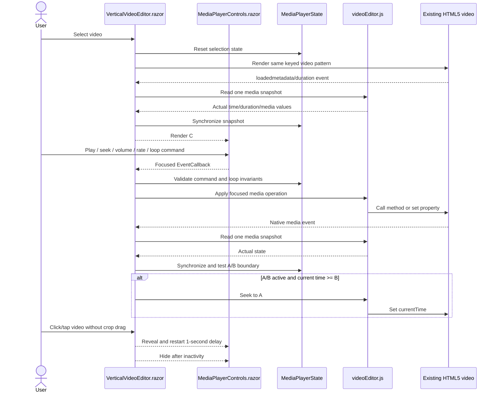

# Plan: Custom Media Player Controls

## Table of Contents

- [Summary](#summary)
- [Technical Approach](#technical-approach)
- [Component Breakdown](#component-breakdown)
- [Dependencies](#dependencies)
- [External / Vendor Documentation Evidence](#external--vendor-documentation-evidence)
- [Flow](#flow)
- [Risk Assessment](#risk-assessment)

## Summary

Extend the existing client-owned `VerticalVideoEditor` with a reusable Blazor control overlay and a focused C# state model while retaining its single keyed video element, crop handlers, Fill-tab state, isolated JavaScript module, and server API. Native media events remain the source of truth for browser state; JavaScript only performs operations unavailable through Blazor's DOM abstraction.

## Technical Approach

### C# state and component ownership (FR1-FR5, FR13-FR23, FR32)

Add `MediaPlayerState` under the existing client `Models` boundary beside `VideoFrameState` and `FillTabState`. It owns normalized media values, supported rate options, formatted-time helpers, selection reset rules, loop-mode exclusivity, marker replacement/clearing, and the strict A/B invariant. It does not hold an `ElementReference`, call JavaScript, or know about video paths. `VerticalVideoEditor.razor` owns one state instance associated with its existing selected-video instance and resets selection-specific fields whenever `Selected.Id` changes. The current muted behavior is preserved; volume, mute, and playback rate remain transient editor-session preferences only.

Add `MediaPlayerControls.razor` as a presentational child rendered inside the existing `.video-viewport`. It receives the current `MediaPlayerState` values and focused `EventCallback` commands for play/pause, seek, volume, mute, rate, standard loop, A/B marker changes, A/B activation, and clearing. It does not access the video element or application/library state. Rate choices come from the C# model rather than conditionals in Razor, making later additions local to one collection.

Standard and A/B loop are mutually exclusive in C#. Enabling standard loop disables A/B mode but may retain valid markers. Enabling A/B disables standard loop and commands the browser adapter to set native loop false. Setting A at or beyond B clears B so the model can never retain an inverted range. Setting B at or before A leaves any prior valid B unchanged and exposes an accessible validation message. Clearing A/B removes both markers and disables A/B mode. Selection changes clear both loop modes and markers.

### Existing media element and browser adapter (FR1, FR6-FR16, FR20, FR30-FR31)

Remove only the native `controls` attribute from the existing keyed `<video>` in `VerticalVideoEditor.razor`; retain its source, preload mode, muted initialization, object-position style, media error handling, pointer handlers, and key. Extend the already isolated `WebApp/WebApp.Client/wwwroot/js/videoEditor.js` module with stateless, element-parameterized functions to play, pause, seek, read a compact media snapshot, and set volume, muted, playback rate, and native loop. This continues the repository's existing `IJSRuntime`/module pattern and avoids global functions or a second playback engine.

Wire supported native media events on the Razor `<video>`—including metadata/duration, play, pause, time, volume, rate, seeking/seeked, and ended transitions—to one C# synchronization method. The handler asks the adapter for one compact snapshot and applies it to `MediaPlayerState`. Control commands update the media element but treat the next actual media snapshot as authoritative, preventing UI drift when Vivaldi clamps or rejects a requested value. A rejected `play()` promise or other command becomes a non-blocking player error and never logs a host path.

Use native `timeupdate` cadence rather than `requestAnimationFrame`. On each bounded progress update, C# first synchronizes current time and then checks the A/B rule. If active playback is at or beyond B, C# issues one seek to A. Standard repeat remains the browser's native loop behavior. Timeline dragging updates a local C# preview, while the media seek is committed at the bounded change/pointer-completion boundary to avoid interop calls for every visual movement. Volume input may be coalesced similarly if Vivaldi produces excessive events.

Dispose the existing module through the component's current `IAsyncDisposable` path. Media bridge operations are stateless and do not add global listeners; existing Fill-tab listener/body-class cleanup remains unchanged.

### Overlay visibility and interaction separation (FR2, FR24-FR29)

Make `.video-viewport` the positioned container and render the new child as a bottom overlay above the video. `VerticalVideoEditor` owns the visible/hidden value and a cancellable one-second inactivity delay in C#. Controls start visible for a new selection. Every relevant click/tap or control interaction cancels and restarts the delay. The delay does not complete while a timeline or volume pointer interaction is active, and component disposal/selection changes cancel stale work.

Reuse the existing pointer session to distinguish a click/tap from a crop drag using a small movement threshold. A non-drag activation reveals controls; a crop drag continues to update `VideoFrameState` without toggling media controls. Control roots stop Blazor pointer/click propagation, and hidden controls use opacity/visibility plus `pointer-events: none`, so their hit targets cannot intercept crop gestures. This preserves pointer capture and `touch-action: none` on the actual video.

Keep the controls inside `.video-viewport`, not `.editor-helper`, because the Fill-tab stylesheet deliberately hides helper chrome. As a result, the same overlay remains present in the full-pane viewport without changing `FillTabState`, Escape handling, focus restoration, or the video node. Existing playback errors remain recoverable outside the overlay and command-specific feedback is placed inside the control layer where it stays visible in Fill-tab mode.

`MediaPlayerControls.razor.css` owns the bar, gradient/scrim, time readout, timeline and A/B indicators, control sizing, selected/pressed states, responsive wrapping, and theme-aware contrast. Bootstrap button/form conventions and existing CSS variables are reused where suitable. Controls use native semantic elements and accessible labels/states; application-wide playback shortcuts are intentionally deferred.

### Validation strategy (FR1-FR32)

Per discovery, do not add a browser automation framework or new automated player-state tests in this stage. Run the existing xUnit suite through `make test` as the regression gate, and perform the complete media behavior pass manually in Vivaldi using actual local videos. `Validation.md` maps every FR to an observable criterion and records automated media coverage as deferred rather than implying that xUnit can prove HTML media behavior.

## Component Breakdown

**Existing files to modify:**

- `WebApp/WebApp.Client/Components/VerticalVideoEditor.razor` — retain the existing video, remove native controls, coordinate `MediaPlayerState`, render the custom control component, synchronize native media events, separate reveal clicks from crop drags, run the one-second visibility timer, and extend lifecycle cleanup.
- `WebApp/WebApp.Client/Components/VerticalVideoEditor.razor.css` — make the viewport an overlay container, preserve the crop surface, and ensure the child control layer remains available in normal and Fill-tab modes.
- `WebApp/WebApp.Client/wwwroot/js/videoEditor.js` — add focused stateless HTML media operations and snapshot reading alongside the existing geometry, mute initialization, and Fill-tab bridge.

**New files to create:**

- `WebApp/WebApp.Client/Components/MediaPlayerControls.razor` — reusable Blazor markup and focused callbacks for playback, timeline, volume, rate, and loop controls.
- `WebApp/WebApp.Client/Components/MediaPlayerControls.razor.css` — isolated overlay, timeline/marker, responsive, high-contrast, active, and disabled styles.
- `WebApp/WebApp.Client/Models/MediaPlayerState.cs` — C# player state, supported-rate data, selection/reset transitions, formatting, and standard/A/B loop invariants.

No server, endpoint, DTO, environment, Docker, database, or generated Bootstrap file changes are required.

## Dependencies

- Existing .NET 10 Interactive WebAssembly runtime, `IJSRuntime`, module import, and `ElementReference` support.
- Existing HTML5 video element and range-enabled `/api/videos/{id}/stream` endpoint.
- Existing Bootstrap assets, application theme tokens, `VideoFrameState`, `FillTabState`, and `videoEditor.js` lifecycle.
- Vivaldi with a browser-decodable local video for acceptance validation.
- No new NuGet, npm, media-player, media-processing, browser-automation, or infrastructure dependency.

## External / Vendor Documentation Evidence

- [ASP.NET Core Blazor event handling](https://learn.microsoft.com/aspnet/core/blazor/components/event-handling?view=aspnetcore-10.0) documents `@on{event}` delegate handlers, task-returning async handlers, pointer event arguments, automatic rerendering after handled events, and propagation directives. This supports native Blazor buttons/inputs and media/pointer event coordination, with focused JS only where media element values aren't carried by Blazor event arguments.
- [Call JavaScript functions from .NET in ASP.NET Core Blazor](https://learn.microsoft.com/aspnet/core/blazor/javascript-interoperability/call-javascript-from-dotnet?view=aspnetcore-10.0) documents module imports, rendered `ElementReference` use, and deterministic disposal of `IJSObjectReference`/`DotNetObjectReference`. This supports extending the current isolated module and retaining its existing lifecycle ownership in `VerticalVideoEditor`.
- [ASP.NET Core Blazor JavaScript interop performance best practices](https://learn.microsoft.com/aspnet/core/blazor/performance/javascript-interoperability?view=aspnetcore-10.0) recommends reducing call granularity and notes client-side interop options. The design batches reads into one media snapshot, uses native `timeupdate` instead of animation-frame polling, and commits timeline seeks at a bounded interaction boundary.
- [ASP.NET Core Blazor CSS isolation](https://learn.microsoft.com/aspnet/core/blazor/components/css-isolation?view=aspnetcore-10.0) documents colocated `.razor.css` files and build-time selector scoping. This supports a dedicated `MediaPlayerControls.razor.css` so player styles do not leak into the library, layout, theme toggle, or editor helper.
- [`JSImport`/`JSExport` interop in .NET WebAssembly](https://learn.microsoft.com/aspnet/core/client-side/dotnet-interop/?view=aspnetcore-10.0) documents a performant client-side alternative. The plan intentionally retains the repository's established isolated `IJSObjectReference` module rather than introducing a second interop mechanism; the feature's bounded event cadence doesn't justify that architectural split.

## Flow

## Risk Assessment

| Risk | Evidence | Mitigation |
| --- | --- | --- |
| Control taps start crop dragging | The current pointer handlers are attached directly to the full video and use pointer capture. | Overlay controls stop pointer/click propagation; hidden controls have no hit testing; the existing drag session gains a movement threshold so only a non-drag click reveals controls. |
| UI state diverges from Vivaldi's actual media state | Browser media methods can reject and properties can be clamped or changed by native behavior. | Treat native media events plus a compact browser snapshot as authoritative and expose command failure without optimistic permanent state. |
| A/B loop overshoots B | `timeupdate` is periodic rather than frame-accurate. | Seek on the first native progress event at or beyond B, document frame-accurate/in-out editing as future work, and manually test short and long ranges in Vivaldi. |
| Standard loop and A/B loop fight each other | Native loop can restart at zero before C# applies A/B behavior. | Enforce exclusivity in `MediaPlayerState` and explicitly set native loop false before activating A/B. |
| One-second hiding interrupts control use | Sliders may remain active longer than the inactivity interval. | Cancel hiding during an active control pointer interaction and restart the full interval after completion or another relevant interaction. |
| Reveal click changes the crop | Click and drag share the video surface. | Classify movement in the existing pointer session; a drag changes framing while a below-threshold activation reveals controls without changing frame state. |
| Fill-tab CSS hides the new layer | Existing Fill-tab rules hide `.editor-helper`. | Place controls inside `.video-viewport`, give them their own stacking order, and verify the existing video node and Escape lifecycle remain unchanged. |
| Media event traffic causes excess interop/renders | Progress can produce recurring events. | Use native `timeupdate`, one snapshot per relevant event, no animation-frame polling, bounded slider commits, and no interop solely on render. |
| Automated coverage doesn't exercise media behavior | Discovery explicitly deferred new xUnit/browser test work and the repo has no rendered-browser harness. | Make Vivaldi manual acceptance authoritative, keep `make test` as the regression gate, and record automated player-state/browser coverage as deferred. |
| Overlay contrast or density fails on portrait/touch layouts | The viewport is narrow in 9:16 mode and video luminance varies. | Use an opaque/gradient scrim, theme tokens, responsive wrapping, sufficiently sized touch targets, and manual checks over bright and dark content. |
