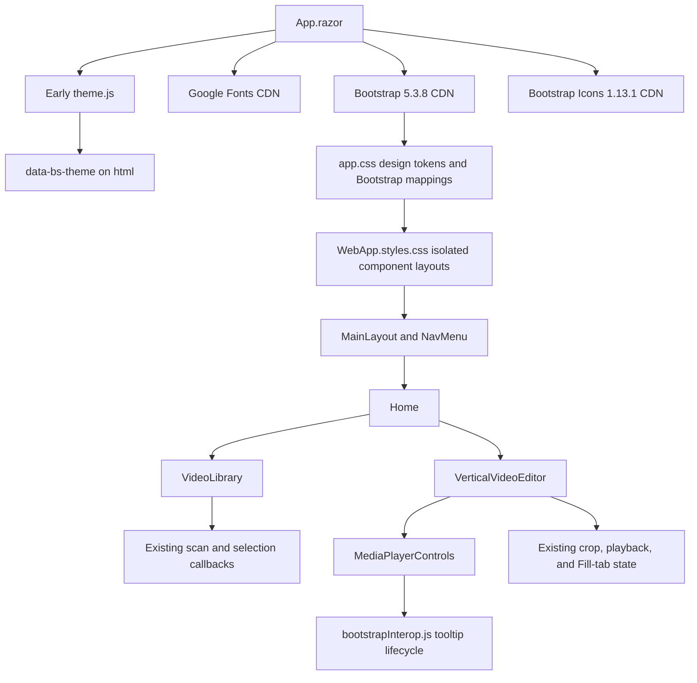

# Plan: Perene Tech Design System Refactor

## Table of Contents

- [Summary](#summary)
- [Technical Approach](#technical-approach)
- [Component Breakdown](#component-breakdown)
- [Dependencies](#dependencies)
- [External / Vendor Documentation Evidence](#external--vendor-documentation-evidence)
- [Flow](#flow)
- [Risk Assessment](#risk-assessment)

## Summary

Refactor the complete current Blazor UI and video-player menu into “Perene Tech Videos” by translating the colocated `design-guide-en.html` into global theme/Bootstrap tokens and applying Bootstrap-native markup plus CSS-isolated layout styles to the existing components. All behavior, state ownership, API/privacy boundaries, and Docker workflows remain unchanged.

## Technical Approach

### Root assets, product identity, and theme foundation (FR1-FR5, FR12, FR18)

Update `WebApp/WebApp/Components/App.razor` so the early `js/theme.js` call remains before styles, then add Google Fonts preconnect/stylesheet links for Zilla Slab and Montserrat, Bootstrap 5.3.8 CSS, and Bootstrap Icons 1.13.1. Replace the runtime reference to vendored Bootstrap 5.3.3 with the versioned jsDelivr URL and load the matching Bootstrap 5.3.8 bundle after the Blazor script. Use the integrity and `crossorigin="anonymous"` values published in Bootstrap's 5.3 quick-start/color-mode example for Bootstrap CSS/JS. The existing vendored files remain untouched and unreferenced.

Retain `<html data-bs-theme="dark">`, the color-scheme metadata, and early theme initialization so the current no-flash behavior and safe dark fallback survive. Update `NavMenu.razor`, `Home.razor`, and page-title content to “Perene Tech Videos”; do not rename assemblies, namespaces, routes, API endpoints, Docker projects, or logical service names.

CDNs are an explicit runtime tradeoff approved in discovery. Use the guide's fallback stacks (`serif` for Zilla Slab and Helvetica/Arial/sans-serif for Montserrat) so content remains legible if fonts fail. Semantic HTML and native form/button behavior must not depend on CDN JavaScript. CDN requests are static and must never be constructed from the selected video, opaque ID, or library data.

### Shared design-system contract (FR2-F3, FR6-F7, FR11, FR14, FR16)

Replace the current `--color-*` foundation in `WebApp/WebApp/wwwroot/app.css` with the exact guide tokens for dark and Kindle-paper light modes: application/surface/elevated backgrounds, borders, text tiers, shadows, semantic alert tokens, brand-on-background colors, hover/ring tokens, and green/gold/blue tints. Map Bootstrap's body, border, background, emphasis, link, primary, danger, info, and validation variables for each color mode.

Define Zilla Slab as `--font-family-title` and Montserrat as `--font-family-base`/`--font-family-meta`; map Bootstrap's body font variable and apply title typography to headings/product marks while leaving body, controls, labels, metadata, and time readouts on Montserrat. Encode the guide's type scale, line heights, weight intent, and tabular numeric metadata behavior without duplicating font declarations in every component.

Theme real Bootstrap variants through their component-level CSS properties. `btn-primary` is Ochre Gold 500 with fixed dark text, and `btn-secondary` is Signal Green 500 with white text per the user's resolution of the guide conflict. Alerts, cards, list groups, forms, badges, progress, icon buttons, and player buttons receive shared token mappings. Keep at most one page-level `btn-primary`; semantic variants are not used for rank alone.

Document this source-of-truth hierarchy in `AGENTS.md`: `Specs/20260827194328-perene-tech-design-system-refactor/design-guide-en.html` defines the detailed system, `app.css` implements shared tokens/Bootstrap mappings, and `.razor.css` owns only component-specific composition. Future UI must use Bootstrap 5 and Bootstrap Icons, Zilla Slab/Montserrat, accessible state patterns, and must not hand-edit vendored Bootstrap.

### Existing layout and application components (FR6-F9, FR12-F15)

Keep `MainLayout.razor` as the application shell and `NavMenu.razor` as the header boundary. Refactor their markup/styles with Bootstrap flex/container/spacing utilities where appropriate, while retaining sticky positioning, the privacy label, theme control, main landmark, and responsive behavior. Apply the guide's surface/border hierarchy and Zilla Slab product mark without copying the style-guide sidebar, which is demonstration content rather than the application layout.

Keep `Home.razor` as the coordinator for scan/selection state and preserve all HTTP/error logic. Its markup continues to render the introduction, `VideoLibrary`, and `VerticalVideoEditor`; only product copy/classes and CSS layout/type hierarchy change. The wide two-column workspace and narrow stacked order remain.

Refactor `VideoLibrary.razor` into Bootstrap card/list-group/alert/spinner patterns. Preserve every existing conditional state, callback, live-region role, item copy, selected ID, and size formatting. Rows remain semantic buttons, now using list-group action/active mechanics and Bootstrap Icons where an icon improves recognition. Selection continues to include visible text or programmatic state so it never depends on color.

Refactor `VerticalVideoEditor.razor` and its isolated CSS as a Bootstrap card with a themed header, alert treatment for playback failure, and unchanged preview viewport. Preserve the keyed video, object-position, crop gestures, Reset callback, empty state, playback state, and Fill-tab selectors. Normal-mode chrome may change visually but Fill-tab continues to hide the same non-player regions and must not replace the video node.

Refactor `ThemeToggle.razor` into the guide's Bootstrap form-switch with a Bootstrap moon/sun icon, accessible action labeling, and unchanged JS calls/state normalization. The component continues to read and toggle the existing browser-local preference rather than moving theme state into Bootstrap or the server.

Update `Error.razor` and `NotFound.razor` only as needed to apply the shared type, alert/link, and product-name conventions so the “entire UI” requirement includes framework error routes.

### Complete video-player menu and Bootstrap interop (FR5-F6, FR9-F11, FR13-F15)

Refactor the entire `MediaPlayerControls.razor` menu while preserving its parameters, callbacks, C# player state, range/select bindings, auto-hide policy, and propagation boundaries. Organize the timeline/A/B markers and elapsed/total time as the progress region; group Play/Pause, Mute/Unmute, volume, speed, whole-video Loop, and Fill tab as the primary toolbar; and group Set A, Set B, A/B Loop, and Clear as the loop-range toolbar. Both rows must wrap deliberately at narrow widths and remain available over the video in normal 9:16 and Fill-tab modes.

Replace Unicode play/audio glyphs and the hand-authored Fill-tab SVG with semantically matched `.bi` icons. Use Bootstrap `btn-toolbar`, `btn-group`, button, range/form-select, progress, and feedback conventions while retaining A/B marker placement, time output, validation copy, disabled-state rules, auto-hide/reveal behavior, and pointer isolation from crop dragging. Icon-only controls receive `btn-icon`, a 40×40 minimum target, `aria-label`, `aria-pressed` when applicable, and `data-bs-toggle="tooltip"`/`data-bs-title`; text-bearing marker controls remain readable without relying on glyphs alone.

Add `WebApp/WebApp.Client/wwwroot/js/bootstrapInterop.js` as a focused module that initializes Bootstrap tooltips inside a rendered control root and disposes them before rerender/removal. `MediaPlayerControls.razor` owns its module/reference lifecycle through existing Blazor interop conventions. The module may call the CDN-provided Bootstrap Tooltip API but must not retain playback, crop, selection, theme, or visibility state. If the Bootstrap bundle is unavailable, buttons remain semantic and their accessible labels/native titles remain sufficient to operate them.

Keep overlay-specific contrast, gradients, marker placement, wrapping, and pointer isolation in `MediaPlayerControls.razor.css`. Shared button/icon/progress/form state colors live in `app.css`. Retain the existing reduced-motion rule and verify that Bootstrap transitions do not reintroduce motion when the preference requests reduction.

### Validation and documentation (FR13-F18)

Extend `WebApp.Tests/Client/ThemeBootstrapTests.cs` rather than adding a browser framework. Server-rendered root-document assertions cover product naming, early theme execution, CDN versions/order, and absence of the old runtime Bootstrap URL. Existing xUnit logic/service/endpoint coverage remains the regression gate; rendered appearance, tooltip behavior, responsive flow, keyboard navigation, screen-reader semantics, contrast, and CDN-failure behavior are manual because the repository has no rendered-browser harness.

Update `AGENTS.md` as repository documentation when this spec is created and again if implementation changes the documented file map. Its design-system section binds future features to the guide and records that current CDN delivery weakens offline presentation but does not change the local video-data boundary.

## Component Breakdown

**Design reference colocated with this spec:**

- `Specs/20260827194328-perene-tech-design-system-refactor/design-guide-en.html` — moved from the repository root so the authoritative visual reference versions together with the requirements, plan, and validation that interpret it.

**Existing files to modify:**

- `AGENTS.md` — make the design guide, tokens, Bootstrap/Icon/font choices, and future UI rules explicit; reconcile stale implementation status.
- `WebApp/WebApp/Components/App.razor` — load versioned CDN assets in safe order while retaining early theme bootstrap and Blazor assets.
- `WebApp/WebApp/wwwroot/app.css` — implement guide tokens, typography, Bootstrap variable mappings, shared component states, accessibility, and reduced motion.
- `WebApp/WebApp/Components/Layout/MainLayout.razor` and `MainLayout.razor.css` — apply the shell/container/surface system without changing layout ownership.
- `WebApp/WebApp/Components/Layout/NavMenu.razor` and `NavMenu.razor.css` — rename the product and apply brand/header/responsive typography.
- `WebApp/WebApp/Components/Pages/Error.razor` — adopt the design-system feedback and type conventions.
- `WebApp/WebApp/Components/Pages/NotFound.razor` — adopt the design-system empty/error and link conventions.
- `WebApp/WebApp.Client/Pages/Home.razor` and `Home.razor.css` — rename the page and apply responsive Bootstrap-oriented composition while preserving scan coordination.
- `WebApp/WebApp.Client/Components/VideoLibrary.razor` and `VideoLibrary.razor.css` — use Bootstrap card/list/alert/spinner patterns for every library state.
- `WebApp/WebApp.Client/Components/VerticalVideoEditor.razor` and `VerticalVideoEditor.razor.css` — use card/alert/icon/button patterns while preserving video/crop/Fill-tab behavior.
- `WebApp/WebApp.Client/Components/ThemeToggle.razor` and `ThemeToggle.razor.css` — use the Bootstrap form-switch and Bootstrap Icons while retaining theme behavior.
- `WebApp/WebApp.Client/Components/MediaPlayerControls.razor` and `MediaPlayerControls.razor.css` — comprehensively redesign the timeline/time, playback/audio/speed/loop/Fill-tab, A/B marker, Clear, validation, and error menu regions with responsive Bootstrap toolbar/form/progress/icon patterns without changing state/callbacks.
- `WebApp.Tests/Client/ThemeBootstrapTests.cs` — verify root identity, CDN versions/order, and theme/static-asset invariants.

**New files to create:**

- `WebApp/WebApp.Client/wwwroot/js/bootstrapInterop.js` — focused Bootstrap tooltip initialization/disposal for dynamically rendered Blazor controls.

No endpoint, service, DTO, data, environment, Docker, migration, or generated Bootstrap file changes are required.

## Dependencies

- Existing .NET 10 Blazor Web App, Interactive WebAssembly components, CSS isolation, `IJSRuntime`, and `data-bs-theme` flow.
- Runtime Internet access to Google Fonts, jsDelivr Bootstrap 5.3.8, and jsDelivr Bootstrap Icons 1.13.1; fallback fonts and semantic controls cover partial degradation, not visual parity.
- Existing browser-local theme bootstrap and existing media/crop JavaScript module.
- Existing Docker Compose/Makefile commands and xUnit/WebApplicationFactory test project.
- No new NuGet, npm, database, media, browser-automation, or build dependency.

## External / Vendor Documentation Evidence

- [ASP.NET Core Blazor static files](https://learn.microsoft.com/aspnet/core/blazor/fundamentals/static-files?view=aspnetcore-10.0#deliver-assets-with-map-static-assets-routing-endpoint-conventions) confirms that root CSS links belong in `Components/App.razor` and shows Bootstrap, application CSS, and the generated CSS-isolation bundle being linked there. The project keeps `app.css` before `WebApp.styles.css` so isolated component composition can build on global tokens.
- [ASP.NET Core Blazor CSS isolation](https://learn.microsoft.com/aspnet/core/blazor/components/css-isolation?view=aspnetcore-10.0) confirms that matching `.razor.css` files are build-time scoped and bundled into the generated app stylesheet. This supports keeping shared tokens global while retaining page/component composition beside each Razor component.
- [ASP.NET Core Blazor layouts](https://learn.microsoft.com/aspnet/core/blazor/components/layouts?view=aspnetcore-10.0#%60mainlayout%60-component) documents `MainLayout` as the default shell and its paired isolated stylesheet. The refactor keeps the current `MainLayout`/`NavMenu` boundary instead of introducing a new layout architecture.
- [Bootstrap 5.3 color modes](https://getbootstrap.com/docs/5.3/customize/color-modes/) documents global `data-bs-theme`, per-mode CSS variable overrides, and the official Bootstrap 5.3.8 jsDelivr CSS/bundle URLs with integrity metadata. This matches the existing theme attribute and the guide's token mapping.
- [Bootstrap 5.3 CSS variables](https://getbootstrap.com/docs/5.3/customize/css-variables/) and [Bootstrap buttons](https://getbootstrap.com/docs/5.3/components/buttons/) document real-time global/component customization via `--bs-*` variables. This supports theming normal Bootstrap components instead of forking their structure.
- [Bootstrap tooltips](https://getbootstrap.com/docs/5.3/components/tooltips/) states that tooltips are opt-in, require initialization, and need Popper or the Bootstrap bundle. The plan therefore loads the bundle and gives the dynamic Blazor control layer focused initialization/disposal interop.
- [Bootstrap Icons](https://icons.getbootstrap.com/) documents the 1.13.1 jsDelivr stylesheet and icon-font usage. This supplies the mandatory icon system without adding npm in the Docker-only repository.
- [Google Fonts: Zilla Slab](https://fonts.google.com/specimen/Zilla+Slab) and [Google Fonts: Montserrat](https://fonts.google.com/specimen/Montserrat) are the official font-family references used by the guide. The exact combined Google Fonts CSS URL already present in `Specs/20260827194328-perene-tech-design-system-refactor/design-guide-en.html` is reused.

## Flow

## Risk Assessment

| Risk | Evidence | Mitigation |
| --- | --- | --- |
| CDN outage or offline use removes fonts/icons/Bootstrap styling | Discovery explicitly chose CDN delivery for this setup. | Keep semantic markup, explicit fallback font stacks, native labels/titles, fixed version URLs, and manual offline-degradation validation; document that full presentation requires Internet access. |
| Third-party CDN supply-chain exposure | CSS/JS execute or influence UI at runtime. | Pin exact versions, use Bootstrap-published SRI/crossorigin metadata for its CSS/bundle, avoid data-derived URLs, and leave later self-hosting as a separate spec. |
| Bootstrap defaults override application themes | Bootstrap declares its own root and dark variables. | Load Bootstrap before `app.css`, map both theme modes in `app.css`, and test link order and representative states. |
| CSS-isolation specificity causes incomplete theming | Child markup receives generated scope identifiers and global component classes still apply. | Keep shared Bootstrap mappings global, layout rules beside their exact Razor owner, and use `::deep` only when a parent must style child-rendered HTML. |
| Tooltip instances leak or duplicate after rerender | Blazor can add/remove player buttons while Bootstrap tooltips are imperative. | Give `MediaPlayerControls` a focused module lifecycle, initialize within its root, dispose instances before removal, and keep `aria-label`/native title as the accessibility source of truth. |
| Visual refactor regresses playback, crop, or Fill-tab gestures | Player controls and video viewport have complex pointer/state behavior. | Do not change callbacks/state models/DOM ownership; confine changes to markup classes/icons/styles/tooltip lifecycle and run the full existing manual player pass. |
| Green secondary/gold primary usage drifts because the guide conflicts | The detailed button section and final do/don't prose disagree. | Record the discovery decision in Requirements, `app.css`, and `AGENTS.md`: primary gold, secondary green. |
| Automated tests overstate UI confidence | Existing xUnit/WebApplicationFactory tests do not render CSS or execute tooltips. | Limit automated claims to root markup/order and existing state logic; make responsive, keyboard, screen-reader, contrast, and visual checks explicit manual acceptance criteria. |
