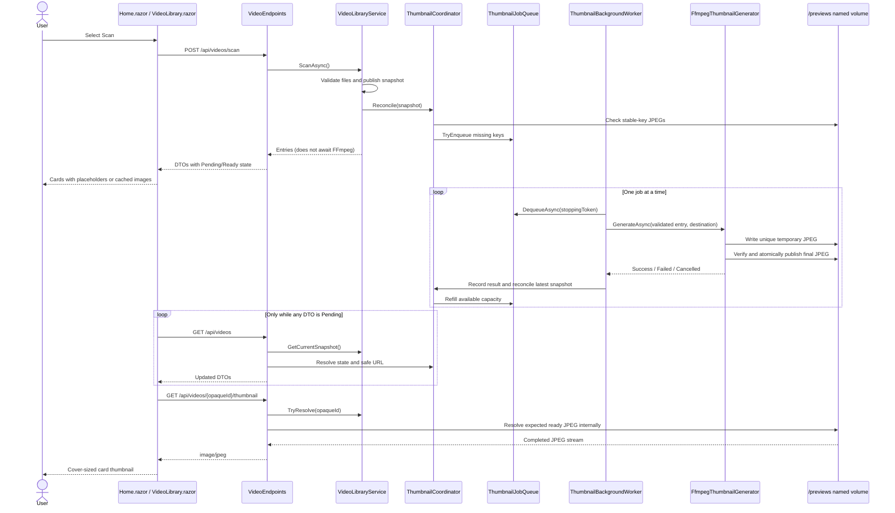

# Plan: Static Video Thumbnails with FFmpeg

## Table of Contents

- [Summary](#summary)
- [Technical Approach](#technical-approach)
- [Component Breakdown](#component-breakdown)
- [Dependencies](#dependencies)
- [External / Vendor Documentation Evidence](#external--vendor-documentation-evidence)
- [Implementation Sequence](#implementation-sequence)
- [Flow](#flow)
- [Risk Assessment](#risk-assessment)

## Summary

Extend the existing snapshot-based server library with a stable private thumbnail identity, persistent JPEG cache, bounded in-process channel, and sequential ASP.NET Core `BackgroundService`. The existing WebAssembly `Home.razor` coordinator will poll current-snapshot state only while work is pending, and `VideoLibrary.razor` will swap its current film icon for a safe application-served image when ready.

This specification is the explicit, narrow successor to the earlier “no FFmpeg/media-processing dependencies” constraint. It authorizes FFmpeg solely for static 640×360 JPEG thumbnails and does not relax any filesystem privacy, read-only source mount, local-only hosting, or opaque-ID requirement.

## Technical Approach

### Preserve the existing snapshot and client/server boundaries

`WebApp/WebApp/Services/VideoLibraryService.cs` remains the only filesystem discovery owner. Extend its internal `VideoFileEntry` data with the normalized root-relative identity input and `LastWriteTimeUtc` captured from the same validated `FileInfo` already used for name and length. Physical and relative paths remain in the server project. Add a current-snapshot read method to `IVideoLibraryService` so status reads and worker reconciliation do not trigger another filesystem scan.

Keep DTO projection in `WebApp/WebApp/Endpoints/VideoEndpoints.cs`. A server-side thumbnail coordinator maps each current `VideoFileEntry` to `Unavailable`, `Pending`, `Ready`, or `Failed` and supplies a URL only for `Ready`. The shared client DTO gains only safe state and URL fields; neither the stable cache key nor any path crosses into `WebApp.Client`.

### Configure a separate persistent cache

Add `ThumbnailCacheOptions` under `WebApp/WebApp/Configuration/` with section name `ThumbnailCache`, `Path`, and a bounded `QueueCapacity` default of 64. Configure `ThumbnailCache__Path=/previews` in both Compose environments. Add a `thumbnail_cache` named volume to `docker-compose.yml`; keep the existing `/videos` bind mount explicitly read-only. The isolated test Compose project receives its own disposable thumbnail volume because `make test` already tears that project down with volumes.

Use startup options validation in `Program.cs`, following the existing `VideoLibraryOptions` pattern. Validation must establish that the preview path is absolute, exists, is readable/writable via a harmless create/delete probe, and is disjoint from the video root in both directions. Avoid persisting the probe. Validation failures identify the configuration key but do not print personal physical paths.

Install Debian's `ffmpeg` package in `Dockerfile` with a noninteractive, no-recommends package layer and clean the package index afterward. No NuGet or frontend package is required: `BackgroundService`, `System.Threading.Channels`, `System.Diagnostics.Process`, hashing, and Minimal API file results are available through .NET 10 and the Web SDK/shared framework.

### Compute a stable, private cache identity

Create a focused thumbnail cache/identity service. Build canonical identity text from:

1. A version marker for future algorithm changes.
2. The normalized root-relative path using `/` separators and the operating system's established path-comparison semantics.
3. File length.
4. UTC last-write ticks.

Hash the UTF-8 identity with SHA-256 and encode lowercase hexadecimal. The final filename is `<hash>.jpg`; a temporary filename is `<hash>.<random>.tmp.jpg`, always inside the validated preview root. The cache service performs containment checks on every resolved cache path and determines `Ready` only for a regular, non-empty readable final JPEG. A source modification selects a new hash; old files can remain as unreachable orphans until a future retention feature.

### Isolate and safely execute FFmpeg

Define `IThumbnailGenerator` around one operation: generate for an already validated `VideoFileEntry` into a coordinator/cache-resolved destination. `FfmpegThumbnailGenerator` must not discover library files, accept HTTP data, manage queue state, or emit browser DTOs.

Before building the ffmpeg command, probe the source's duration through a focused `IVideoDurationProbe`/`FfprobeDurationProbe` (same `ProcessStartInfo`/`ArgumentList`, no-shell shape as the generator itself: `ffprobe -v error -show_entries format=duration -of default=noprint_wrappers=1:nokey=1 <validated-source>`). Feed the probed duration (or `null` when the probe fails) into a pure `ComputeSeekTime` function: target 10% of the duration, clamped between a 2-second floor (so a still-valid frame exists even for very short sources, staying inside a half-second safety margin before end of stream) and a 10-minute cap (so very long videos don't seek unreasonably far in); fall back to a fixed 3-second offset when duration is unknown, zero, or negative. This replaces the originally planned fixed 3-second offset so a single frame stays representative across widely varying video lengths.

Build `ProcessStartInfo` with `FileName = "ffmpeg"`, `UseShellExecute = false`, redirected standard error, no standard input, and individual `ArgumentList` entries. The intended operation is equivalent to:

```text
ffmpeg -nostdin -hide_banner -loglevel error -ss <computed-seek-seconds> -i <validated-source> -frames:v 1 -vf scale=640:360:force_original_aspect_ratio=increase,crop=640:360 -q:v 3 -y <unique-temp.jpg>
```

This text documents behavior only; implementation must not pass it through a shell. Before process start, re-read source length and last-write UTC and compare them with the queued entry. Read redirected standard error asynchronously while awaiting `WaitForExitAsync(stoppingToken)` to avoid pipe deadlocks. Because cancelling `WaitForExitAsync` cancels the wait rather than proving the child exited, cancellation handling must kill the process tree when still running, await termination, and then clean the temporary file. The duration probe honors the same cancellation token and is treated as a `Cancelled` outcome, not a probe failure, when it is cancelled.

On exit code zero, verify the temporary output is a non-empty readable regular file, then move it to the final filename without overwriting an existing valid winner. A concurrent valid final file counts as success. On failure, cancellation, invalid output, or process-start error, best-effort delete the temporary file and return a structured result. Capture standard error in memory with a size bound; replace occurrences of configured source/preview roots and exact source/temp paths before logging. Logs use the opaque snapshot ID and a short cache-key prefix, never a physical or root-relative path.

### Schedule bounded work without delaying scans

Create `IThumbnailJobQueue`/`ThumbnailJobQueue` around `Channel<ThumbnailJob>` with a finite capacity and non-blocking `TryEnqueue`. Maintain a concurrency-safe active-key set so a key already queued or running cannot be duplicated. If the channel is full, release the active-key claim; the source remains conceptually `Pending` and is eligible during the next reconciliation.

Create `ThumbnailCoordinator` to own in-memory failed keys and state resolution. Its synchronous/non-blocking `Reconcile(currentSnapshot)` performs, for every entry:

- `Ready` and no job when a valid final cache file exists.
- `Failed` and no job when that key failed earlier in this process.
- `Pending` plus a `TryEnqueue` attempt otherwise.

`VideoLibraryService.ScanAsync` atomically publishes its completed snapshot, invokes reconciliation, and immediately returns DTO source entries; it never awaits channel capacity or FFmpeg. The `ThumbnailBackgroundWorker` dequeues exactly one job at a time, invokes the generator, records ready/failed/cancelled state, releases the queue's active-key claim in `finally`, and then reconciles the latest library snapshot to refill capacity. This refill loop guarantees eventual admission for libraries larger than the channel while keeping the channel itself bounded. One job exception is caught and classified without ending `ExecuteAsync`; host cancellation exits promptly.

The failed-key set is intentionally in memory. A failed key is never re-enqueued during the process, including on rescan or polling. Restart clears failure state, and a changed source creates a new key, matching the agreed debug-oriented MVP behavior.

### Serve state and images through validated endpoints

Extend `MapVideoEndpoints` with:

- `GET /api/videos` — project the current in-memory snapshot and current thumbnail states without touching the video tree or creating new opaque IDs. Reconciliation may be called non-blockingly before projection.
- `GET /api/videos/{id}/thumbnail` — resolve `id` through the current snapshot, derive its cache key/path server-side, and return a stream/file result with `image/jpeg` only for a valid ready file; otherwise return `404`.

Do not register `/previews` as a static-file root. The thumbnail route has the same future authorization seam as the stream route: a resource must first resolve from the current snapshot. Handle file disappearance/races as `404`. The ready DTO URL is generated from the opaque ID, not the hash.

### Update the Bootstrap-first Blazor UI

Add a browser-safe `ThumbnailState` enum and extend `VideoItemDto`. In `VideoLibrary.razor`, keep the existing `.ratio-16x9` container. Render `` only for `Ready` with a non-empty URL; render the current centered `bi-film` placeholder for unavailable, pending, or failed state. The title below the image already supplies the accessible name, so the image remains decorative. Do not add component CSS unless verification shows Bootstrap utilities cannot provide the required sizing.

Keep `Home.razor` as scan, selection, and HTTP-state coordinator. After a successful scan, start a cancellation-aware polling loop only if any item is `Pending`. At a modest two-second interval, call `GET /api/videos`, replace `_videos`, preserve `_selected` by matching its opaque ID, and render. Stop after a response contains no pending item. Cancel and supersede the old loop before rescan and dispose it when the component is removed. A transient polling error keeps the current cards/placeholders and ends that polling run rather than surfacing a scan failure or retrying tightly; the user can rescan to restart observation.

### Testing strategy

Follow the existing xUnit layout under `WebApp.Tests/` and `WebApplicationFactory<Program>` endpoint pattern. Unit-test deterministic identity/version changes, cache containment and validity, bounded/deduplicated queue behavior, single-failure suppression, refill behavior, DTO state projection, and source-metadata checks. Exercise the concrete FFmpeg generator in the Docker test image with a tiny generated fixture or a controlled executable seam, verifying argument separation, success/failure/cancellation, atomic publication, and cleanup without relying on a personal `VIDEO_ROOT`.

Extend endpoint tests to prove current-snapshot status behavior, ready JPEG serving, rejection of malformed/stale/path-like IDs, no path leakage, and placeholder-compatible non-ready DTOs. Extend the existing rendered-source/static-root client tests or add focused component tests consistent with current repository capabilities to verify conditional markup and that `/previews` is not publicly mapped. All automated execution remains `make test`; actual codec generation, volume persistence, source read-only behavior, and live polling also receive Docker/browser manual checks.

## Component Breakdown

### Existing files to modify

- `Dockerfile` — install FFmpeg in the existing .NET 10 SDK development image.
- `docker-compose.yml` — mount the persistent `thumbnail_cache` named volume at `/previews` and pass `ThumbnailCache__Path` while retaining read-only `/videos`.
- `docker-compose.test.yml` — provide isolated valid thumbnail configuration/cache storage to the test host.
- `WebApp/WebApp/Program.cs` — bind/validate thumbnail options and register cache, coordinator, queue, generator, and hosted worker services.
- `WebApp/WebApp/Models/VideoFileEntry.cs` — add server-only relative-path and last-modification identity metadata.
- `WebApp/WebApp/Services/IVideoLibraryService.cs` — expose the current immutable snapshot without rescanning.
- `WebApp/WebApp/Services/VideoLibraryService.cs` — capture stable identity metadata and reconcile thumbnail work after atomic snapshot replacement.
- `WebApp/WebApp/Endpoints/VideoEndpoints.cs` — project thumbnail state/URL and map current-snapshot status plus validated JPEG endpoints.
- `WebApp/WebApp.Client/Models/VideoItemDto.cs` — add safe thumbnail state and nullable application URL.
- `WebApp/WebApp.Client/Pages/Home.razor` — add pending-only status polling, cancellation, disposal, and selection preservation.
- `WebApp/WebApp.Client/Components/VideoLibrary.razor` — conditionally render a cover-sized JPEG or the existing Bootstrap film placeholder.
- `WebApp.Tests/Services/VideoLibraryServiceTests.cs` — update entry expectations and verify stable source identity inputs without weakening current path/snapshot tests.
- `WebApp.Tests/Endpoints/VideoEndpointsTests.cs` — cover status and thumbnail routes plus DTO/path privacy.
- `WebApp.Tests/Client/ThemeBootstrapTests.cs` — extend static/rendered UI assertions where appropriate and supply valid thumbnail configuration to test hosts.

### New files to create

- `WebApp/WebApp/Configuration/ThumbnailCacheOptions.cs` — preview cache and bounded-queue configuration contract/validation helpers.
- `WebApp/WebApp/Models/ThumbnailJob.cs` — immutable server-only validated work item.
- `WebApp/WebApp/Models/ThumbnailGenerationResult.cs` — structured generator outcome without thrown process details crossing layers.
- `WebApp/WebApp/Services/IThumbnailGenerator.cs` — focused one-video generation contract.
- `WebApp/WebApp/Services/FfmpegThumbnailGenerator.cs` — safe process, temporary-file, verification, cancellation, duration-aware seek computation, and diagnostic implementation.
- `WebApp/WebApp/Services/IVideoDurationProbe.cs` — focused one-video duration-probe contract.
- `WebApp/WebApp/Services/FfprobeDurationProbe.cs` — safe `ffprobe` process invocation returning a nullable duration.
- `WebApp/WebApp/Services/IThumbnailJobQueue.cs` — bounded enqueue/dequeue/completion contract.
- `WebApp/WebApp/Services/ThumbnailJobQueue.cs` — bounded channel and active-key deduplication.
- `WebApp/WebApp/Services/ThumbnailCache.cs` — stable hashing, contained cache-path resolution, and ready-file checks.
- `WebApp/WebApp/Services/ThumbnailCoordinator.cs` — cache/state reconciliation and one-failure-per-process policy.
- `WebApp/WebApp/Services/ThumbnailBackgroundWorker.cs` — sequential resilient consumer and queue refill owner.
- `WebApp/WebApp.Client/Models/ThumbnailState.cs` — browser-safe thumbnail lifecycle enum.
- `WebApp.Tests/Configuration/ThumbnailCacheOptionsTests.cs` — absolute/writable/disjoint startup validation.
- `WebApp.Tests/Services/ThumbnailCacheTests.cs` — deterministic identity, invalidation, containment, and cache readiness.
- `WebApp.Tests/Services/ThumbnailJobQueueTests.cs` — capacity, deduplication, cancellation, and completion behavior.
- `WebApp.Tests/Services/FfmpegThumbnailGeneratorTests.cs` — process outcome, atomic publication, source-version check, cleanup, cancellation, and duration-aware seek clamping.
- `WebApp.Tests/Services/FfprobeDurationProbeTests.cs` — real-duration probing, missing/corrupt-source handling, and cancellation.
- `WebApp.Tests/Services/ThumbnailCoordinatorTests.cs` — state transitions, failure suppression, cache reuse, and refill eligibility.

## Dependencies

- Debian FFmpeg package installed into `mcr.microsoft.com/dotnet/sdk:10.0` during image build.
- Existing Docker/Compose development workflow and a persistent Compose named volume mounted at `/previews`.
- Existing read-only `${VIDEO_ROOT}` bind mount at `/videos`.
- .NET 10 shared-framework/BCL APIs: `BackgroundService`, `System.Threading.Channels`, `System.Diagnostics.Process`, `SHA256`, and ASP.NET Core Minimal API file results.
- Existing Bootstrap 5.3.8 and Bootstrap Icons presentation contract. No new browser library is required.

## External / Vendor Documentation Evidence

- [Background tasks with hosted services in ASP.NET Core (.NET 10)](https://learn.microsoft.com/aspnet/core/fundamentals/host/hosted-services?view=aspnetcore-10.0) — Microsoft documents `BackgroundService` for long-running host-managed work, propagating the stopping token for prompt shutdown, and sequential queued work backed by a bounded `Channel`. It also confirms that Web SDK projects already receive hosting APIs through the shared framework, so no explicit hosting package is needed. The plan follows that lifecycle but uses non-blocking admission plus worker reconciliation because this repository requires scans not to wait for bounded-channel backpressure.
- [Options pattern in ASP.NET Core (.NET 10)](https://learn.microsoft.com/aspnet/core/fundamentals/configuration/options?view=aspnetcore-10.0#options-validation) — Microsoft states that `ValidateOnStart` performs options validation during startup rather than on first use. The thumbnail cache extends the repository's existing `VideoLibraryOptions` startup-validation pattern.
- [`ProcessStartInfo.ArgumentList` (.NET 10)](https://learn.microsoft.com/dotnet/api/system.diagnostics.processstartinfo.argumentlist?view=net-10.0) — Microsoft documents that list entries do not require pre-escaping, recommends `ArgumentList` when escaping is uncertain, prohibits mixing it with `Arguments`, and warns that untrusted input remains unsafe. The design therefore passes only server-validated paths as individual arguments.
- [`Process.WaitForExitAsync(CancellationToken)` (.NET 10)](https://learn.microsoft.com/dotnet/api/system.diagnostics.process.waitforexitasync?view=net-10.0) — Microsoft documents that the task completes when the process exits, cancellation is requested, or an error occurs. The plan explicitly handles cancellation by terminating and reaping a still-running FFmpeg child rather than assuming cancellation killed it.
- [`Process.StandardError` / redirected stream guidance (.NET 10)](https://learn.microsoft.com/dotnet/api/system.diagnostics.process.standarderror?view=net-10.0) — Microsoft warns about deadlocks when redirected streams fill and recommends asynchronous reading of at least one redirected stream. The generator consumes FFmpeg standard error concurrently with process waiting.
- [File result return values in ASP.NET Core Minimal APIs (.NET 10)](https://learn.microsoft.com/aspnet/core/fundamentals/minimal-apis/responses?view=aspnetcore-10.0#file-result-return-values) — Microsoft recommends Minimal API file results for non-JSON binary responses and documents stream/physical-file variants that set content type and handle protocol details. The thumbnail endpoint uses an explicit validated result rather than static-file middleware over the cache directory.
- [Introduction to .NET and Docker](https://learn.microsoft.com/dotnet/core/docker/introduction) — Microsoft identifies official .NET images as the supported base for containerized .NET applications. This plan retains the repository's existing official .NET 10 SDK image and adds only the required OS-level FFmpeg package.

## Implementation Sequence

1. Add FFmpeg and the `/previews` volume/configuration to Docker and Compose; build and manually prove `ffmpeg -version`, preview write access, and `/videos` read-only behavior.
2. Manually generate one 640×360 JPEG from a known mounted source into `/previews` (using `ffprobe` to read its duration and computing the seek per the 10%/2s-floor/10-minute-cap rule, or the 3-second fallback for an unprobeable source), open it, and verify the source checksum/metadata did not change.
3. Add `ThumbnailCacheOptions`, cross-directory startup validation, and Docker test configuration.
4. Extend `VideoFileEntry` with stable identity metadata and implement `ThumbnailCache` hashing/path/readiness rules.
5. Implement `IThumbnailGenerator`/`FfmpegThumbnailGenerator` with structured arguments, source revalidation, concurrent stderr capture, cancellation/child termination, temporary outputs, verification, atomic move, cleanup, and redacted diagnostics.
6. Implement the bounded deduplicated job queue, coordinator state machine, sequential worker, and refill reconciliation.
7. Connect completed scans to reconciliation without awaiting FFmpeg; expose the current snapshot through the library interface.
8. Extend `VideoItemDto` and endpoint projection; add `GET /api/videos` and `GET /api/videos/{id}/thumbnail`.
9. Add pending-only polling to `Home.razor` and conditional cover images to `VideoLibrary.razor`.
10. Add focused unit/endpoint/client tests, run `make test`, then execute the clean-cache, persistence, new-video, modified-video, corrupt-video, polling, and source-read-only manual scenarios.

## Flow



## Risk Assessment

| Risk | Evidence | Mitigation |
| --- | --- | --- |
| FFmpeg expands image size and supply-chain surface | The current image contains only the .NET 10 SDK and the repository previously excluded media dependencies. | Keep the official .NET base, install the distro package in one reproducible layer, verify `ffmpeg -version`, and scope use to static JPEG generation. |
| Bounded queue backpressure delays scans or drops work | Microsoft’s sample uses `BoundedChannelFullMode.Wait`, but FR16 forbids awaiting capacity during scans. | Use `TryEnqueue`; keep missing items pending and let the single worker reconcile the latest snapshot after every completion until all capacity-limited work is admitted. |
| Child process survives application cancellation | `WaitForExitAsync` cancellation cancels the wait, not necessarily the operating-system process. | Kill the still-running process tree, await exit, and remove temporary output during cancellation. |
| Raw FFmpeg diagnostics leak source paths | FFmpeg standard error commonly prints its input/output names, while repository rules prohibit paths in normal logs. | Bound captured output, redact configured roots and exact paths, and identify failures by opaque ID/cache-key prefix only. |
| Partial or corrupt JPEG becomes publicly visible | FFmpeg could fail after creating output or the host could stop mid-write. | Generate uniquely named temporary files, verify success/non-empty readability, and atomically rename only after completion. |
| Snapshot changes while a job is queued | Opaque IDs and snapshots are replaced on each scan; files can also change during work. | Jobs carry captured source metadata; revalidate before process start. Endpoint access always resolves the current snapshot and current cache key. Obsolete output is never served for a new version. |
| Persistent cache accumulates orphaned source versions | Stable keys deliberately change when source metadata changes and MVP has no database/index. | Make old keys unreachable, document volume reset as rollback/cleanup, and defer retention/garbage collection explicitly. |
| Polling races with rescan or component disposal | `Home.razor` currently owns scan state without a long-lived loop. | Give every polling run a cancellation token/generation, cancel before rescan/disposal, preserve selection only by a matching current opaque ID, and stop on no pending work. |
| Named-volume permissions fail under a future non-root image | The current development SDK container runs with permissions compatible with its mounted volumes, but this may change. | Validate writable cache access at startup and fail clearly; revisit ownership when the runtime/container user model changes. |
| Failure suppression hides recovery during a process | The agreed MVP retries a failed key only after restart or source change. | Expose `Failed` explicitly, log one redacted diagnostic, retain the placeholder/playback, and document restart as the debug retry mechanism. |
