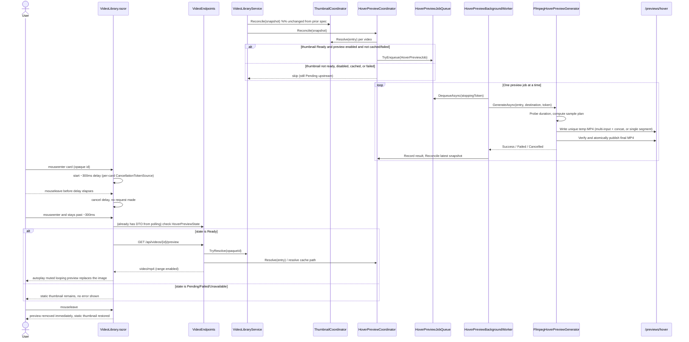

# Plan: Multi-Scene Hover Video Previews with FFmpeg

## Table of Contents

- [Summary](#summary)
- [Technical Approach](#technical-approach)
- [Component Breakdown](#component-breakdown)
- [Dependencies](#dependencies)
- [External / Vendor Documentation Evidence](#external--vendor-documentation-evidence)
- [Implementation Sequence](#implementation-sequence)
- [Flow](#flow)
- [Risk Assessment](#risk-assessment)

## Summary

Add a second, independent derived-media pipeline — bounded queue, sequential `BackgroundService`, coordinator, cache, and FFmpeg generator — that produces a short muted multi-scene MP4 preview per video, entirely parallel to the existing static-thumbnail pipeline from `Specs/20260831104814-static-video-thumbnails-ffmpeg/`. `VideoLibrary.razor` swaps a card's static `` for this preview only after a ~300ms hover delay, and only when the preview is `Ready`; every other card state is untouched.

## Technical Approach

### Deliberately parallel, not merged, architecture

This spec explicitly does **not** touch `ThumbnailCache`, `ThumbnailCoordinator`, `ThumbnailBackgroundWorker`, `ThumbnailJobQueue`, `IThumbnailGenerator`, or `FfmpegThumbnailGenerator`. Every new type gets its own `HoverPreview*`/`FfmpegHoverPreview*` name and its own DI registration. Small pieces of logic that look similar to the thumbnail pipeline (SHA-256 identity hashing, the safe-process pattern, bounded-channel queueing) are **intentionally duplicated in the new types** rather than extracted into a shared `Media*` abstraction now. This mirrors the repository's own general implementation guidance to prefer small focused services over premature shared abstractions, and matches this feature's explicit design rule: implement the second derived-media use case first, and only extract a shared identity-hashing/process-runner utility once a third asset makes the duplication concrete. The one exception is genuinely generic, already-shared, asset-agnostic code: `VideoLibraryService.IsWithinRoot` (path-containment check) is reused as-is, exactly as `ThumbnailCache` already reuses it today.

Critically, the existing thumbnail cache's version marker (`"v1"`) inside `ThumbnailCache.ComputeKey` must not change — changing it would invalidate every already-generated production thumbnail. The new `HoverPreviewCache` uses its own distinct version marker (`"hoverv1"`) in its own key-computation method.

### Configuration: reuse the validated preview root, add a small options type

`HoverPreviewOptions` (`WebApp/WebApp/Configuration/HoverPreviewOptions.cs`) does **not** introduce a new top-level path or Docker volume. Its `Enabled` (default `true`), `Width` (default `480`), `FrameRate` (default `15`), `SegmentSeconds` (default `1.5`), and `QueueCapacity` (default `8`) properties are all simple value bounds — no filesystem probing is needed at startup because the physical hover-preview directory is `Path.Combine(<already-validated ThumbnailCache:Path>, "hover")`, created on first use with `Directory.CreateDirectory` (idempotent) inside `HoverPreviewCache`. This reuses the existing `ThumbnailCacheOptions` startup validation (absolute, existing, writable, disjoint from the video root) instead of duplicating a second validation pipeline, while still keeping thumbnail and preview assets in clearly separated subdirectories as required. Compose files gain an optional, self-documenting `HoverPreview__Enabled` environment entry; no new volume declaration is needed since the `hover` subdirectory lives inside the existing `thumbnail_cache` volume already mounted at `/previews`.

### Identity, cache, and generator

`HoverPreviewCache` mirrors `ThumbnailCache`'s shape (`ComputeKey`, `GetFinalPath`, `GetTemporaryPath`, `IsReady`) with its own SHA-256 computation over `hoverv1|<normalized-relative-path>|<size>|<last-write-ticks>`, resolving `<key>.mp4`/`<key>.<random>.tmp.mp4` under the `hover` subdirectory, with the same containment check via `VideoLibraryService.IsWithinRoot`.

`FfmpegHoverPreviewGenerator` (`IHoverPreviewGenerator`) mirrors `FfmpegThumbnailGenerator`'s safe-process shape end to end: revalidate source size/last-write time before starting, probe duration through the existing `IVideoDurationProbe`, compute a sample plan with a new pure `ComputeSamplePositions(TimeSpan? duration, TimeSpan segmentLength)` function (mirroring `ComputeSeekTime`'s testability), build `ProcessStartInfo`/`ArgumentList` (never a shell string), capture bounded/redacted stderr, honor cancellation by killing the process tree, verify a non-empty temp output, and atomically publish without overwriting a concurrently-published valid file.

**Sample plan** (three tiers, matching the confirmed MVP decision):

- Duration ≥ 15s: three starts at 20%/50%/80% of duration, each `SegmentSeconds` long, each clamped so `start + SegmentSeconds ≤ duration − 0.2s` safety margin.
- 3s ≤ duration < 15s: one segment starting at `0`, length `min(3s, duration − 0.2s)`.
- 0 < duration < 3s: one segment starting at `0`, length `duration − 0.2s` (or `0` floor if that would go negative).
- Duration is `null`, `0`, or negative: return `Failed` immediately (`"duration unavailable"`) without invoking FFmpeg at all — satisfies FR6 and keeps this cheap for corrupt/garbage inputs (no process launched).

**FFmpeg argument shape** (three-segment case, illustrative — proven manually before automation per the implementation sequence below):

```text
ffmpeg -nostdin -hide_banner -loglevel error \
  -ss <t1> -t <segLen> -i <validated-source> \
  -ss <t2> -t <segLen> -i <validated-source> \
  -ss <t3> -t <segLen> -i <validated-source> \
  -filter_complex "[0:v]scale=<width>:-2,fps=<fps>,setsar=1[v0];[1:v]scale=<width>:-2,fps=<fps>,setsar=1[v1];[2:v]scale=<width>:-2,fps=<fps>,setsar=1[v2];[v0][v1][v2]concat=n=3:v=1:a=0[outv]" \
  -map "[outv]" -an -c:v libx264 -preset veryfast -crf 28 -movflags +faststart -y <unique-temp.mp4>
```

For the single-segment fallback, the same safe pattern applies without `-filter_complex`/`concat`: `-ss <t> -t <segLen> -i <source> -vf "scale=<width>:-2,fps=<fps>,setsar=1" -an -c:v libx264 -preset veryfast -crf 28 -movflags +faststart -y <temp.mp4>`. `libx264`/`-crf 28`/`-preset veryfast` are a starting point explicitly meant to be measured and adjusted (per the manual proof-and-evaluate steps below) rather than treated as final; `-crf`/preset are not exposed as configuration in this slice (avoids over-configuring FFmpeg internals per the requirement to only expose meaningful application behavior) but can be revisited if measurement shows they need tuning.

### Queue, worker, and coordinator

`HoverPreviewJobQueue` (`IHoverPreviewJobQueue`) is a second, independent `Channel<HoverPreviewJob>`-backed bounded queue with the same non-blocking `TryEnqueue`/active-key-dedup shape as `ThumbnailJobQueue` (including the same `BoundedChannelFullMode.Wait` fix already applied there, so `TryEnqueue` returns `false` — never silently drops — when full).

`HoverPreviewBackgroundWorker` is a second `BackgroundService`, registered independently, processing exactly one job at a time, logging with the opaque media ID and a cache-key prefix, and calling `HoverPreviewCoordinator.Reconcile` again after each completed job to refill capacity — mirroring `ThumbnailBackgroundWorker`'s refill loop. Because .NET 10 changed `BackgroundService.ExecuteAsync` to run its entire body (not just the portion after the first `await`) on a background thread rather than blocking host startup, no special handling is needed to keep this worker's own dequeue loop from delaying other services' startup — the existing pattern already used by `ThumbnailBackgroundWorker` continues to be correct here.

`HoverPreviewCoordinator` mirrors `ThumbnailCoordinator`'s shape: an in-memory failed-key set, `Resolve(VideoFileEntry?) -> HoverPreviewState`, and a synchronous, non-blocking `Reconcile(IReadOnlyList<VideoFileEntry>)`. It takes a constructor dependency on the existing `ThumbnailCoordinator` (read-only — it only calls `ThumbnailCoordinator.Resolve`) to implement the "wait for the thumbnail first" priority rule: `Reconcile` skips a video entirely (leaves it `Pending`, no enqueue) unless `HoverPreviewOptions.Enabled` is `true` **and** `thumbnailCoordinator.Resolve(entry) == ThumbnailState.Ready`. This gives the thumbnail pipeline effective priority without a general priority queue, and makes disabling previews a pure no-op at the coordinator boundary (FR22) — no conditional service registration needed.

### Wiring into discovery, DTOs, and endpoints

`VideoLibraryService.ScanAsync` (already injecting `ThumbnailCoordinator`) additionally injects `HoverPreviewCoordinator` and calls its `Reconcile` right after `ThumbnailCoordinator.Reconcile`, still before returning — the scan itself still never awaits any FFmpeg-family process. `VideoItemDto` gains `HoverPreviewState` and a nullable `HoverPreviewUrl`, projected in `VideoEndpoints.BuildDto` alongside the existing thumbnail projection. A new `GET /api/videos/{id}/preview` mirrors the existing `/thumbnail` endpoint's resolve-then-serve shape, but with range processing enabled (`Results.Stream(..., "video/mp4", enableRangeProcessing: true)`) since it backs an actual `<video>` element, matching the existing `/stream` endpoint's use of range processing for the same reason.

### Client interaction

`VideoLibrary.razor` keeps its default `` rendering path untouched. It adds `@onmouseenter`/`@onmouseleave` on each card (per [ASP.NET Core Blazor event handling](https://learn.microsoft.com/aspnet/core/blazor/components/event-handling?view=aspnetcore-10.0), Blazor wires arbitrary DOM events — including mouse events — directly to C# handlers via `@on{event}` with no JS interop required), tracking a single `_hoveredVideoId`/`_hoverDelayCts` pair (not a shared boolean) so only the actually-hovered card can activate. On `mouseenter`, it starts a `Task.Delay(~300ms, token)`; if not cancelled by a subsequent `mouseleave` and the item's `HoverPreviewState == Ready` with a non-null URL when the delay completes, it sets an "actively previewing" id and re-renders, showing a `<video autoplay muted loop playsinline poster="@ThumbnailUrl">` sized identically to the `` it replaces (same `.ratio-16x9` container, same cover sizing) with no controls. `mouseleave` always cancels the pending delay and clears the actively-previewing id immediately, regardless of the delay's state. This project currently respects `prefers-reduced-motion` only through pure CSS `@media` rules in `WebApp/WebApp/wwwroot/app.css` (confirmed: there is no existing JavaScript/interop-based preference read to reuse, e.g. `theme.js` only reads a stored theme choice from `localStorage`); since the task's scope explicitly excludes new JavaScript interop, this spec does not add a reduced-motion check for the hover preview (see Requirements.md Out of Scope). The card's outer `<button>`/`OnSelect` wiring is untouched; the hover video sits purely as decorative media inside the same clickable button, never intercepting pointer events itself (`pointer-events: none` is not needed because the video has no controls and does not stop propagation).

### Testing strategy

Follow the exact conventions already established for the thumbnail pipeline: `Configuration/HoverPreviewOptionsTests.cs` for bounds validation, `Services/HoverPreviewCacheTests.cs` for identity/containment/readiness, `Services/HoverPreviewJobQueueTests.cs` for capacity/dedup/cancellation, `Services/FfmpegHoverPreviewGeneratorTests.cs` for `ComputeSamplePositions` (pure, exhaustive `[Theory]` coverage of all three duration tiers and their boundaries) plus a real-FFmpeg-gated end-to-end generation test (skipped, not failed, when `ffmpeg` isn't on `PATH`, exactly like the existing generator tests), and `Services/HoverPreviewCoordinatorTests.cs` for state resolution, the thumbnail-first gating rule, and the `Enabled=false` no-op path. `Endpoints/VideoEndpointsTests.cs` gains coverage for `GET /api/videos/{id}/preview` mirroring the existing thumbnail-endpoint tests (ready/not-ready/malformed/stale/deleted-source cases, no path leakage). `Services/VideoLibraryServiceTests.cs`'s `CreateService` factory gains a `HoverPreviewCoordinator` alongside the existing `ThumbnailCoordinator`. No existing `WebApplicationFactory`-based test needs new configuration, because every `HoverPreviewOptions` property has a safe default — the already-registered `HoverPreviewBackgroundWorker` will harmlessly attempt (and fail fast on, since duration probing on non-video fixture bytes returns `null`) preview generation against those tests' fake byte-array "videos," exactly as the thumbnail worker already does today, without needing to be muted for each factory.

## Component Breakdown

### Existing files to modify

- `docker-compose.yml` — document the optional `HoverPreview__Enabled` environment entry (default `true` in code if unset); no new volume.
- `docker-compose.test.yml` — same optional environment entry for the isolated test project; reuses the existing `test_thumbnail_cache` volume.
- `WebApp/WebApp/Program.cs` — bind `HoverPreviewOptions`; register `HoverPreviewCache`, `HoverPreviewCoordinator`, `IHoverPreviewJobQueue`/`HoverPreviewJobQueue`, `IHoverPreviewGenerator`/`FfmpegHoverPreviewGenerator`, and the `HoverPreviewBackgroundWorker` hosted service.
- `WebApp/WebApp/Services/VideoLibraryService.cs` — inject `HoverPreviewCoordinator` alongside the existing `ThumbnailCoordinator`; call its `Reconcile` after publishing each scan snapshot.
- `WebApp/WebApp/Endpoints/VideoEndpoints.cs` — extend `BuildDto` to project hover-preview state/URL; add `GET /api/videos/{id}/preview`.
- `WebApp/WebApp.Client/Models/VideoItemDto.cs` — add `HoverPreviewState` and nullable `HoverPreviewUrl`.
- `WebApp/WebApp.Client/Components/VideoLibrary.razor` — hover tracking state, entry-delay/exit-cancel logic, conditional `<video>` rendering, reduced-motion check.
- `WebApp.Tests/Services/VideoLibraryServiceTests.cs` — `CreateService` factory gains the new coordinator dependency.
- `WebApp.Tests/Endpoints/VideoEndpointsTests.cs` — add preview-endpoint and DTO-projection coverage.

### New files to create

- `WebApp/WebApp/Configuration/HoverPreviewOptions.cs` — `Enabled`/`Width`/`FrameRate`/`SegmentSeconds`/`QueueCapacity` with bounds-validation helpers.
- `WebApp/WebApp/Models/HoverPreviewJob.cs` — immutable server-only validated work item (cache key + `VideoFileEntry`).
- `WebApp/WebApp/Models/HoverPreviewGenerationResult.cs` — structured Success/Failed/Cancelled outcome, independent of `ThumbnailGenerationResult`.
- `WebApp/WebApp/Services/IHoverPreviewGenerator.cs` — focused one-video preview-generation contract.
- `WebApp/WebApp/Services/FfmpegHoverPreviewGenerator.cs` — duration probing, sample-plan computation, safe multi-input/concat FFmpeg invocation, atomic publication, redacted diagnostics.
- `WebApp/WebApp/Services/IHoverPreviewJobQueue.cs` — bounded enqueue/dequeue/completion contract, independent of `IThumbnailJobQueue`.
- `WebApp/WebApp/Services/HoverPreviewJobQueue.cs` — bounded channel and active-key deduplication.
- `WebApp/WebApp/Services/HoverPreviewCache.cs` — own SHA-256 identity computation (distinct version marker), contained cache-path resolution under the `hover` subdirectory, and ready-file checks.
- `WebApp/WebApp/Services/HoverPreviewCoordinator.cs` — cache/state reconciliation, one-failure-per-process policy, thumbnail-first gating, and `Enabled` short-circuit.
- `WebApp/WebApp/Services/HoverPreviewBackgroundWorker.cs` — sequential resilient consumer and queue refill owner.
- `WebApp/WebApp.Client/Models/HoverPreviewState.cs` — browser-safe preview lifecycle enum, independent of `ThumbnailState`.
- `WebApp.Tests/Configuration/HoverPreviewOptionsTests.cs` — bounds validation.
- `WebApp.Tests/Services/HoverPreviewCacheTests.cs` — deterministic identity, invalidation, containment, and cache readiness under the `hover` subdirectory.
- `WebApp.Tests/Services/HoverPreviewJobQueueTests.cs` — capacity, deduplication, cancellation, and completion behavior.
- `WebApp.Tests/Services/FfmpegHoverPreviewGeneratorTests.cs` — `ComputeSamplePositions` theory coverage, process outcome, atomic publication, source-version check, cleanup, cancellation, and a real-FFmpeg-gated concat generation test.
- `WebApp.Tests/Services/HoverPreviewCoordinatorTests.cs` — state transitions, thumbnail-first gating, `Enabled=false` no-op, failure suppression, cache reuse, and refill eligibility.

## Dependencies

- The `ffmpeg` binary already installed in the Docker image by the prior spec (no `Dockerfile` change needed — the same binary handles both extraction and multi-input concat encoding).
- The existing `thumbnail_cache` named volume and its already-validated `ThumbnailCache:Path` mount (no new volume).
- Existing `IVideoDurationProbe`/`FfprobeDurationProbe`, reused unmodified.
- .NET 10 shared-framework APIs already in use: `BackgroundService`, `System.Threading.Channels`, `System.Diagnostics.Process`, `SHA256`, ASP.NET Core Minimal API stream results.
- Existing Bootstrap 5.3.8 ratio-container/cover-sizing utilities; no new browser library for playback (native `<video>`).

## External / Vendor Documentation Evidence

- [ASP.NET Core Blazor event handling (.NET 10)](https://learn.microsoft.com/aspnet/core/blazor/components/event-handling?view=aspnetcore-10.0) — confirms Blazor wires arbitrary DOM events (including mouse events, via `MouseEventArgs`) directly to synchronous or asynchronous C# handlers through `@on{event}` directive attributes, with no JavaScript interop required. This directly supports implementing `mouseenter`/`mouseleave` hover tracking in C# as planned, consistent with this repository's existing `@onclick` usage in the same component.
- [BackgroundService runs all of ExecuteAsync as a Task (.NET 10 breaking change)](https://learn.microsoft.com/dotnet/core/compatibility/extensions/10.0/backgroundservice-executeasync-task) — confirms that, starting in .NET 10, the entirety of `BackgroundService.ExecuteAsync` (not just the portion after the first `await`) runs on a background thread and never blocks other services from starting. This means adding a second `BackgroundService` (`HoverPreviewBackgroundWorker`) alongside `ThumbnailBackgroundWorker` cannot delay host startup, and no extra lifecycle handling is needed beyond what `ThumbnailBackgroundWorker` already does.
- [Background tasks with hosted services in ASP.NET Core (.NET 10)](https://learn.microsoft.com/aspnet/core/fundamentals/host/hosted-services?view=aspnetcore-10.0) — reconfirms the same `BackgroundService` sequential-consumer/cancellation-token lifecycle already cited and followed by the existing thumbnail spec; the new worker follows the identical pattern.
- FFmpeg's `concat` filter (`https://trac.ffmpeg.org/wiki/Concatenate` / `ffmpeg.org` FAQ) is the standard mechanism for joining independently re-encoded segments — appropriate here because each sampled segment is already being re-scaled/re-encoded into a new standardized preview asset rather than losslessly copied. No Microsoft Learn MCP equivalent exists for FFmpeg itself (it is not a Microsoft-documented technology); the exact concat/filter graph will be proven manually inside the existing Docker container (Implementation Sequence step 1) before being encoded into `FfmpegHoverPreviewGenerator`, consistent with how the prior spec proved its single-frame FFmpeg invocation manually before implementing it.

## Implementation Sequence

1. Manually probe one known real video's duration with `ffprobe` inside the running container, compute its three sample positions by hand, and run the illustrative `ffmpeg` command above (adjusting `-crf`/`-preset` as needed) to produce one real multi-scene preview MP4. Inspect it for content, size, and encode time before writing any C#.
2. Add `HoverPreviewOptions` and its bounds validation; register it in `Program.cs`.
3. Implement `HoverPreviewCache` (own identity hashing under a distinct version marker, contained path resolution under `.../hover`, readiness checks).
4. Implement `HoverPreviewJob`/`HoverPreviewGenerationResult`, `IHoverPreviewGenerator`/`FfmpegHoverPreviewGenerator` (duration probing via the existing `IVideoDurationProbe`, `ComputeSamplePositions`, safe process invocation, atomic publication), matching the command proven in step 1.
5. Implement `IHoverPreviewJobQueue`/`HoverPreviewJobQueue` and `HoverPreviewCoordinator` (thumbnail-first gating via `ThumbnailCoordinator.Resolve`, `Enabled` short-circuit, one-failure-per-process policy).
6. Implement `HoverPreviewBackgroundWorker`; register it and the rest of the new services in `Program.cs`.
7. Wire `VideoLibraryService.ScanAsync` to also call `HoverPreviewCoordinator.Reconcile`.
8. Extend `VideoItemDto` and `VideoEndpoints` (DTO projection plus the new `GET /api/videos/{id}/preview` endpoint).
9. Extend `VideoLibrary.razor` with hover tracking, the entry delay/exit cancellation, reduced-motion check, and conditional `<video>` rendering.
10. Add the full unit/endpoint test suite described above, run `make test`, then execute the manual cache-reuse, corrupt-source, thumbnail-priority, full-library, and hover-interaction scenarios from `Validation.md`.

## Flow



## Risk Assessment

| Risk | Evidence | Mitigation |
| --- | --- | --- |
| Two FFmpeg-launching background systems compete for CPU/I/O | Video encoding (multi-input concat + H.264 encode) is materially heavier per job than single-frame JPEG extraction. | Thumbnail-first gating (FR15) defers all preview work until a video's thumbnail already exists; preview worker processes one job at a time; `HoverPreview:Enabled` gives an instant kill switch without redeploying; a shared FFmpeg concurrency limiter is deferred until measurement shows it's needed (Out of Scope). |
| Full-library backfill on first deploy is slow | The preview coordinator reconciles the *entire* current snapshot on every scan, exactly like the thumbnail coordinator — meaning every already-thumbnailed video in a real library becomes eligible for preview generation on the very next scan after this ships. | Documented explicitly in Validation.md's manual verification and Definition of Done as expected, bounded-by-one-worker behavior; the `Enabled` switch lets an operator defer this rollout entirely if needed. |
| Multi-input `-ss`/`concat` FFmpeg invocation is more failure-prone than a single-frame extraction | More moving parts (three seeks, a filter graph) than the proven single-frame thumbnail command. | Prove the exact command manually inside the container (Implementation Sequence step 1) before writing any generator code, mirroring how the prior spec proved its own FFmpeg invocation manually first; `ComputeSamplePositions` is a pure, exhaustively unit-tested function independent of the process invocation itself. |
| Raw FFmpeg diagnostics leak source paths | Same class of risk as the thumbnail generator; FFmpeg stderr commonly echoes input/output filenames. | Reuse the same bounded-capture-then-redact pattern (replace source/temp/destination/root strings) before returning any diagnostic, logged only with opaque ID/cache-key prefix by the worker. |
| Card hover state leaks across cards or fights with existing scroll/selection UX | `VideoLibrary.razor` renders many cards from one loop; a single shared boolean cannot distinguish which card triggered it, and rapid pointer movement across many cards could otherwise burst-request previews. | Track the specific hovered opaque ID plus a per-hover `CancellationTokenSource`; the ~300ms entry delay (cancelled on `mouseleave`) is exactly the mechanism that prevents a fast mouse sweep from firing a burst of preview requests, per FR25. |
| Duplicated logic between `ThumbnailCache`/`FfmpegThumbnailGenerator` and their new `HoverPreview*` counterparts becomes a maintenance burden | Real duplication (identity hashing, safe-process ceremony) is introduced by this spec's own design rule. | Deliberate and time-boxed: Out of Scope explicitly defers extracting a shared abstraction until a third derived asset makes the actual duplication (not a guessed one) visible, per this feature's guiding design principle. |
| Reduced-motion users get an autoplaying video this project doesn't otherwise suppress in JS | The project's existing `prefers-reduced-motion` handling is CSS-only (`app.css`); there is no existing JS/interop preference read to reuse, and adding one is explicitly out of scope for this task. | Accepted and documented in Requirements.md's Out of Scope as a deferred follow-up; the preview remains muted/short/decorative in the meantime, limiting the impact. |
