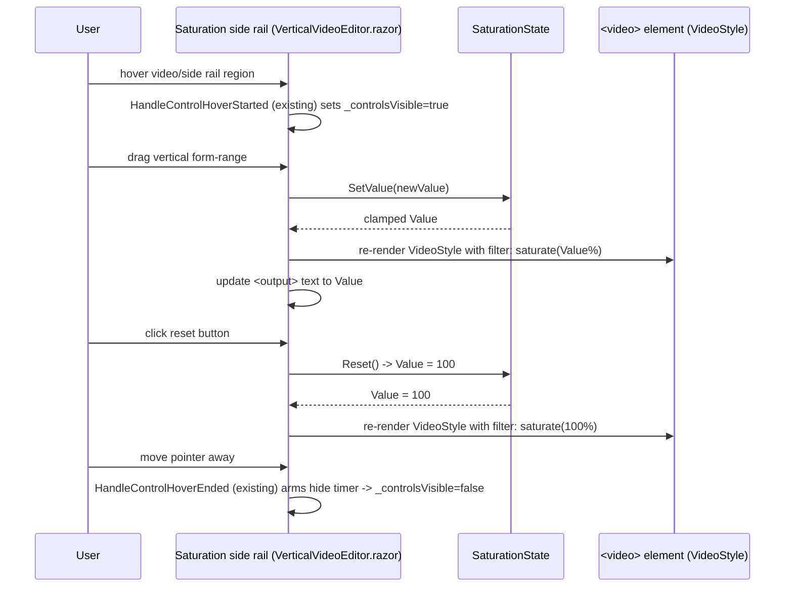

# Plan: Saturation Filter Control

## Table of Contents

- [Plan: Saturation Filter Control](#plan-saturation-filter-control)
  - [Summary](#summary)
  - [Technical Approach](#technical-approach)
  - [Component Breakdown](#component-breakdown)
  - [Dependencies](#dependencies)
  - [External / Vendor Documentation Evidence](#external--vendor-documentation-evidence)
  - [Flow](#flow)
  - [Risk Assessment](#risk-assessment)

## Summary

Add a new client-owned `SaturationState` model and a vertical Bootstrap `form-range` control rendered beside the video viewport in `VerticalVideoEditor.razor`, driving `filter: saturate(x%)` on the `<video>` element's existing inline style, with visibility tied to the same `_controlsVisible` flag that already governs `MediaPlayerControls`.

## Technical Approach

This follows the existing client-state-per-concern pattern already used by `VerticalVideoEditor.razor`: `VideoFrameState` owns crop, `MediaPlayerState` owns playback, `FillTabState` owns Fill-tab presentation. A new `WebApp.Client/Models/SaturationState.cs` owns saturation the same way — a plain C# class with a `Value` property (double, 0–300, default 100, both bounds exposed as `Default`/`Max` constants), a `Select(string? id)` method mirroring `VideoFrameState.Select`/`FillTabState.Select` (resets `Value` to 100 whenever the selection id changes), and a `SetValue(double value)` mutator that clamps to `[0, Max]`. The 0–300 range (rather than the originally discussed 0–1000) was chosen after a visual pass on the rendered slider — values above ~300% add no further usable preview signal and made the slider's effective travel harder to control.

`VerticalVideoEditor.razor` instantiates `private readonly SaturationState _saturation = new();` alongside `_frame`/`_fillTab`/`_player`, calls `_saturation.Select(Selected?.Id)` in `OnParametersSet` next to the existing `_frame.Select`/`_player.Select`/`_fillTab.Select` calls, and extends the existing `VideoStyle` computed property (`VerticalVideoEditor.razor:147-148`) to append `; filter: saturate({_saturation.Value:0}%)` — this keeps all inline video styling centralized in one property instead of a second style attribute, avoiding the two-attribute conflict Blazor would otherwise require workarounds for.

The slider itself is new markup inside the existing `@if (Selected is null) { } else { 
 ... }` block (`VerticalVideoEditor.razor:28-97`), placed as a sibling of `@VideoViewportCssClass` inside a small side rail `
` so it sits beside the viewport in normal mode and beside the full-bleed video in Fill-tab mode (both modes already share the same DOM structure — only `PreviewStageCssClass`/`VideoViewportCssClass` change between them). Its visibility uses the same `_controlsVisible` boolean via a CSS class toggle identical in spirit to `MediaPlayerControls`'s `RootCssClass` visibility toggle (`MediaPlayerControls.razor:243`) — no new hover region, pointer handlers, or timer are introduced; the existing pointer/hover handlers on `MediaPlayerControls` (`HandleControlHoverStarted`/`HandleControlHoverEnded`/`InteractionStarted`/`InteractionEnded`) already arm/cancel the shared `_controlsHideCancellation` timer in `VerticalVideoEditor.razor:431-473`, and the new side-rail element reuses these same event handlers (`@onmouseenter="HandleControlHoverStarted"` / `@onmouseleave="HandleControlHoverEnded"`) so hovering the slider itself also keeps the whole control cluster (including the bottom toolbar) visible, matching how hovering `MediaPlayerControls` already behaves.

Bootstrap has no built-in vertical `form-range` orientation, so the vertical layout is achieved the standard way — rotating a horizontal `input.form-range` with CSS (`writing-mode: vertical-lr` + `direction: rtl`) inside `VerticalVideoEditor.razor.css`, which is the correct file per `AGENTS.md`'s Coding Conventions ("Use isolated `.razor.css` only when Bootstrap cannot express required behavior... A/B marker geometry... player-specific responsive states"). Track/thumb color reuses `var(--bs-primary)` exactly as `MediaPlayerControls.razor.css`'s `.timeline`/`.volume-control` rules already do, so the new control matches the existing gold-accent slider language without inventing new tokens.

The rail sits inside the `.ratio` viewport used in normal (9:16, `max-width: 24rem`) mode, and Bootstrap's `.ratio > *` rule forces every direct child to `position: absolute; top: 0; left: 0; width: 100%; height: 100%`. Left unaddressed, this stretches the rail to the full viewport width and its `align-items-center` flex layout then centers the button/slider/output in the middle of the frame instead of pinning it to an edge. `.saturation-rail` in `VerticalVideoEditor.razor.css` explicitly overrides `top`, `left`, `width`, and `height`, positions itself with `right: .75rem` and a `transform: translateY(-50%)` at `top: 50%`, and wins the cascade the same way `MediaPlayerControls.razor.css`'s `.media-controls` rule already overrides the same forced properties (component-scoped CSS loads after Bootstrap, so a tied-specificity single-class selector defined later wins). The rail also carries a translucent dark panel background (`rgba(8, 10, 9, .5)`), border, and shadow so it stays legible over any video content, echoing (at a lower, "floating panel" opacity) the same dark surface language as `.media-controls`'s bottom gradient.

The reset button is a small icon-only `<button>` (Bootstrap Icons `bi-arrow-counterclockwise`, the same icon already used for "Reset crop" in the header), wrapped in its own `btn-group` — matching the same bordered-group convention `MediaPlayerControls.razor` already uses for the A/B marker buttons — placed above the slider in the same side rail. It calls `_saturation.Reset()` (alias for `SetValue(Default)`), is gated by the same visibility class as the slider, and is disabled when `_saturation.Value == SaturationState.Default` to give a non-color affordance for "nothing to reset," consistent with FR8's accessibility requirement and the project's non-color state cue rule.

No JavaScript changes are needed: this is pure Blazor two-way event binding (`@oninput`) plus a computed C# style string, unlike crop-dragging (which needs `videoEditor.js` for pointer capture and geometry) or Fill-tab (which needs real DOM fullscreen-style lifecycle). This keeps `videoEditor.js` scope-free per the "no framing/playback/application state belongs in JS" convention.

## Component Breakdown

**Existing files to modify:**

- `WebApp/WebApp.Client/Components/VerticalVideoEditor.razor` — add the side-rail markup (vertical range + output + reset button) beside `@VideoViewportCssClass` in both normal and Fill-tab layout branches; add `_saturation` field, `_saturation.Select(...)` call in `OnParametersSet`, `SetSaturationAsync`/`ResetSaturation` handlers, and extend `VideoStyle` to include the `saturate()` filter.
- `WebApp/WebApp.Client/Components/VerticalVideoEditor.razor.css` — add vertical-orientation CSS for the new `form-range` (rotated/vertical-mode track+thumb styling reusing `--bs-primary`), side-rail layout/visibility classes mirroring `.media-controls`/`.is-visible` fade behavior from `MediaPlayerControls.razor.css`.

**New files to create:**

- `WebApp/WebApp.Client/Models/SaturationState.cs` — client-owned saturation value state (`Value`, `Select(string? id)`, `SetValue(double)`, `Reset()`), following the `VideoFrameState`/`FillTabState` pattern.

## Dependencies

- No new runtime dependency. Uses the already-approved Bootstrap 5.3.8 (`form-range`) and Bootstrap Icons 1.13.1 (`bi-arrow-counterclockwise`) CDN assets per `AGENTS.md`'s Design System section.

## External / Vendor Documentation Evidence

Not applicable — this feature uses only standard CSS (`filter: saturate()`, `writing-mode`/`transform` for vertical range styling) and existing Blazor two-way binding/event callback patterns already proven elsewhere in this codebase (e.g. `MediaPlayerControls.razor`'s volume `form-range`); no new Microsoft-specific API or vendor-documented technology decision is introduced.

## Flow

## Risk Assessment

| Risk | Evidence | Mitigation |
| --- | --- | --- |
| A second inline `style` binding on `<video>` could silently override `VideoStyle` if added separately | `VerticalVideoEditor.razor:39` already binds `style="@VideoStyle"` as the single source of inline style | Extend the existing `VideoStyle` computed property to include the saturate filter instead of adding a second `style` attribute |
| Vertical `form-range` styling via `writing-mode`/`transform` can behave inconsistently across browsers for thumb hit-testing | Bootstrap has no native vertical range orientation; this is a known CSS-only technique | Scope the rule to `VerticalVideoEditor.razor.css` only, verify manually in the Manual Verification steps across the browsers the project already targets, and keep a generous thumb/track hit area consistent with `MediaPlayerControls.razor.css`'s existing touch-friendly sizing |
| Reusing `_controlsVisible`/hover handlers incorrectly could accidentally hide the bottom toolbar when only the side rail is hovered, or vice versa | Both are driven by the same shared `_controlsHideCancellation` timer in `VerticalVideoEditor.razor:463-473` | Wire the side rail's `onmouseenter`/`onmouseleave` to the exact same `HandleControlHoverStarted`/`HandleControlHoverEnded` methods already used by `MediaPlayerControls`, so both regions extend one shared visible/hidden state rather than introducing a second independent timer |
