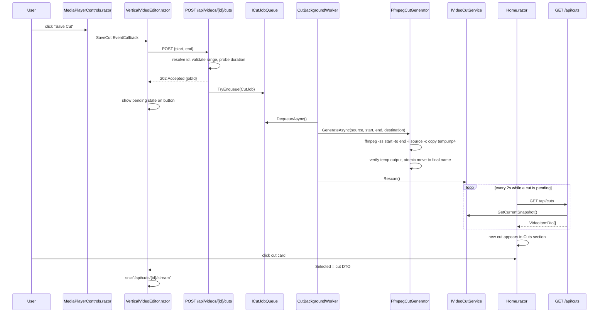

# Plan: Save Cut (A/B Video Export)

## Table of Contents

- [Plan: Save Cut (A/B Video Export)](#plan-save-cut-ab-video-export)
  - [Summary](#summary)
  - [Technical Approach](#technical-approach)
  - [Component Breakdown](#component-breakdown)
  - [Dependencies](#dependencies)
  - [External / Vendor Documentation Evidence](#external--vendor-documentation-evidence)
  - [Flow](#flow)
  - [Risk Assessment](#risk-assessment)

## Summary

Add a "Save Cut" button to `MediaPlayerControls.razor`'s A/B loop-points group that enqueues a server-side FFmpeg stream-copy job producing `<VIDEO_ROOT>/Cuts/<first two words> <NNNN>.mp4`, list those cuts through a new `IVideoCutService` scanned the same way `VideoLibraryService` scans the main root, and surface them in a new "Cuts" section on `Home.razor` (below `VerticalVideoEditor`) that reuses `VideoLibrary.razor`'s card grid and feeds the same editor when clicked.

## Technical Approach

This extends three existing, already-approved patterns rather than inventing new ones:

1. **The thumbnail background-job pipeline** (`Specs/20260831104814-static-video-thumbnails-ffmpeg/Plan.md`): bounded `Channel`-backed queue (`IThumbnailJobQueue`/`ThumbnailJobQueue`) → single-drain `BackgroundService` (`ThumbnailBackgroundWorker`) → `ProcessStartInfo`/`ArgumentList`-only FFmpeg generator (`FfmpegThumbnailGenerator`) → atomic temp-file-then-`File.Move` publish. A new, parallel set of types (`ICutJobQueue`/`CutJobQueue`, `CutBackgroundWorker`, `ICutGenerator`/`FfmpegCutGenerator`) follows this exact shape for cuts. Unlike thumbnails (deduplicated by content-derived cache key, silently reconciled from every scan), cut jobs are one-shot, user-triggered, and keyed by a generated job id — there is nothing to "reconcile" on every scan, so no coordinator-style `Reconcile()` sweep is needed; the queue only needs simple FIFO enqueue/dequeue (a `Channel<CutJob>` is still the right primitive for the same non-blocking, single-writer-drain reasons the thumbnail pipeline chose it).
2. **The server-owns-filesystem / client-owns-UI split** (`AGENTS.md` Coding Conventions): all physical path, FFmpeg, and Cuts-folder logic stays in `WebApp` server services; `WebApp.Client` only ever sees opaque IDs and DTOs, exactly like the existing video/thumbnail boundary.
3. **The scan-snapshot-plus-opaque-ID pattern** (`VideoLibraryService`): a new `IVideoCutService`/`VideoCutService` walks `<VIDEO_ROOT>/Cuts` the same way (extension allowlist, symlink/reparse-point skip, canonical-containment check via the existing `VideoLibraryService.IsWithinRoot` helper — made `internal` and reused, not duplicated) and holds its own atomically-replaced in-memory snapshot of opaque-ID → `VideoFileEntry`. Cuts get their own ID space/service instance rather than being merged into `IVideoLibraryService`'s snapshot, because they live in a distinct root, are mutated by this app itself (not just discovered), and must never be confused with source videos when resolving a stream request.

**Read-only mount resolution.** Per the confirmed decision, `VIDEO_ROOT` itself stays `read_only: true` in `docker-compose.yml` (preserving the existing source-safety boundary — nothing about how source videos are discovered or streamed changes). A second bind mount is added for the same host directory's `Cuts` subfolder, read-write, at its own container path (`/videos-cuts`), mirroring how `thumbnail_cache` already gets its own mount separate from the read-only `/videos` mount:

```yaml
volumes:
  - type: bind
    source: ${VIDEO_ROOT:?...}
    target: /videos
    read_only: true
  - type: bind
    source: ${VIDEO_ROOT:?...}/Cuts
    target: /videos-cuts
    read_only: false
  - thumbnail_cache:/previews
  ...
```

A new `VideoCutOptions` (`VideoCut__Path`, e.g. default `/videos-cuts`) is bound/validated at startup the same way `ThumbnailCacheOptions` is (`HasConfiguredPath`, `HasAbsolutePath`, `DirectoryExists`, `DirectoryIsWritable`), except its directory is created on first run if missing (the host `${VIDEO_ROOT}/Cuts` folder must exist before Compose can bind-mount it, so `make docker-run`'s documented workflow — or a one-time `mkdir -p` step called out in `Validation.md` — must create it before first start; the app itself only needs to find it already present and writable, consistent with how `VideoLibraryOptions.DirectoryExists` already requires the video root to pre-exist rather than being auto-created by the app). `VideoLibraryService`'s existing containment/canonicalization logic is reused against this new root's path, not VIDEO_ROOT's, so cuts are never visible through the library's own scan or opaque-ID space.

**FFmpeg scope.** Per the confirmed decision, `AGENTS.md`'s FFmpeg constraint is updated (see `init-agent`/AGENTS.md changes below) to explicitly also authorize this narrow cut pipeline: `ProcessStartInfo`/`ArgumentList`-only, stream-copy (`-c copy`) only, reading only from a resolved `VideoFileEntry` inside `VIDEO_ROOT` and writing only inside the new Cuts root, invoked only from `FfmpegCutGenerator`. No other transcoding/processing is authorized by this spec.

**Cut precision.** Per the confirmed decision, `FfmpegCutGenerator` uses `-c copy` for both video and audio (bit-for-bit preservation of the source's resolution/codec/audio quality) with `-ss <start> -to <end> -i <source>` placement chosen so the cut snaps to the nearest keyframe at or before `start` (standard, well-documented FFmpeg stream-copy behavior — `-ss` before `-i` seeks the demuxer to the nearest preceding keyframe when `-c copy` is used, since a copy cannot start mid-GOP). The job records the ffmpeg-reported actual start alongside the requested start for diagnostics; the UI is not required to reconcile or display the drift (out of scope — see `Requirements.md`).

**Filename/counter.** A new `CutNamingService` (pure, easily unit-tested, no I/O beyond `Directory.EnumerateFileSystemEntries` on the Cuts root) implements: take the source file name without extension, split on whitespace, take the first two tokens (or fewer if the name has fewer), re-join with a single space; list existing `<prefix> NNNN.mp4` files in Cuts whose prefix matches case-insensitively; return `prefix + " " + (max NNNN found, or 0) + 1` zero-padded to 4 digits. This mirrors the "list-then-compute" approach the thumbnail pipeline already uses for idempotent state (no separate counter file to keep in sync or get out of sync with reality).

**Frontend.** `VerticalVideoEditor.razor` gains a `SaveCut` `EventCallback` parameter wired to a new button in `MediaPlayerControls.razor`'s "Loop points" `btn-group` (same icon-button/tooltip pattern as the adjacent A/B buttons), calling a new client method that POSTs to `/api/videos/{id}/cuts` with `{ start, end }` from `_player.MarkerA`/`MarkerB`, then sets a per-editor "cut pending" flag so the button shows a spinner/disabled state until the polling in `Home.razor` observes the new cut (mirroring the existing `_isScanning`/spinner pattern in `VideoLibrary.razor`'s Scan button). `Home.razor` extracts `VideoLibrary.razor`'s card-grid rendering into a shared `VideoGrid.razor` component (props: `Items`, `HasScanned`/`HasLoaded`, `IsLoading`, `Error`, `SelectedId`, `OnSelect`, plus a `Title`/`EmptyMessage` override) so both the existing library scan-triggered header and a new, simpler Cuts section (no Scan button, just a heading and the grid, loaded via `GET /api/cuts` on `OnInitializedAsync` and re-polled after a Save Cut job is enqueued) share identical card markup, loading/empty/error states, and hover-preview behavior. `VideoLibrary.razor` keeps owning the scan button/header and delegates rendering to `VideoGrid.razor`.

## Component Breakdown

**Existing files to modify:**

- `docker-compose.yml` — add the second `VIDEO_ROOT`/Cuts read-write bind mount and `VideoCut__Path` environment variable.
- `.env.example` — document that `${VIDEO_ROOT}/Cuts` must exist on the host before first run (or note the one-time `mkdir -p` step), matching the existing `VIDEO_ROOT` documentation style.
- `WebApp/WebApp/Program.cs` — bind/validate `VideoCutOptions`; register `IVideoCutService`, `ICutJobQueue`, `ICutGenerator`/`FfmpegCutGenerator`, `CutNamingService`, and `CutBackgroundWorker` (as `AddHostedService`).
- `WebApp/WebApp/Services/VideoLibraryService.cs` — make `IsWithinRoot` reusable (already `internal static`; no signature change needed, just referenced from the new service) and confirm it stays the single source of truth for canonical-containment checks.
- `WebApp/WebApp/Endpoints/VideoEndpoints.cs` — add `POST /api/videos/{id}/cuts` (enqueue). Alternatively a new `CutEndpoints.cs` (see below) keeps cut-listing endpoints separate; the enqueue endpoint stays here because it's keyed by an existing video id and reuses `IVideoLibraryService`/`IVideoDurationProbe` already injected in this file's style.
- `WebApp/WebApp.Client/Components/MediaPlayerControls.razor` — add the "Save Cut" button (`bi-download`, `title`/`aria-label`/`data-bs-title="Save Cut"`) to the "Loop points" `btn-group`, disabled unless `State.HasValidAbRange`; add `[Parameter] public EventCallback SaveCut { get; set; }` and a `HandleSaveCutAsync` handler, following the existing `HandleSetMarkerAAsync`-style delegation.
- `WebApp/WebApp.Client/Components/VerticalVideoEditor.razor` — add a `SaveCutAsync` method that POSTs `{ start = MarkerA, end = MarkerB }` to `api/videos/{Selected.Id}/cuts`, tracks a pending/error state surfaced through the new button, and wires it into `MediaPlayerControls`' new `SaveCut` callback.
- `WebApp/WebApp.Client/Components/VideoLibrary.razor` — extract the `row row-cols-*` card grid + empty/loading/error states into `VideoGrid.razor`; `VideoLibrary.razor` keeps its header/Scan button and renders `<VideoGrid ... />` for the body.
- `WebApp/WebApp.Client/Pages/Home.razor` — add cut-related state (`_cuts`, `_cutsLoaded`, `_cutError`, cut-polling), load cuts on init, add the "Cuts" section below `<VerticalVideoEditor>` using `<VideoGrid>`, and extend `SelectVideo`/selection handling so a clicked cut becomes `_selected` and streams from `/api/cuts/{id}/stream`.
- `AGENTS.md` — update the FFmpeg constraint bullet to explicitly also authorize this narrow cut pipeline (same `ProcessStartInfo`/`ArgumentList`-only, single-purpose framing as the thumbnail bullet), and add the new service/root to the Repository Map/Architecture Summary once implemented (handled by the `init-agent` skill after implementation, per existing project convention).

**New files to create:**

- `WebApp/WebApp/Configuration/VideoCutOptions.cs` — `VideoCut__Path` binding/validation, mirroring `ThumbnailCacheOptions`.
- `WebApp/WebApp/Models/VideoCutJob.cs` — `record CutJob(string JobId, VideoFileEntry SourceEntry, TimeSpan Start, TimeSpan End)`.
- `WebApp/WebApp/Models/CutGenerationResult.cs` — mirrors `ThumbnailGenerationResult` (`Success`/`Cancelled`/`Failed(diagnostic)`).
- `WebApp/WebApp/Services/ICutJobQueue.cs` / `CutJobQueue.cs` — `Channel<CutJob>`-backed FIFO queue (simpler than `ThumbnailJobQueue`: no `IsActive`/`Release` dedup key, since cut jobs aren't deduplicated by content — a per-selection in-flight guard instead lives client-side via the button's pending state, matching how the existing Scan button already disables itself while `_isScanning`).
- `WebApp/WebApp/Services/ICutGenerator.cs` / `FfmpegCutGenerator.cs` — the `-c copy` FFmpeg invocation, `ProcessStartInfo`/`ArgumentList`-only, temp-file-then-atomic-move publish, source-freshness re-check, mirroring `FfmpegThumbnailGenerator`.
- `WebApp/WebApp/Services/CutBackgroundWorker.cs` — `BackgroundService` draining `ICutJobQueue`, mirroring `ThumbnailBackgroundWorker`'s logging/error-handling shape (minus the coordinator `Reconcile()` call, which doesn't apply here).
- `WebApp/WebApp/Services/CutNamingService.cs` — computes the next `<prefix> NNNN.mp4` name for a given source file name, scanning the Cuts root.
- `WebApp/WebApp/Services/IVideoCutService.cs` / `VideoCutService.cs` — scans `<VideoCut__Path>` for existing cuts, holds the opaque-ID snapshot, resolves IDs to `VideoFileEntry`, mirroring `IVideoLibraryService`/`VideoLibraryService`'s public shape (`GetCurrentSnapshot`, `TryResolve`, plus a `Rescan`/refresh called after each successful cut job so newly published files appear without a full app restart).
- `WebApp/WebApp/Endpoints/CutEndpoints.cs` — `GET /api/cuts` (current snapshot, DTOs), `GET /api/cuts/{id}/stream` (range-enabled stream), mirroring `VideoEndpoints`' `GetCurrentSnapshot`/`StreamAsync`.
- `WebApp/WebApp.Client/Components/VideoGrid.razor` — the extracted card-grid component shared by `VideoLibrary.razor` and the new Cuts section.

## Dependencies

- `ffmpeg` must remain on `PATH` inside the app container — already true (`Dockerfile` installs it for the thumbnail pipeline; no new package needed).
- The host directory `${VIDEO_ROOT}/Cuts` must exist before `docker compose up` can bind-mount it (Docker/Podman bind mounts do not auto-create host-side directories the way named volumes do); this is a one-time host-side step documented in `Validation.md`/`.env.example`, not a new runtime dependency.
- No new NuGet packages or frontend libraries are introduced; everything reuses `System.Threading.Channels`, `System.Diagnostics.Process`, and the existing Bootstrap/Blazor stack already in the project.

## External / Vendor Documentation Evidence

- Not applicable for the .NET/ASP.NET Core/Blazor portions — this plan reuses existing, already-verified patterns from `Specs/20260831104814-static-video-thumbnails-ffmpeg/Plan.md` (background services, minimal API endpoints, options validation) without introducing new framework APIs.
- FFmpeg itself is not a Microsoft technology, so the Microsoft Learn MCP server does not apply; the `-c copy`/keyframe-seek behavior this plan relies on (`-ss` before `-i` seeking to the nearest preceding keyframe when combined with `-c copy`) is standard, widely documented FFmpeg stream-copy behavior consistent with how the existing `FfmpegThumbnailGenerator`/`FfmpegHoverPreviewGenerator` already reason about seek placement in this codebase; no vendor-doc citation is applicable.

## Flow



## Risk Assessment

| Risk | Evidence | Mitigation |
| --- | --- | --- |
| Stream-copy cut lands before point A if there's no keyframe exactly at A, surprising a user expecting a frame-exact clip | Confirmed, accepted tradeoff from the cut-precision discovery question; standard FFmpeg `-c copy` behavior | Documented as expected behavior in FR5/Requirements.md; out of scope to "fix" via re-encoding per the confirmed decision |
| Host `${VIDEO_ROOT}/Cuts` directory must pre-exist for the bind mount to succeed, unlike the app's other directories which are validated-but-not-created | `docker-compose.yml`'s bind-mount semantics; `VideoLibraryOptions.DirectoryExists` already assumes pre-existence for the main root | Document the one-time `mkdir -p "${VIDEO_ROOT}/Cuts"` step in `Validation.md`/`.env.example`, consistent with how `VIDEO_ROOT` itself is already a manual prerequisite |
| Two near-simultaneous Save Cut clicks for sources with the same first-two-words prefix could both list the same `max` and collide on the same output filename | `CutNamingService` computes the next number by scanning the directory at enqueue/generation time, and jobs are processed one at a time by the single-drain `CutBackgroundWorker`, but the *name* is not reserved until the file is actually written | Compute the name inside `FfmpegCutGenerator` immediately before writing (not earlier in the request), and since jobs drain strictly sequentially through the one `CutBackgroundWorker`, no two cuts can compute a name from the same directory listing concurrently — document this ordering as a class-level invariant on `CutBackgroundWorker` |
| Widening `AGENTS.md`'s FFmpeg constraint changes an explicit, previously narrow safety boundary | `AGENTS.md` Constraints section currently says all FFmpeg use "beyond that spec ... remains out of scope" | User explicitly confirmed extending the constraint during discovery; the update stays narrowly scoped (stream-copy only, fixed source/destination roots) rather than opening FFmpeg use generally |
| Extracting `VideoGrid.razor` from `VideoLibrary.razor` could regress existing hover-preview/thumbnail/selection behavior for the main library grid | `VideoLibrary.razor` currently owns hover-preview timers (`_previewingVideoId`, `OnCardMouseEnter`/`Leave`) inline with the grid markup | Keep hover-preview state/handlers in `VideoLibrary.razor` and pass them into `VideoGrid.razor` as parameters/callbacks rather than moving that logic, so the extraction is markup-only and existing `WebApp.Tests` behavior for the library grid is unaffected; add/keep test coverage per `Validation.md` |
