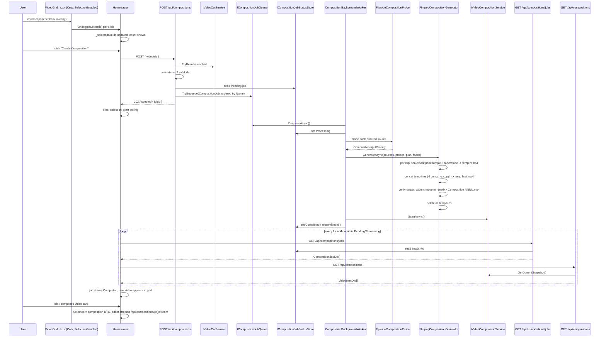

# Plan: Video Composition (Multi-Clip FFmpeg Concat)

## Table of Contents

- [Plan: Video Composition (Multi-Clip FFmpeg Concat)](#plan-video-composition-multi-clip-ffmpeg-concat)
  - [Summary](#summary)
  - [Technical Approach](#technical-approach)
  - [Component Breakdown](#component-breakdown)
  - [Dependencies](#dependencies)
  - [External / Vendor Documentation Evidence](#external--vendor-documentation-evidence)
  - [Flow](#flow)
  - [Risk Assessment](#risk-assessment)

## Summary

Add checkbox multi-select to the existing Cuts `VideoGrid.razor` instance on `Home.razor`, a "Create Composition" action that posts selected cut IDs to a new `POST /api/compositions` endpoint, a background job pipeline (`ICompositionJobQueue` → `CompositionBackgroundWorker` → `IVideoCompositionProbe`/`FfprobeCompositionProbe` → `ICompositionGenerator`/`FfmpegCompositionGenerator`) that probes, normalizes-with-fades, and concatenates the selected cuts in filename order into one H.264/AAC MP4 written to a new `<VideoComposition__Path>` root, and a new "Video Compositions" section (below Cuts) that lists both in-flight job status and finished compositions through the same `VideoGrid.razor` used everywhere else.

## Technical Approach

This plan extends four already-approved patterns from `Specs/20260903190117-video-cut-export/Plan.md` and `Specs/20260831104814-static-video-thumbnails-ffmpeg/Plan.md` rather than inventing new ones:

1. **The background-job pipeline shape**: bounded `Channel`-backed queue → single-drain `BackgroundService` → `ProcessStartInfo`/`ArgumentList`-only FFmpeg generator → atomic temp-file-then-`File.Move` publish. `ICompositionJobQueue`/`CompositionJobQueue`, `CompositionBackgroundWorker`, and `ICompositionGenerator`/`FfmpegCompositionGenerator` follow this exact shape, mirroring `ICutJobQueue`/`CutJobQueue`/`CutBackgroundWorker`/`FfmpegCutGenerator`. Unlike cuts (one FFmpeg invocation per job), a composition job runs *N* normalize invocations plus one concat invocation per job — this stays inside a single `ICompositionGenerator.GenerateAsync` call so the worker/queue shape doesn't change, only the generator's internal steps.
2. **The scan-snapshot-plus-opaque-ID pattern** (`IVideoCutService`/`VideoCutService`): a new `IVideoCompositionService`/`VideoCompositionService` walks `<VideoComposition__Path>` the same way (extension allowlist, symlink/reparse-point skip, canonical-containment check via the existing `VideoLibraryService.IsWithinRoot`), holding its own atomically-replaced opaque-ID snapshot, completely separate from the cuts and library ID spaces so a composed video can never be confused with its own source cuts.
3. **The server-owns-filesystem / client-owns-UI split** (`AGENTS.md` Coding Conventions): the browser only ever sees the selected cuts' opaque IDs (never physical/root-relative paths); all path resolution, `ffprobe`/`ffmpeg` invocation, and the new `VideoComposition` root stay server-side in `WebApp`.
4. **The shared `VideoGrid.razor` component**: rather than adding a bespoke composition-picker UI, `VideoGrid.razor` gains an opt-in selection mode (checkbox overlay + `SelectedIds`/`OnToggleSelect`) used only by the Cuts section instance on `Home.razor`, so the composed-video listing itself reuses the exact same grid component a third time (after Library and Cuts) with zero new markup for card rendering, thumbnails, or hover previews.

**New pipeline pieces this feature does introduce** (nothing in the existing codebase does full transcode/filter/concat today — only stream-copy):

- **`IVideoCompositionProbe`/`FfprobeCompositionProbe`**: a new, separate probe from the existing lightweight `IVideoDurationProbe`/`IVideoResolutionProbe` (which only ever fetch duration/width/height for grid display). This probe shells out to `ffprobe -v error -show_entries stream=width,height,r_frame_rate,codec_type,codec_name,sample_rate,channels -show_entries format=duration -of json` (or the equivalent, run once per input file) and parses width, height, duration, frame rate (`r_frame_rate`, a fraction like `30000/1001`, parsed to a `double`), video codec name, audio codec name, audio sample rate, and audio channel count into a new `CompositionInputProbe` record. A failed parse or non-zero exit fails the job at the `probe` stage (FR7/FR15).
- **Canvas/frame-rate/audio-format selection**: pure, unit-testable logic (a new `CompositionFormatPlanner` or similar) takes the ordered list of `CompositionInputProbe`s and computes: (a) target width/height = the probed dimensions of the input with the smallest `width * height` (ties broken by first-in-order, since input order is already deterministic by filename); (b) target frame rate = `Min` of all probed frame rates; (c) a fixed target audio format (48 kHz, stereo, AAC) applied uniformly regardless of source audio, since "lowest common audio format" has no single well-defined ffmpeg-native meaning across differing sample rates/channel layouts the way resolution/fps do, and a fixed common target is simpler and just as correct for the MVP goal of "produce compatible streams before joining."
- **Fade-plan calculation**: pure, unit-testable logic (a new `CompositionFadePlanner` or similar) takes each input's probed duration, its position (first/middle/last), and the configured `TransitionDuration` (`CompositionOptions.TransitionDuration`, default `TimeSpan.FromSeconds(5)`), and returns per-clip fade-in/fade-out start offsets and durations, clamping each individual fade to at most half that clip's own duration so a fade never runs past its clip's midpoint (avoids negative/overlapping fade windows on very short clips). First clip: fade-out only, positioned to end exactly at the clip's end. Middle clips: fade-in at the start, fade-out at the end. Last clip: fade-in only, positioned to start at the clip's beginning.
- **Normalize-then-concat FFmpeg strategy**: `FfmpegCompositionGenerator` runs, per ordered input, one `ffmpeg` invocation applying: `scale=w:h:force_original_aspect_ratio=decrease,pad=w:h:(ow-iw)/2:(oh-ih)/2,setsar=1,fps=<target fps>` for video plus that clip's `fade` filter(s), and `aresample=<target rate>,aformat=channel_layouts=stereo` for audio plus that clip's `afade` filter(s), each writing an independent temporary `.mp4` (H.264/AAC, since re-encoding is unavoidable once scale/pad/fade/resample are applied — no stream-copy path exists for this pipeline, unlike cuts). It then runs one final `ffmpeg -f concat -safe 0 -i <generated filelist> -c copy` invocation over the *normalized* temporary files (all now identical format, so this final concat step can safely stream-copy) to produce the temporary final output, verifies it, then atomically publishes.

**Read-write mount.** A new `VideoComposition__Path` (default `/videos-composition` in Compose) is added as a sibling to `VideoCut__Path`, bind-mounted read-write from `${VIDEO_ROOT}/VideoComposition` on the host, validated at startup by a new `VideoCompositionOptions` mirroring `VideoCutOptions` exactly (`HasConfiguredPath`/`HasAbsolutePath`/`DirectoryExists`/`DirectoryIsWritable`/`HasPositiveQueueCapacity`). Like `${VIDEO_ROOT}/Cuts`, the host folder must pre-exist before Compose can bind-mount it (documented in `Validation.md`/`.env.example`, matching the existing Cuts precedent).

**In-memory job registry.** Per the confirmed decision (job history is not persisted across restarts, matching this app's existing single-process, local-only design), a new `ICompositionJobStatusStore`/`CompositionJobStatusStore` (a simple `ConcurrentDictionary<string, CompositionJobStatus>`) records each job's id, current `CompositionJobState` (`Pending`/`Processing`/`Completed`/`Failed`), and — once resolvable — the produced composition's opaque video id or a redacted failure diagnostic. `POST /api/compositions` seeds an entry as `Pending`; `CompositionBackgroundWorker` transitions it to `Processing` on dequeue and to `Completed`/`Failed` on completion; `GET /api/compositions/jobs` reads the store directly (no I/O), so the client can poll job status independently of the folder-scan-based `GET /api/compositions` listing.

**Naming.** `CutNamingService`'s `GetPrefix` static logic is reused (made `internal static` if not already accessible, or duplicated as a one-line call into a shared static helper — no behavior fork) to extract the two-word prefix from the *first* ordered clip's file name, per the confirmed naming decision. A new `CompositionNamingService` (mirroring `CutNamingService`'s "list existing files matching `<prefix> Composition NNNN.mp4`, take `max + 1`" approach) computes `<prefix> Composition <NNNN>.mp4` against `<VideoComposition__Path>`, scoped per distinct prefix, exactly like cuts are scoped per distinct prefix in their own root.

**Frontend.** `VideoGrid.razor` gains `[Parameter] public bool SelectionEnabled`, `[Parameter] public IReadOnlySet<string> SelectedIds`, and `[Parameter] public EventCallback<string> OnToggleSelect`; when `SelectionEnabled`, each card overlays a checkbox (`position-absolute top-0 start-0 m-2`, `@onclick:stopPropagation` so checking a box doesn't also trigger `OnSelect`/open the editor) reflecting whether that card's id is in `SelectedIds`. `Home.razor` owns a `HashSet<string> _selectedCutIds` (client-only), passes `SelectionEnabled="true"` only to the Cuts grid instance, renders a "N clips selected" `
` plus a "Create Composition" `btn-primary` (disabled unless `_selectedCutIds.Count >= 2`) above that grid, and on click POSTs `{ videoIds = _selectedCutIds.ToList() }` to `/api/compositions`, clears the selection, and starts polling both `/api/compositions/jobs` and `/api/compositions` (mirroring the existing `StartCutPolling`/`PollCutsAsync` pattern) until no job remains `Pending`/`Processing`. A new "Video Compositions" section below Cuts renders the job-status list (simple Bootstrap list-group/badges keyed by job id and `CompositionJobState`) above a `<VideoGrid Items="_compositions" ...>` (no `SelectionEnabled`) for finished compositions, wired into `SelectVideo`/`VerticalVideoEditor` exactly like the Cuts grid already is, streaming from `/api/compositions/{id}/stream`.

## Component Breakdown

**Existing files to modify:**

- `docker-compose.yml` — add a third bind mount (`${VIDEO_ROOT}/VideoComposition` → `/videos-composition`, read-write) and a `VideoComposition__Path` environment variable, mirroring the existing Cuts mount block.
- `.env.example` — document that `${VIDEO_ROOT}/VideoComposition` must exist on the host before first run, matching the existing Cuts documentation.
- `WebApp/WebApp/Program.cs` — bind/validate `VideoCompositionOptions`; register `IVideoCompositionService`, `ICompositionJobQueue`, `ICompositionJobStatusStore`, `IVideoCompositionProbe`/`FfprobeCompositionProbe`, `ICompositionGenerator`/`FfmpegCompositionGenerator`, `CompositionNamingService`, `CompositionFormatPlanner`, `CompositionFadePlanner`, and `CompositionBackgroundWorker` (as `AddHostedService`).
- `WebApp/WebApp/Services/CutNamingService.cs` — expose `GetPrefix` as `internal static` (if not already) so `CompositionNamingService` can call it without duplicating the whitespace-split/two-word-take logic.
- `WebApp/WebApp/Endpoints/CutEndpoints.cs` or a new `CompositionEndpoints.cs` — new file preferred (see below) to keep composition's job-status endpoint and folder-listing endpoints together and independently testable, matching how `CutEndpoints.cs` was already split out from `VideoEndpoints.cs`.
- `WebApp/WebApp.Client/Components/VideoGrid.razor` — add `SelectionEnabled`/`SelectedIds`/`OnToggleSelect` parameters and the checkbox overlay markup described above; existing Library/Cuts usages are unaffected since the new parameters default to disabled/empty.
- `WebApp/WebApp.Client/Pages/Home.razor` — add `_selectedCutIds`, the "N clips selected" + "Create Composition" controls above the Cuts grid, `_compositions`/`_compositionJobs` state, composition polling (mirroring `StartCutPolling`/`PollCutsAsync`), and the new "Video Compositions" section below the existing Cuts section.
- `AGENTS.md` — add a new, narrowly-scoped FFmpeg authorization bullet for this composition pipeline (full transcode: scale/pad/fps/resample/fade/afade/concat, `ProcessStartInfo`/`ArgumentList`-only, fixed source roots `VIDEO_ROOT`'s Cuts subtree and `VideoComposition__Path` as its only destination), per the confirmed FFmpeg-scope decision; update the Repository Map/Architecture Summary after implementation via the `init-agent` skill, per existing project convention.

**New files to create:**

- `WebApp/WebApp/Configuration/VideoCompositionOptions.cs` — `VideoComposition__Path`/`QueueCapacity` binding/validation, mirroring `VideoCutOptions` exactly, plus a `TransitionDuration` (`TimeSpan`, default 5s) configuration value.
- `WebApp/WebApp/Models/CompositionJob.cs` — `record CompositionJob(string JobId, IReadOnlyList<VideoFileEntry> OrderedSources)`.
- `WebApp/WebApp/Models/CompositionInputProbe.cs` — `record CompositionInputProbe(int Width, int Height, TimeSpan Duration, double FrameRate, string VideoCodec, string? AudioCodec, int? AudioSampleRate, int? AudioChannels)`.
- `WebApp/WebApp/Models/CompositionFormatPlan.cs` — `record CompositionFormatPlan(int Width, int Height, double FrameRate, int AudioSampleRate, int AudioChannels)`.
- `WebApp/WebApp/Models/CompositionFadePlan.cs` — `record CompositionFadePlan(TimeSpan? FadeInStart, TimeSpan? FadeInDuration, TimeSpan? FadeOutStart, TimeSpan? FadeOutDuration)` (nulls mean "no fade of that kind for this clip").
- `WebApp/WebApp/Models/CompositionGenerationResult.cs` — mirrors `CutGenerationResult` (`Success`/`Cancelled`/`Failed(stage, diagnostic)`), with an added `stage` (`Probe`/`Normalize`/`Concat`) so failures are attributable per FR15.
- `WebApp/WebApp/Models/CompositionJobStatus.cs` — `record CompositionJobStatus(string JobId, CompositionJobState State, string? ResultVideoId, string? Diagnostic)`; `enum CompositionJobState { Pending, Processing, Completed, Failed }`.
- `WebApp/WebApp/Services/ICompositionJobQueue.cs` / `CompositionJobQueue.cs` — `Channel<CompositionJob>`-backed FIFO queue, mirroring `ICutJobQueue`/`CutJobQueue`.
- `WebApp/WebApp/Services/ICompositionJobStatusStore.cs` / `CompositionJobStatusStore.cs` — in-memory job-status registry (`ConcurrentDictionary`), read by `GET /api/compositions/jobs`, written by the endpoint (seed `Pending`) and the worker (`Processing`/`Completed`/`Failed`).
- `WebApp/WebApp/Services/IVideoCompositionProbe.cs` / `FfprobeCompositionProbe.cs` — the new `ffprobe`-based multi-field probe described above.
- `WebApp/WebApp/Services/CompositionFormatPlanner.cs` — pure canvas/frame-rate/audio-format selection logic (FR8/FR9), unit-testable without I/O.
- `WebApp/WebApp/Services/CompositionFadePlanner.cs` — pure fade-position calculation logic (FR10), unit-testable without I/O.
- `WebApp/WebApp/Services/CompositionNamingService.cs` — `<prefix> Composition <NNNN>.mp4` naming, mirroring `CutNamingService`.
- `WebApp/WebApp/Services/ICompositionGenerator.cs` / `FfmpegCompositionGenerator.cs` — per-clip normalize (scale/pad/fps/resample/fade) FFmpeg invocations, then the concat FFmpeg invocation, temp-file-then-atomic-move publish, cleanup of all per-clip temp files, `ProcessStartInfo`/`ArgumentList`-only, mirroring `FfmpegCutGenerator`'s structure/redaction pattern.
- `WebApp/WebApp/Services/CompositionBackgroundWorker.cs` — `BackgroundService` draining `ICompositionJobQueue`, updating `ICompositionJobStatusStore` at each transition, calling `IVideoCompositionService.ScanAsync()` after a successful publish, mirroring `CutBackgroundWorker`.
- `WebApp/WebApp/Services/IVideoCompositionService.cs` / `VideoCompositionService.cs` — scans `<VideoComposition__Path>` for existing compositions, holds the opaque-ID snapshot, resolves IDs to `VideoFileEntry`, mirroring `IVideoCutService`/`VideoCutService`.
- `WebApp/WebApp/Endpoints/CompositionEndpoints.cs` — `POST /api/compositions` (validate + enqueue, FR4/FR5), `GET /api/compositions/jobs` (job-status listing, FR17), `GET /api/compositions` (folder-scan DTO listing, FR18), `GET /api/compositions/{id}/stream`, `GET /api/compositions/{id}/thumbnail`, `GET /api/compositions/{id}/preview`, mirroring `CutEndpoints.cs`.
- `WebApp/WebApp.Client/Models/CreateCompositionRequest.cs` (or inline in the existing `Models` folder) — `record CreateCompositionRequest(IReadOnlyList<string> VideoIds)`.
- `WebApp/WebApp.Client/Models/CompositionJobDto.cs` — browser-safe shape of `CompositionJobStatus` for `GET /api/compositions/jobs`.

## Dependencies

- `ffmpeg` and `ffprobe` must remain on `PATH` inside the app container — already true (`Dockerfile` installs `ffmpeg`, which bundles `ffprobe`; no new package needed, and `ffprobe` is already used for duration probing today).
- The host directory `${VIDEO_ROOT}/VideoComposition` must exist before `docker compose up` can bind-mount it, the same one-time prerequisite already documented for `${VIDEO_ROOT}/Cuts`.
- No new NuGet packages or frontend libraries are introduced; everything reuses `System.Threading.Channels`, `System.Diagnostics.Process`, `System.Text.Json` (for parsing `ffprobe -of json` output, the same approach the existing duration/resolution probes already use), and the existing Bootstrap/Blazor stack.

## External / Vendor Documentation Evidence

- Not applicable for the .NET/ASP.NET Core/Blazor portions — this plan reuses existing, already-verified patterns from `Specs/20260903190117-video-cut-export/Plan.md` and `Specs/20260831104814-static-video-thumbnails-ffmpeg/Plan.md` (background services, minimal API endpoints, options validation, `ProcessStartInfo`/`ArgumentList` process invocation) without introducing new framework APIs.
- FFmpeg/ffprobe are not Microsoft technologies, so the Microsoft Learn MCP server does not apply. The `scale`/`pad`/`fps`/`fade`/`afade` filters and the `-f concat -safe 0` demuxer are standard, widely documented FFmpeg filtergraph/concat behavior; the "concat only same-format streams safely with `-c copy`" constraint that motivates this plan's normalize-then-concat-copy strategy is the same reasoning already applied informally by this codebase's existing FFmpeg generators (stream-copy only works between identical formats). No vendor-doc citation is applicable.

## Flow

## Risk Assessment

| Risk | Evidence | Mitigation |
| --- | --- | --- |
| Widening `AGENTS.md`'s FFmpeg constraint to full transcode/filter/concat is a materially larger surface than the existing stream-copy-only cut/thumbnail exceptions | `AGENTS.md` Constraints currently frames all non-thumbnail/cut FFmpeg use as out of scope | User explicitly confirmed widening scope during discovery; the new authorization stays narrowly scoped to fixed source roots (Cuts) and one destination root (`VideoComposition__Path`), invoked only from `FfmpegCompositionGenerator`/`FfprobeCompositionProbe` via `ProcessStartInfo`/`ArgumentList` — no shell strings, no arbitrary paths |
| A composition job can take several minutes across multiple clips; a crashed/restarted app loses in-memory job status for any job that was Pending/Processing at the time | Confirmed decision: no persisted job history, consistent with this app's existing single-process design | Document as an accepted MVP limitation in `Requirements.md`'s Out of Scope; a job's output file (if the worker already published it) still appears via `GET /api/compositions`'s folder scan on next request regardless of job-status loss, so a completed-but-unwitnessed job still surfaces correctly |
| Two near-simultaneous "Create Composition" clicks whose first selected clip shares the same two-word prefix could compute the same next `NNNN` before either publishes | Same class of race already accepted for `CutNamingService` in `Specs/20260903190117-video-cut-export/Plan.md` | Same mitigation: `CompositionNamingService` computes the name immediately before writing (inside the generator, not the endpoint), and jobs drain strictly sequentially through the single `CompositionBackgroundWorker`, so no two compositions can compute a name from the same directory listing concurrently |
| A very short clip (shorter than `2 * TransitionDuration`) could otherwise get overlapping/negative-duration fade windows | New fade-planning logic introduced by this feature, unlike cuts (no fades) | `CompositionFadePlanner` clamps each fade to at most half the clip's own duration, verified by dedicated unit tests including a sub-1-second clip case |
| Selecting a very low-resolution/oddly-shaped cut (e.g. accidentally cut to a tiny region) as one of the inputs forces the whole composition down to that canvas, surprising the user | Confirmed MVP rule: "lowest resolution among selected clips becomes the canvas, never upscale" | Documented as expected MVP behavior in Requirements/FR8; out of scope to add a canvas-override UI for this MVP |
| Re-encoding (unlike the existing stream-copy-only cut pipeline) is CPU/time-intensive and could starve the single-drain worker if many compositions are queued back-to-back | New to this feature; existing pipelines only ever stream-copy or produce one small JPEG | Single sequential worker (matching existing pattern) bounds concurrency to one FFmpeg render at a time; jobs simply queue and show Pending, consistent with how the existing bounded queue already handles backpressure for thumbnails/cuts |
