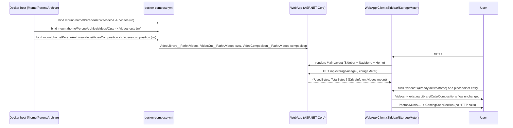

# Plan: PereneArchive NAS Rebrand (Sidebar + Auto-Configured Storage Root)

## Table of Contents

- [Summary](#summary)
- [Technical Approach](#technical-approach)
- [Component Breakdown](#component-breakdown)
- [Dependencies](#dependencies)
- [External / Vendor Documentation Evidence](#external--vendor-documentation-evidence)
- [Flow](#flow)
- [Risk Assessment](#risk-assessment)

## Summary

Point the existing Docker Compose bind mounts at a fixed `/home/PereneArchive` host root (with `videos/`, `videos/Cuts`, `videos/VideoComposition` subpaths) so no operator configuration is required, and add a new persistent left-sidebar layout region (Yandex Disk–style) with one fully wired "Videos" destination and eight presentation-only placeholder destinations, reusing the existing Bootstrap/`app.css` design-system contract end to end.

## Technical Approach

**Storage root (FR1–FR5).** The app never manipulates `VIDEO_ROOT` itself — it is purely a `docker-compose.yml` build-time/run-time host path fed into `VideoLibrary__Path`, `VideoCut__Path`, `VideoComposition__Path` env vars, validated at startup by the existing `VideoLibraryOptions`/`VideoCutOptions`/`VideoCompositionOptions` (`WebApp/WebApp/Configuration/`). Those options classes already validate "absolute, existing, readable/writable" without caring what the path *is*, so no C# changes are needed there. The only change is in `docker-compose.yml`: replace the `${VIDEO_ROOT:?VIDEO_ROOT is required...}` interpolation (which currently hard-fails without a `.env`) with `${VIDEO_ROOT:-/home/PereneArchive}`, and change the three bind-mount `source:` values from `${VIDEO_ROOT}`, `${VIDEO_ROOT}/Cuts`, `${VIDEO_ROOT}/VideoComposition` to `${VIDEO_ROOT}/videos`, `${VIDEO_ROOT}/videos/Cuts`, `${VIDEO_ROOT}/videos/VideoComposition`. `.env.example` is updated to describe `VIDEO_ROOT` as optional (default `/home/PereneArchive`) and to describe the expected `videos/{Cuts,VideoComposition}` subfolder shape instead of instructing folder creation at the old root. Per explicit instruction, the operator moves existing video/cut/composition files into this layout by hand before this spec is implemented — no migration script or startup migration code is added; this plan only needs the app to work correctly once those files already exist at the new paths (validated by FR5's manual test in `Validation.md`).

**Sidebar (FR6, FR9).** This follows the same layering already used by `MainLayout.razor` (server-rendered, non-interactive shell) plus `NavMenu.razor` (existing top nav). A new server-rendered `WebApp/WebApp/Components/Layout/Sidebar.razor` is added and composed into `MainLayout.razor` alongside `NavMenu`, using plain `<NavLink>`/`<a>` anchors (no interactivity required — this is standard Blazor routing, not app state), consistent with `NotFoundPage`/`Router` already resolving routes via `WebApp.Client._Imports`. The sidebar reuses the exact visual pattern the design guide itself already demonstrates for its own in-page navigation (`design-guide-en.html`'s `.sidebar`/`.nav-pills`/`.nav-link`/`.grp` rules) and the already-themed global `.list-group` tokens in `app.css` (`--bs-list-group-active-bg`, `--bs-list-group-action-hover-bg`, etc.) — those CSS custom properties already resolve to the correct dark/light palette, so the sidebar needs only a small new scoped stylesheet (`Sidebar.razor.css`) for the fixed-width rail geometry and active-item affordance, not new tokens. Bootstrap Icons (`bi-collection-play` for Videos, `bi-image` for Photos, `bi-music-note-beamed` for Music, `bi-file-earmark-text` for Documents, `bi-download` for Downloads, `bi-people` for Shared, `bi-house-heart` for Family, `bi-clock-history` for History, `bi-trash3` for Trash) are used exactly as the existing icon-button accessibility contract requires (`currentColor`, accessible name via link text, visible focus via existing `:focus-visible` rule in `app.css`, 40×40px minimum target). Active-route styling uses Blazor's built-in `NavLink` `active` class (same mechanism `.sidebar .nav-pills .nav-link.active` in the design guide already targets), satisfying FR9 without new JS.

**Mobile top tab bar (FR10).** Below Bootstrap's `md` breakpoint, `Sidebar.razor` renders the identical 9 `NavLink` entries as a single horizontally-scrollable row instead of a vertical rail — matching the Yandex Disk mobile reference (one line of tabs, e.g. NEWEST/FILES/PHOTO/ALBUMS/SHARED ACCESS/FAMILY, scrollable left-to-right, no wrapping). This is done with plain Bootstrap utilities (`d-md-none`/`d-none d-md-flex` to swap between the two layouts, `d-flex flex-nowrap overflow-x-auto` for the scrollable row, `text-nowrap` per item) plus the same `Sidebar.razor.css` file for the rail-vs-tabbar geometry — both layouts share one `NavLink` list markup fragment (a small `@{ }` render fragment inside `Sidebar.razor`) so active-state/keyboard-navigation logic is never duplicated between desktop and mobile.

**Videos destination (FR7).** No change to `Home.razor`'s content or the `/` route — it keeps rendering the existing Library/Cuts/Video Compositions experience unchanged. The sidebar's "Videos" entry is simply a `NavLink` to `/`.

**Placeholder destinations (FR8).** A single reusable `WebApp/WebApp.Client/Components/ComingSoonSection.razor` component (parameters: `Icon`, `Title`, `Message`) renders the same empty-state visual pattern `VideoGrid.razor` already uses for its `NotLoaded`/`Empty` states (icon + heading + message inside a `.card`), so no new empty-state pattern is invented. Eight thin pages under `WebApp/WebApp.Client/Pages/` (`Photos.razor`, `Music.razor`, `Documents.razor`, `Downloads.razor`, `Shared.razor`, `Family.razor`, `History.razor`, `Trash.razor`) each `@page` a distinct route (`/photos`, `/music`, `/documents`, `/downloads`, `/shared`, `/family`, `/history`, `/trash`) and render `<ComingSoonSection>` with their own icon/title/message — no data fetching, no HTTP calls, no FFmpeg, no filesystem access, satisfying the NFR that these are presentation-only. These pages can render statically (no `@rendermode` directive needed, matching how `NotFound.razor`/`Error.razor` are already static server components) since they have zero interactive state.

**Storage usage (FR10, FR11).** A new minimal endpoint follows the existing `MapVideoEndpoints`/`MapCutEndpoints`/`MapCompositionEndpoints` pattern in `WebApp/WebApp/Endpoints/`: a new `MapStorageEndpoints` (`WebApp/WebApp/Endpoints/StorageEndpoints.cs`) exposes `GET /api/storage/usage`, backed by a small `IStorageUsageService`/`StorageUsageService` (`WebApp/WebApp/Services/`) that calls `System.IO.DriveInfo` (or `GetDiskFreeSpaceEx`-equivalent cross-platform API) against the configured `VideoLibraryOptions.Path`'s root drive/mount to compute used/total bytes — no directory enumeration, no filenames, satisfying the "no new data-exposure surface" NFR. It returns a new browser-safe `StorageUsageDto` (`WebApp/WebApp.Client/Models/`) with only `UsedBytes`/`TotalBytes`, following the existing DTO convention (`VideoItemDto`, `CompositionJobDto`) of keeping browser-visible models in `WebApp.Client/Models/`. The sidebar (or a small child `StorageMeter.razor`) fetches this once on load via `HttpClient` — this requires the sidebar's storage-meter piece to be an interactive island; the simplest approach consistent with existing patterns is giving just that meter fragment its own small interactive component (`WebApp.Client/Components/StorageMeter.razor`, `@rendermode InteractiveWebAssembly`) embedded in the otherwise-static `Sidebar.razor`, the same island-of-interactivity approach `Home.razor` already uses for the rest of the app. Branding text (`App.razor` `<title>`, `NavMenu.razor` brand mark/name, `Sidebar.razor` header) is updated from "Perene Tech Videos" to the **PereneArchive** product identity per the Requirements' [Branding](Requirements.md#branding) rules and FR12: the brand icon becomes `bi-archive` (replacing `bi-aspect-ratio` in `NavMenu.razor`), the brand name text is wrapped in the existing `.h5`/`<strong>` element which already inherits `--font-family-title` (Zilla Slab) from `app.css`'s heading rule (`h1, h2, h3, h4, h5, h6, .card-title { font-family: var(--font-family-title); }`) — confirmed applicable since `NavMenu.razor`'s brand mark already uses `class="h5"` — so no new CSS rule is needed, only correct element/class reuse, and an optional secondary "Perene Tech" byline (if added) stays in the existing `<small class="text-body-secondary">` element, which already resolves to the Montserrat body font, keeping the company name visually subordinate to the product mark. This is done without touching `.NET` project/namespace/solution identifiers, per the explicit out-of-scope boundary.

This design follows the codebase's established client/server separation (server owns filesystem/config/disk-usage logic behind a service+endpoint; client owns Razor rendering and DTO consumption), keeps each new responsibility in its own small file (one placeholder page per route, one service for disk usage, one component for the sidebar and one for the storage meter) rather than a large multi-purpose layout or endpoint file, and introduces no new runtime package, frontend framework, or infrastructure — `DriveInfo` is part of the base class library already available to `WebApp`.

## Component Breakdown

**Existing files to modify:**

- `docker-compose.yml` — default `VIDEO_ROOT` to `/home/PereneArchive`; change the three bind-mount sources to `${VIDEO_ROOT}/videos`, `${VIDEO_ROOT}/videos/Cuts`, `${VIDEO_ROOT}/videos/VideoComposition`.
- `.env.example` — document `VIDEO_ROOT` as optional with the `/home/PereneArchive` default and the `videos/{Cuts,VideoComposition}` layout; drop the old "create Cuts/VideoComposition folders" instructions in favor of describing the already-populated PereneArchive layout.
- `WebApp/WebApp/Components/Layout/MainLayout.razor` — add the new `<Sidebar />` region alongside the existing header/`<NavMenu />`, restructuring into a sidebar + content flex layout.
- `WebApp/WebApp/Components/Layout/NavMenu.razor` — update brand text from "Perene Tech Videos"/"Local reframing workspace" to the PereneArchive identity, swap the brand icon from `bi-aspect-ratio` to `bi-archive` (top bar stays for the private/local badge and theme toggle).
- `WebApp/WebApp/Components/App.razor` — update `<title>` from "Perene Tech Videos" to "PereneArchive".
- `WebApp/WebApp/Program.cs` — register `IStorageUsageService`/`StorageUsageService` in DI and call the new `MapStorageEndpoints` alongside the existing `MapVideoEndpoints`/`MapCutEndpoints`/`MapCompositionEndpoints` registrations.
- `WebApp/WebApp.Client/Pages/Home.razor` — update the header copy ("Perene Tech Videos · local library") to the PereneArchive identity; no structural/behavioral change.

**New files to create:**

- `WebApp/WebApp/Components/Layout/Sidebar.razor` (+ `Sidebar.razor.css`) — the persistent left rail: brand/logo, primary nav list (Videos + 8 placeholders) using `NavLink`, and the embedded `<StorageMeter />`.
- `WebApp/WebApp.Client/Components/StorageMeter.razor` — small interactive island that fetches `GET /api/storage/usage` once and renders a Bootstrap progress bar with used/total labels; graceful fallback (hidden or "Unavailable") on fetch failure.
- `WebApp/WebApp.Client/Components/ComingSoonSection.razor` — reusable empty-state card (`Icon`, `Title`, `Message` parameters), mirroring `VideoGrid.razor`'s existing empty-state markup pattern.
- `WebApp/WebApp.Client/Pages/Photos.razor`, `Music.razor`, `Documents.razor`, `Downloads.razor`, `Shared.razor`, `Family.razor`, `History.razor`, `Trash.razor` — one thin routed page per placeholder destination, each rendering `<ComingSoonSection>` with its own copy/icon.
- `WebApp/WebApp/Services/IStorageUsageService.cs` / `StorageUsageService.cs` — wraps `DriveInfo` lookup for the configured video-library mount's used/total bytes.
- `WebApp/WebApp/Endpoints/StorageEndpoints.cs` — `MapStorageEndpoints` exposing `GET /api/storage/usage`.
- `WebApp/WebApp.Client/Models/StorageUsageDto.cs` — `{ long UsedBytes, long TotalBytes }` browser-safe DTO.

## Dependencies

- The host must already have `/home/PereneArchive/videos` (and, before implementation is exercised end-to-end, `/home/PereneArchive/videos/Cuts` and `/home/PereneArchive/videos/VideoComposition`) present and populated by the operator's manual move — this is a precondition, not something this spec automates.
- No new NuGet packages, npm packages, or system packages are required; `System.IO.DriveInfo` is part of the .NET base class library already referenced by `WebApp`.
- Existing Docker Compose / `Makefile` workflow is unchanged; `make docker-run` remains the way to exercise this.

## External / Vendor Documentation Evidence

- Not applicable in the sense of introducing a new vendor technology — this plan reuses `System.IO.DriveInfo` (already part of the referenced .NET base class library) and Blazor's existing `NavLink`/routing/`@rendermode` mechanisms, all already in active use elsewhere in this codebase (e.g. `InteractiveWebAssemblyRenderMode` in `Home.razor`, `NavLink`-style routing conventions implied by `Router`/`RouteView` in `Routes.razor`). No new ASP.NET Core/Blazor API surface requiring fresh Microsoft Learn verification is introduced.

## Flow

## Risk Assessment

| Risk | Evidence | Mitigation |
| --- | --- | --- |
| Changing `docker-compose.yml`'s required `VIDEO_ROOT` to a defaulted value could silently point at the wrong host folder for an operator who forgets `.env` entirely on a shared/CI host. | `docker-compose.yml` currently uses `${VIDEO_ROOT:?...}` specifically to fail loudly if unset. | Keep the same fail-loud behavior for anyone who *does* set an incorrect/nonexistent path — `VideoLibraryOptions`' existing startup validation (`DirectoryExists`/`DirectoryIsReadable`) still fails fast if `/home/PereneArchive/videos` doesn't exist, so misconfiguration is still caught at boot, just with a friendlier zero-config default for the common case. |
| Relocating Cuts/VideoComposition to nest under `videos/` instead of the old root changes the on-disk relationship existing operators may have scripts/backups pointing at. | `VideoCutOptions`/`VideoCompositionOptions` only validate the path is absolute/existing/writable, not its relationship to the video root — `IsDisjointFromVideoRoot` logic exists only for `ThumbnailCacheOptions`, not Cuts/Composition. | Document the new nested layout explicitly in `.env.example` and `AGENTS.md`; this is a one-person local NAS per the existing "local-only by design" constraint, and the operator has already agreed to move files manually. |
| A new `GET /api/storage/usage` endpoint could inadvertently leak path information via error messages or by resolving the wrong mount. | Constraint: "No physical or root-relative filesystem paths may ever be exposed to the browser." | `StorageUsageService` returns only `{UsedBytes, TotalBytes}` numeric fields, never the resolved path; any failure returns a generic 200/`null` state the client renders as "Unavailable," never an exception detail. |
| Adding a second interactive-WebAssembly island (`StorageMeter`) alongside `Home.razor`'s existing one could increase initial WASM payload/startup complexity if implemented as a separate render boundary. | `Home.razor` is the only current `@rendermode InteractiveWebAssembly` component; `NavMenu`/`MainLayout` are otherwise static server components. | Keep `StorageMeter` intentionally tiny (one fetch, one progress bar) and reuse the same `WebApp.Client` assembly already loaded for `Home.razor`, so no additional assembly/download is introduced — only an additional render boundary within the already-loaded client app. |
