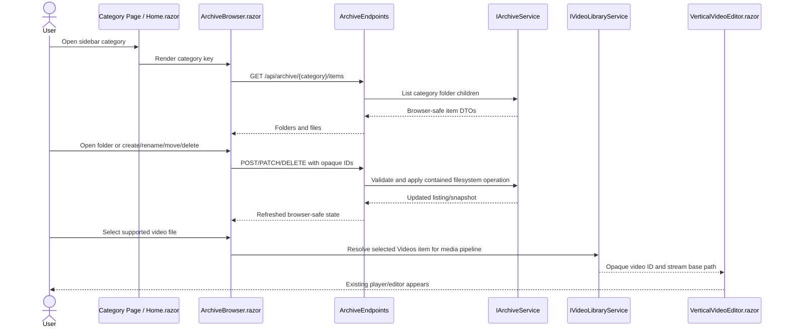

# Plan: Archive Folder Manager

## Table of Contents

- [Summary](#summary)
- [Technical Approach](#technical-approach)
- [Component Breakdown](#component-breakdown)
- [Dependencies](#dependencies)
- [External / Vendor Documentation Evidence](#external--vendor-documentation-evidence)
- [Flow](#flow)
- [Risk Assessment](#risk-assessment)

## Summary

Implement a category-scoped archive manager on top of the existing Blazor Web App and server-owned filesystem boundary. The design extends the current options/services/minimal-endpoint/client-component pattern instead of exposing static filesystem roots or host paths.

## Technical Approach

Add an `ArchiveRootOptions` configuration section that points at the mounted archive root, replacing the current assumption that `VideoLibrary:Path` is the top-level Videos folder. `docker-compose.yml` should mount `${VIDEO_ROOT}` at a fixed internal path such as `/archive`, keep the app loopback-only, and configure category-specific server options from that root. The existing writable cut and composition paths may continue as separate binds or be mapped to contained folders under `/archive/Videos/Cuts` and `/archive/Videos/VideoComposition` if containment and write requirements stay explicit.

Create a focused archive service layer in `WebApp/WebApp/Services/` that owns category definitions, snapshot/listing, ID resolution, containment checks, folder creation, rename, move, and soft-delete. This should follow the established `IVideoLibraryService` pattern: server-only physical paths, canonical containment checks like `VideoLibraryService.IsWithinRoot`, opaque browser identifiers, stable in-memory snapshots for currently listed folders, and narrowly scoped DTOs in `WebApp/WebApp.Client/Models/`.

Add archive minimal endpoints under a new `WebApp/WebApp/Endpoints/ArchiveEndpoints.cs`. Routes should use stable category keys such as `/api/archive/{category}/items`, plus opaque item IDs for operations. Endpoint handlers return browser-safe DTOs only, map validation failures to `400`, forbidden/default-folder operations to `403` or `400`, missing stale IDs to `404`, and transient filesystem failures to `409` or `500` depending on whether the user can retry.

Refactor the client pages so each sidebar category uses a shared archive browser component. `Home.razor` remains the Videos page but gains folder navigation and passes selected video files into `VerticalVideoEditor.razor` using the existing `api/videos/{id}/stream` style where practical. Placeholder pages such as `Photos.razor`, `Music.razor`, `Documents.razor`, `Books.razor`, `Downloads.razor`, `Shared.razor`, `Family.razor`, `History.razor`, and `Trash.razor` should render the same browser component with their category key and label. Folder tiles use Bootstrap cards/buttons and the required `bi-folder-fill` icon with names below the icon.

Video behavior should be adapted carefully. Either `VideoLibraryService` becomes category/folder-aware for the Videos category, or a new archive-video adapter resolves selected video file IDs into the existing thumbnail, hover-preview, stream, A/B cut, and composition flows. The selected design must keep physical paths server-only and must not weaken snapshot authorization. Non-video categories do not gain preview/playback in this spec.

Soft delete moves non-default files/folders into the top-level Trash folder. To avoid collisions and preserve some origin context without exposing it, the server should generate safe destination names when needed, for example appending a timestamp or counter. Permanent deletion and emptying Trash remain excluded.

The UI should stay within the current design system: Bootstrap components and utilities first, Bootstrap Icons for actions and folder tiles, existing `app.css` tokens, accessible names on icon controls, live regions for operation status, and responsive grid behavior similar to `VideoGrid.razor` but generalized for folders/files.

## Component Breakdown

**Existing files to modify:**

- `docker-compose.yml` - mount `${VIDEO_ROOT}` as the archive root and update environment variables for archive, video, cut, and composition paths.
- `.env.example` - document that `VIDEO_ROOT` points to the parent archive folder containing default category folders.
- `WebApp/WebApp/Program.cs` - register archive options, services, and endpoints.
- `WebApp/WebApp/Configuration/VideoLibraryOptions.cs` - either retarget Videos to the archive Videos category or defer to new archive options.
- `WebApp/WebApp/Services/VideoLibraryService.cs` - make video discovery folder-aware or integrate with archive item resolution while preserving supported-extension filtering and opaque IDs.
- `WebApp/WebApp/Endpoints/VideoEndpoints.cs` - adjust scan/list/stream behavior if Videos is no longer a flat recursive scan from `/videos`.
- `WebApp/WebApp/Endpoints/StorageEndpoints.cs` and `WebApp/WebApp/Services/StorageUsageService.cs` - report archive-root storage instead of only the video root.
- `WebApp/WebApp.Client/Layout/Sidebar.razor` - keep the current category list while aligning labels/keys with archive categories.
- `WebApp/WebApp.Client/Pages/Home.razor` - replace top-level video listing with Videos archive navigation and preserve player/editor behavior for selected video files.
- `WebApp/WebApp.Client/Pages/Photos.razor`, `Music.razor`, `Documents.razor`, `Books.razor`, `Downloads.razor`, `Shared.razor`, `Family.razor`, `History.razor`, `Trash.razor` - replace placeholder content with shared archive browser usage.
- `WebApp/WebApp/wwwroot/app.css` - add only shared archive UI tokens/utility mappings that Bootstrap cannot express.
- `WebApp.Tests/Services/VideoLibraryServiceTests.cs` and `WebApp.Tests/Endpoints/VideoEndpointsTests.cs` - update video expectations for folder-scoped browsing where needed.

**New files to create:**

- `WebApp/WebApp/Configuration/ArchiveRootOptions.cs` - validates the archive root and expected default folders.
- `WebApp/WebApp/Models/ArchiveCategory.cs` - defines route key, display label, physical folder name, icon, and CRUD capabilities.
- `WebApp/WebApp/Models/ArchiveItemEntry.cs` - server-only snapshot entry with physical path, type, category, parent identity, name, size, and timestamps.
- `WebApp/WebApp/Services/IArchiveService.cs` - listing and CRUD contract.
- `WebApp/WebApp/Services/ArchiveService.cs` - canonicalized filesystem implementation.
- `WebApp/WebApp/Endpoints/ArchiveEndpoints.cs` - browser-safe list and CRUD minimal APIs.
- `WebApp/WebApp.Client/Models/ArchiveItemDto.cs` - browser-safe folder/file item contract.
- `WebApp/WebApp.Client/Models/CreateFolderRequest.cs`, `RenameArchiveItemRequest.cs`, `MoveArchiveItemRequest.cs` - request DTOs with validation-friendly shapes.
- `WebApp/WebApp.Client/Components/ArchiveBrowser.razor` - shared category browser with breadcrumb, toolbar, grid/list, states, and CRUD controls.
- `WebApp/WebApp.Client/Components/ArchiveItemGrid.razor` - reusable folder/file tiles if `ArchiveBrowser.razor` becomes too large.
- `WebApp.Tests/Services/ArchiveServiceTests.cs` - category, containment, validation, CRUD, Trash behavior.
- `WebApp.Tests/Endpoints/ArchiveEndpointsTests.cs` - browser-safe contracts and HTTP status behavior.
- `WebApp.Tests/Client/ArchiveBrowserTests.cs` - route/page markup and design-system smoke tests where practical.

## Dependencies

- Docker Compose remains the only supported run/test environment via `make docker-run`, `make docker-run-bg`, and `make test`.
- The host archive must contain or allow creation of default folders under `${VIDEO_ROOT}`: `Videos`, `Pictures`, `Music`, `Documents`, `Books`, `Downloads`, `Shared`, `Family`, `History`, and `Trash`.
- No new runtime package is required unless implementation proves built-in validation insufficient; prefer existing .NET and Blazor APIs first.

## External / Vendor Documentation Evidence

- Microsoft Learn, "Call a web API from ASP.NET Core Blazor" (`https://learn.microsoft.com/aspnet/core/blazor/call-web-api?view=aspnetcore-10.0`) confirms the existing Blazor WebAssembly client can call server APIs through `HttpClient` with the app base address, matching the current component-to-minimal-API pattern.
- Microsoft Learn, "ASP.NET Core Blazor forms validation" (`https://learn.microsoft.com/aspnet/core/blazor/forms/validation?view=aspnetcore-10.0`) supports using Blazor form validation and optional remote validation against Minimal APIs for create/rename/move forms.
- Microsoft Learn, "Validation in ASP.NET Core" (`https://learn.microsoft.com/aspnet/core/fundamentals/validation?view=aspnetcore-10.0`) and ".NET 10 Minimal APIs validation support" (`https://learn.microsoft.com/aspnet/core/release-notes/aspnetcore-10.0?view=aspnetcore-10.0#minimal-apis`) document Minimal API validation support via `AddValidation`; use manual validation if adding validation services would be broader than this feature needs.
- Microsoft Learn, "Route handlers in Minimal API apps" (`https://learn.microsoft.com/aspnet/core/fundamentals/minimal-apis/route-handlers?view=aspnetcore-10.0`) documents route parameters and catch-all route behavior; the implementation should prefer category keys plus opaque IDs instead of catch-all physical-like paths.

## Flow

## Risk Assessment

| Risk | Evidence | Mitigation |
| --- | --- | --- |
| Host path exposure | Existing tests assert video APIs do not expose root paths or nested directory names. | Keep physical paths in server-only entries; return category keys, names, IDs, and metadata only; add endpoint tests that search JSON for temp root paths. |
| Escaping category roots | New CRUD can write/move files, unlike the current mostly read-only video scan. | Canonicalize every source and destination path; reuse separator-aware containment checks; reject reparse points for traversal operations. |
| Default folder damage | The user explicitly does not want default folders changed from the web UI. | Model default categories as immutable roots and reject CRUD when the target is a category root. |
| Trash collisions | Soft-delete moves items from many folders into one Trash root. | Generate unique destination names and test repeated deletes of same-named files/folders. |
| Video pipeline regression | Current thumbnail, hover preview, cut, and composition flows assume a configured Videos root. | Adapt `VideoLibraryService` deliberately and preserve opaque snapshot authorization; keep existing video endpoint tests updated. |
| Compose mount broadens write access | Mounting `${VIDEO_ROOT}` gives the app visibility across all categories. | Keep local-only binding, validate exact category allowlist, avoid static file serving, and constrain writes to allowed category operations. |
