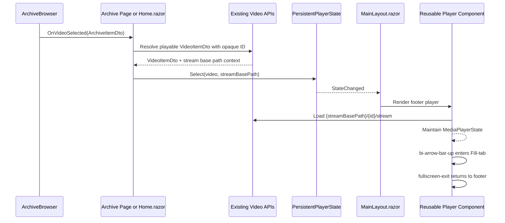

# Plan: Persistent Footer Player

## Table of Contents

- [Summary](#summary)
- [Technical Approach](#technical-approach)
- [Component Breakdown](#component-breakdown)
- [Dependencies](#dependencies)
- [External / Vendor Documentation Evidence](#external--vendor-documentation-evidence)
- [Flow](#flow)
- [Risk Assessment](#risk-assessment)

## Summary

Refactor the existing page-owned `VerticalVideoEditor.razor` into a reusable layout-hosted player that is driven by shared client-side state. The plan follows the current Blazor WebAssembly component pattern: routed pages publish opaque video selections, while `MainLayout.razor` renders the persistent footer player and preserves the existing Fill-tab implementation.

## Technical Approach

Create a focused client-side player state service in `WebApp/WebApp.Client` and register it as scoped in `WebApp/WebApp.Client/Program.cs`. The service owns the current selected `VideoItemDto`, stream base path, and display mode, and exposes a change event so `MainLayout.razor` can rerender the persistent player when a page selects media. This follows the existing client-owned application shell boundary documented in `AGENTS.md`; no server filesystem logic moves into the browser.

Move selection ownership out of `WebApp/WebApp.Client/Pages/Home.razor`. `Home.razor` should still resolve selected archive files into browser-safe `VideoItemDto`s through `POST /api/videos/scan`, `GET /api/cuts`, and `GET /api/compositions`, but it should call the player state service instead of rendering `VerticalVideoEditor.razor` inline. Cuts and compositions keep their existing grids, polling, and selected-card styling by comparing against the shared selected ID and stream base path.

Split the current `VerticalVideoEditor.razor` responsibilities into reusable player presentation pieces. The browser media element, `MediaPlayerState`, `FillTabState`, `VideoFrameState`, `SaturationState`, JS interop, and cut-save command behavior remain together in one reusable player component so the active `<video>` element is not recreated by normal page navigation. Add a footer mode for the mini player and keep the existing fixed full-tab mode for expanded playback. The mini mode shows a small video preview and metadata on the side, then the existing control layout adapted for the footer. Fill-tab mode enables crop dragging and saturation controls; footer mode hides them.

Keep `MediaPlayerControls.razor` as the shared control renderer. Add parameters for compact/footer layout and for the expand icon/action, using Bootstrap Icons and accessible labels. Existing A/B loop and Save Cut controls remain visible in the footer when the selected video is eligible for `/api/videos/{id}/cuts`; if the selected item comes from cuts or compositions and cut export is not supported, Save Cut must be disabled or hidden with clear state semantics.

Update `ArchiveBrowser.razor` so any archive-backed page can select a supported video file. The Videos category continues to resolve through `api/videos` so Save Cut remains available. Other categories publish a browser-safe `VideoItemDto` derived from `ArchiveItemDto` and stream through a new narrow archive video endpoint.

Add `GET /api/archive/{category}/items/{id}/stream` to `ArchiveEndpoints.cs`, backed by a focused `IArchiveService.TryResolveVideo` method. This endpoint must resolve only existing category-scoped opaque archive IDs, reject non-video files, stream only the existing supported extensions, and never return physical/root-relative paths.

Update layout styling in `WebApp/WebApp.Client/Layout/MainLayout.razor`, `WebApp/WebApp/wwwroot/app.css`, and narrowly scoped player CSS so the footer overlays the app container in a controlled way. The footer appears only when a video is selected and adds enough bottom padding to scrollable content to keep controls from covering important UI. Use Bootstrap utilities for layout where possible; reserve component CSS for player geometry, media overlay behavior, and responsive footer constraints.

## Component Breakdown

**Existing files to modify:**

- `WebApp/WebApp.Client/Program.cs` - register the scoped player state service.
- `WebApp/WebApp.Client/Layout/MainLayout.razor` - render the persistent footer player outside `@Body` and subscribe to player state changes.
- `WebApp/WebApp.Client/Pages/Home.razor` - remove inline `VerticalVideoEditor.razor`, publish selections to shared player state, and keep cuts/composition grid behavior.
- `WebApp/WebApp.Client/Pages/Music.razor` - wire archive video selection into the shared player where the page uses `ArchiveBrowser`.
- `WebApp/WebApp.Client/Pages/Documents.razor` - wire archive video selection into the shared player where the page uses `ArchiveBrowser`.
- `WebApp/WebApp.Client/Pages/Downloads.razor` - wire archive video selection into the shared player where the page uses `ArchiveBrowser`.
- `WebApp/WebApp.Client/Pages/Shared.razor` - wire archive video selection into the shared player where the page uses `ArchiveBrowser`.
- `WebApp/WebApp.Client/Pages/Family.razor` - wire archive video selection into the shared player where the page uses `ArchiveBrowser`.
- `WebApp/WebApp.Client/Pages/Trash.razor` - wire archive video selection into the shared player where the page uses `ArchiveBrowser`.
- `WebApp/WebApp.Client/Components/ArchiveBrowser.razor` - keep folder/file activation behavior and expose video file selections consistently through `OnVideoSelected`.
- `WebApp/WebApp.Client/Components/VerticalVideoEditor.razor` - refactor into a reusable player that supports footer and Fill-tab modes from shared state.
- `WebApp/WebApp.Client/Components/VerticalVideoEditor.razor.css` - scope crop/saturation styles to full mode and add footer preview geometry only where Bootstrap cannot express it.
- `WebApp/WebApp.Client/Components/MediaPlayerControls.razor` - add footer layout and expand-button support while preserving existing callback-driven controls.
- `WebApp/WebApp.Client/Components/MediaPlayerControls.razor.css` - adapt controls for compact footer width and existing Fill-tab layout.
- `WebApp/WebApp/wwwroot/app.css` - add global layout accommodation for the visible player footer using existing design tokens.
- `WebApp/WebApp/Endpoints/ArchiveEndpoints.cs` - add the narrow archive video stream endpoint for non-Videos category playback.
- `WebApp/WebApp/Services/IArchiveService.cs` - expose category-scoped video resolution.
- `WebApp/WebApp/Services/ArchiveService.cs` - resolve supported video files by opaque archive ID without exposing paths.
- `WebApp.Tests/Endpoints/ArchiveEndpointsTests.cs` - cover archive video streaming and non-video rejection.

**New files to create:**

- `WebApp/WebApp.Client/Services/PersistentPlayerState.cs` - scoped state container for selected video, source kind, stream base path, and change notifications.
- `WebApp.Tests/Client/PersistentPlayerStateTests.cs` - state-selection and reset behavior tests following existing client state-model tests.

## Dependencies

- Existing Blazor WebAssembly client project and global Interactive WebAssembly render mode.
- Existing video stream endpoints: `api/videos/{id}/stream`, `api/cuts/{id}/stream`, and `api/compositions/{id}/stream`.
- New archive video stream endpoint: `api/archive/{category}/items/{id}/stream`.
- Existing `videoEditor.js` JS interop module for media commands and Fill-tab lifecycle.
- Existing Docker Compose test workflow via `make test`.
- No new runtime packages, frontend libraries, server services, or external infrastructure.

## External / Vendor Documentation Evidence

- Microsoft Learn, "ASP.NET Core Blazor state management overview" (`https://learn.microsoft.com/aspnet/core/blazor/state-management/?view=aspnetcore-10.0`) - supports using scoped app state services for app-wide state and notes that components receiving external service notifications should render through `InvokeAsync`.
- Microsoft Learn, "ASP.NET Core Blazor cascading values and parameters" (`https://learn.microsoft.com/aspnet/core/blazor/components/cascading-values-and-parameters?view=aspnetcore-10.0`) - confirms root-level cascading values and granular notifying state are valid for interactive components, while warning against one large global state object. The implementation should keep the player state focused only on persistent media selection.
- Microsoft Learn, "ASP.NET Core Blazor data binding" (`https://learn.microsoft.com/aspnet/core/blazor/components/data-binding?view=aspnetcore-10.0`) - reinforces parent/child callback and controlled state update patterns, which matches keeping `MediaPlayerControls.razor` callback-driven rather than letting it mutate parent state directly.

## Flow

## Risk Assessment

| Risk | Evidence | Mitigation |
| --- | --- | --- |
| Navigation recreates the video element and loses playback | The current player is rendered inside `Home.razor`, so page changes dispose it. | Render the player from `MainLayout.razor` outside `@Body` and keep selected media in a scoped client service. |
| Broad shared state causes unnecessary rerenders | Microsoft Learn warns that large notifying cascading values can rerender too much. | Keep `PersistentPlayerState` focused only on media selection and player visibility, leaving archive listings local to pages. |
| Footer blocks page content | The requested UI overlays the app container like Plex. | Add bottom layout accommodation only while visible and test desktop/mobile scrolling manually. |
| Cut export appears for unsupported sources | Current Save Cut posts to `api/videos/{id}/cuts`, which only applies to library videos. | Track source kind/stream base path and disable or hide Save Cut for cuts/compositions unless future endpoints support it. |
| Fill-tab cleanup regresses | `VerticalVideoEditor.razor` currently owns JS cleanup and Escape handling. | Preserve `FillTabState`, `DotNetObjectReference`, and `videoEditor.js` lifecycle inside the reusable player component. |
| Physical paths leak through generalized archive selection | The repository explicitly forbids exposing physical/root-relative paths. | Use category-scoped opaque archive IDs and stream from `ArchiveEndpoints.cs` without returning path data. |
