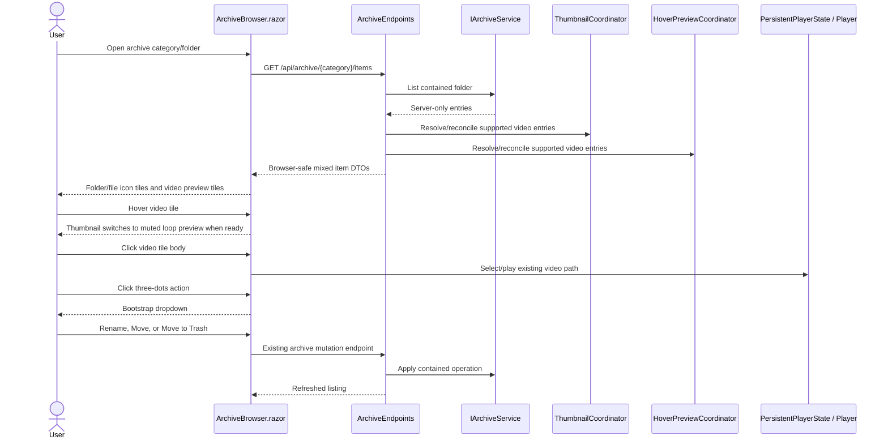

# Plan: Unified Archive Browser

## Table of Contents

- [Summary](#summary)
- [Technical Approach](#technical-approach)
- [Component Breakdown](#component-breakdown)
- [Dependencies](#dependencies)
- [External / Vendor Documentation Evidence](#external--vendor-documentation-evidence)
- [Flow](#flow)
- [Risk Assessment](#risk-assessment)

## Summary

Refactor the archive category browser so `ArchiveBrowser.razor` renders a single mixed folder/file card system with video thumbnails and hover previews for supported video files, icon tiles for everything else, and top-right Bootstrap dropdown actions. Keep `VideoGrid.razor` as the specialized video grid for Cuts and Video Compositions in `Home.razor`.

## Technical Approach

Extend the existing archive service/minimal-endpoint/Blazor component pattern rather than introducing a new frontend grid framework. `ArchiveService` already owns category-contained filesystem listing and CRUD, while `ArchiveEndpoints.ToDto` maps server-only `ArchiveItemEntry` values into browser-safe `ArchiveItemDto` objects. The media-preview work should be added at that DTO boundary by resolving archive video entries through the same `ThumbnailCoordinator` and `HoverPreviewCoordinator` pattern used by `VideoEndpoints`, `CutEndpoints`, and `CompositionEndpoints`.

To keep the design testable and scoped, update archive item DTOs with nullable media fields equivalent to the video-grid contract: `ThumbnailState`, `ThumbnailUrl`, `HoverPreviewState`, `HoverPreviewUrl`, plus optional duration/resolution fields only if the existing archive model can provide them without new probing work. The first implementation should not add duration/resolution probing for arbitrary archive files unless a server entry already has that metadata. Non-video files only need name, size, extension/type, kind, and `IsVideo`.

On the server, adapt `ArchiveEndpoints` so list responses call a video-aware DTO builder for supported archive video files. That builder should:

- Preserve opaque archive item IDs.
- Return preview URLs under archive-owned endpoints such as `/api/archive/{category}/items/{id}/thumbnail` and `/api/archive/{category}/items/{id}/preview`, or another route shape that resolves through `IArchiveService`.
- Resolve and reconcile existing thumbnail/hover-preview coordinators with `VideoFileEntry`-compatible source metadata.
- Return unavailable media states for folders and non-video files.

If `ArchiveItemEntry` cannot currently supply the same path/size/timestamp data that `VideoFileEntry` requires, add a narrow conversion method or server-only adapter in the endpoint/service layer. Do not put physical paths in client DTOs. Do not add a second thumbnail cache or hover-preview cache.

In `ArchiveBrowser.razor`, replace the current card-footer action bar with a `dropdown` positioned at the top-right of each item card. The toggle should be an icon-only Bootstrap button containing `bi-three-dots-vertical`, with `aria-label="Actions for {item.Name}"`, `data-bs-toggle="dropdown"`, and `aria-expanded="false"`. Dropdown actions should be `<button class="dropdown-item">` controls that call the existing `StartRename`, `StartMove`, and `DeleteAsync` methods with `@onclick:stopPropagation="true"` where needed. Use `.dropdown-menu dropdown-menu-end` to keep the menu visually anchored to the right edge.

The main card activation target should remain separate from the dropdown. A good shape is a containing `.card.position-relative` with an absolute dropdown in the corner and a sibling full-card button for the item body. That keeps folder opening/video selection ergonomic while letting the dropdown own actions. Video tiles should borrow the media area pattern from `VideoGrid.razor`: `ratio ratio-16x9`, `<video>` for hover previews, `` for ready thumbnails, and a film icon fallback. Folders and non-video files should render an icon-led tile without media preview.

Hover-preview state in `ArchiveBrowser.razor` should mirror `VideoLibrary.razor`/`VideoGrid.razor`: track a private `_previewingVideoId`, set it on mouse enter only when the item is a video with a ready hover preview URL, clear it on mouse leave, and let the grid re-render naturally. This preserves the existing interaction pattern without moving playback logic into JavaScript.

Keep `VideoGrid.razor` unchanged unless a minor compatibility tweak is needed. `Home.razor` should continue using `VideoGrid` for `_cuts` and `_compositions`; the Videos archive area should continue to use `ArchiveBrowser Category="videos"` and pass selected videos into the existing player/editor path.

## Component Breakdown

**Existing files to modify:**

- `WebApp/WebApp.Client/Components/ArchiveBrowser.razor` - render unified archive cards, add video media preview UI, track hover preview state, replace footer actions with a top-right Bootstrap dropdown, and preserve existing dialogs/mutations.
- `WebApp/WebApp.Client/Models/ArchiveItemDto.cs` - add browser-safe thumbnail/hover-preview state and URLs for video archive items, plus extension/type metadata if not already available.
- `WebApp/WebApp/Endpoints/ArchiveEndpoints.cs` - build video-aware archive DTOs, reconcile thumbnail/hover-preview state for every supported archive video file, and add archive thumbnail/preview endpoints if current routes cannot serve archive-scoped video assets.
- `WebApp/WebApp/Models/ArchiveItemEntry.cs` - expose server-only source metadata needed to adapt supported archive videos into the existing media-preview coordinators, if missing.
- `WebApp/WebApp/Services/ArchiveService.cs` - update listing metadata only if the endpoint cannot derive extension/type/media source information from existing entries.
- `WebApp/WebApp.Client/Pages/Home.razor` - verify Videos continues to use `ArchiveBrowser` and Cuts/Compositions continue to use `VideoGrid`; update only if new archive media state requires parameter wiring.
- `WebApp/WebApp/wwwroot/app.css` - add minimal shared styles only if Bootstrap utilities cannot express dropdown placement, stable media/icon tile dimensions, or responsive metadata wrapping.
- `WebApp.Tests/Endpoints/ArchiveEndpointsTests.cs` - assert archive video DTOs include media states/URLs safely and non-video DTOs do not receive preview URLs.
- `WebApp.Tests/Client/ArchiveBrowserTests.cs` - update or add markup smoke tests for unified video/non-video/folder cards and the three-dots dropdown where the existing test setup supports it.

**New files to create:**

- None required.

## Dependencies

- Reuse existing Bootstrap 5.3.8 dropdown JavaScript already loaded through the app's Bootstrap bundle.
- Reuse existing Bootstrap Icons; the action toggle icon is `bi-three-dots-vertical`.
- Reuse existing thumbnail and hover-preview services, cache roots, background workers, and FFmpeg authorization from the implemented thumbnail and hover-preview specs.
- No new runtime package, frontend library, Docker mount, or background service is required.

## External / Vendor Documentation Evidence

- Microsoft Learn, "Call a web API from ASP.NET Core Blazor" (`https://learn.microsoft.com/aspnet/core/blazor/call-web-api?view=aspnetcore-10.0`) confirms the current pattern of injecting `HttpClient` into Blazor components and using JSON helpers such as `GetFromJsonAsync`/`PostAsJsonAsync` for same-origin server APIs.
- Microsoft Learn, "ASP.NET Core Blazor event handling" (`https://learn.microsoft.com/aspnet/core/blazor/components/event-handling?view=aspnetcore-10.0`) documents Blazor event callbacks and browser event handling, matching the planned `@onclick`, `@onmouseenter`, `@onmouseleave`, and propagation-control usage.
- Bootstrap 5.3 Dropdowns (`https://getbootstrap.com/docs/5.3/components/dropdowns/`) documents button-based dropdown toggles, `.dropdown-menu`, `.dropdown-item`, keyboard support, and the need for authors to include appropriate ARIA attributes for action menus. The implementation should use Bootstrap's documented dropdown structure rather than a custom popover.

## Flow

## Risk Assessment

| Risk | Evidence | Mitigation |
| --- | --- | --- |
| Host path exposure through new media URLs | Archive entries are backed by physical files across multiple categories. | Keep URLs category/id based; resolve every thumbnail/preview request through `IArchiveService`; add endpoint tests that serialized JSON omits temp/root paths. |
| Unauthorized FFmpeg scope expansion | The repo only authorizes thumbnail and hover-preview pipelines for preview generation. | Reuse existing thumbnail/hover-preview coordinators and caches; do not add new transforms or preview types. |
| Dropdown click activates the card | Current archive card uses a large button around the whole body. | Split action dropdown from the activation button and stop propagation on dropdown controls. |
| Non-video files accidentally request previews | Unified cards may tempt generic preview behavior. | Gate preview state on `item.IsVideo`; return unavailable states and null URLs for non-video items; test both cases. |
| Cuts/Compositions regression | `VideoGrid.razor` owns composition selection and existing preview behavior. | Leave `VideoGrid` in place for those sections and test/inspect `Home.razor` usage after the refactor. |
| Layout overlap on small screens | Top-right dropdown, selected badges, checkboxes, and media previews can compete for card corners. | Keep archive cards simpler than `VideoGrid`, use Bootstrap spacing/position utilities, and manually verify mobile and desktop widths. |
