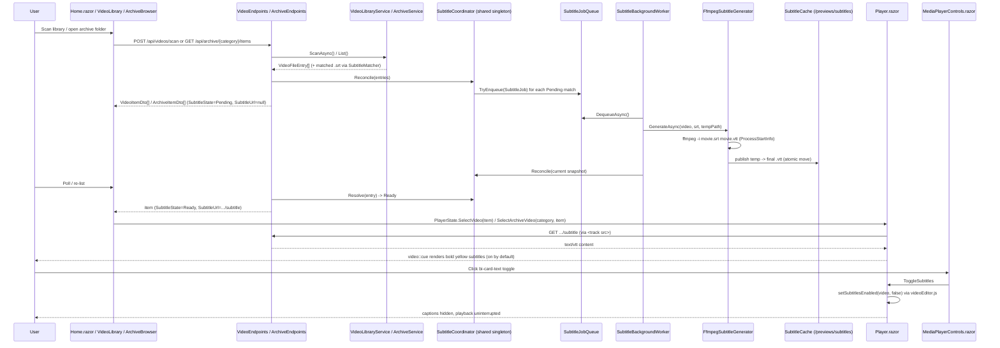

# Plan: External Subtitle Support

## Table of Contents

- [Summary](#summary)
- [Technical Approach](#technical-approach)
- [Component Breakdown](#component-breakdown)
- [Dependencies](#dependencies)
- [External / Vendor Documentation Evidence](#external--vendor-documentation-evidence)
- [Flow](#flow)
- [Risk Assessment](#risk-assessment)

## Summary

Add a fourth narrowly scoped, server-only FFmpeg pipeline — subtitle discovery and one-time SRT→WebVTT conversion — that mirrors the existing thumbnail pipeline (`ThumbnailCache`/`ThumbnailCoordinator`/`ThumbnailJobQueue`/`ThumbnailBackgroundWorker`/`FfmpegThumbnailGenerator`) file-for-file, share it across `VideoEndpoints` and `ArchiveEndpoints` exactly the way `ThumbnailCoordinator`/`HoverPreviewCoordinator` are already shared (so Video Library and every Archive Browser category get subtitles for free from one coordinator), and surface the result in `Player.razor` as a native `<track>` with bold yellow `video::cue` styling plus a `bi-card-text` toggle button in `MediaPlayerControls.razor` to show/hide it.

## Technical Approach

This follows the thumbnail/hover-preview precedent already established in `WebApp/WebApp/Services/` almost exactly, so the design introduces no new architectural pattern:

- **Cache/identity** (`SubtitleCache`, new): computes a SHA-256 content-identity key from the video's `(RelativePath, SizeBytes, LastWriteTimeUtc)` **and** the matched `.srt` file's own size/last-write time, so a change to either the video or the subtitle text triggers reconversion. Resolves `<key>.vtt` inside a `subtitles/` subdirectory of the existing `ThumbnailCacheOptions.Path` root (same precedent as `HoverPreviewCache` using a `hover/` subdirectory of the same root) — no new `ThumbnailCacheOptions`-style options class or Docker volume is needed. Reuses `VideoLibraryService.IsWithinRoot` for path-containment safety, exactly like `ThumbnailCache.ResolveContained`.
- **Matching** (`SubtitleMatcher`, new, or a static helper called from `VideoLibraryService.ScanAsync`): for each `VideoFileEntry`, resolves the sibling path via `Path.ChangeExtension(entry.PhysicalPath, ".srt")` and checks `File.Exists`, returning an optional `SubtitleFileInfo(PhysicalPath, SizeBytes, LastWriteTimeUtc)` record. This is pure path/filesystem logic kept server-side and unit-testable without FFmpeg.
- **State/coordination** (`SubtitleCoordinator`, new): same shape as `ThumbnailCoordinator` — `Resolve(VideoFileEntry, SubtitleFileInfo?)` returns `SubtitleState.Unavailable` (no `.srt` found), `Pending` (found, not yet converted), `Ready` (`.vtt` exists and is non-empty), or `Failed` (previously failed this process lifetime, tracked in a `ConcurrentDictionary<string,bool>` exactly like `ThumbnailCoordinator._failedKeys`). `Reconcile(IReadOnlyList<VideoFileEntry>)` enqueues a `SubtitleJob` for every video with a detected, not-yet-ready, not-failed subtitle.
- **Queue** (`ISubtitleJobQueue`/`SubtitleJobQueue`, new): a bounded, deduplicated `Channel<SubtitleJob>`, copied from `ThumbnailJobQueue`/`IThumbnailJobQueue`, keyed by the same cache key so a subtitle already queued or already converting is never enqueued twice.
- **Generation** (`ISubtitleGenerator`/`FfmpegSubtitleGenerator`, new): copied from `IThumbnailGenerator`/`FfmpegThumbnailGenerator` — revalidates the source pair hasn't changed since enqueue, shells out to `ffmpeg -nostdin -hide_banner -loglevel error -i <srt> -y <temp>.vtt` via `ProcessStartInfo`/`ArgumentList` (never a shell string), and publishes via temp-file-then-atomic-`File.Move` exactly like `FfmpegThumbnailGenerator.Publish`. No duration probing or seek math is needed (SRT→VTT is a lossless format conversion, not a frame extraction), so this generator is materially simpler than `FfmpegThumbnailGenerator`.
- **Background worker** (`SubtitleBackgroundWorker`, new): a `BackgroundService` copied from `ThumbnailBackgroundWorker` — dequeues one job at a time, calls the generator, marks failures on the coordinator, releases the queue slot, and re-reconciles against the current library snapshot.
- **DTO/endpoint wiring — shared across Video Library and Archive Browser**: `VideoItemDto` and `ArchiveItemDto` both gain `SubtitleState SubtitleState` and `string? SubtitleUrl`, mirroring `ThumbnailState`/`ThumbnailUrl`. `VideoEndpoints.BuildDto` and `ArchiveEndpoints`'s `ToDto`/`ToDtoAsync` both resolve subtitle state from the *same* injected `SubtitleCoordinator` singleton the same way they already resolve thumbnail/hover-preview state (this is exactly how `ThumbnailCoordinator`/`HoverPreviewCoordinator` are already shared between the two endpoint classes today — no per-section duplication). `VideoEndpoints` sets `SubtitleUrl` to `/api/videos/{entry.Id}/subtitle`; `ArchiveEndpoints` sets it to `/api/archive/{category}/items/{id}/subtitle` (mirroring its existing thumbnail/preview URL construction with `Uri.EscapeDataString`). Two new endpoints — `GET /api/videos/{id}/subtitle` and `GET /api/archive/{category}/items/{id}/subtitle` — each stream the cached `.vtt` file as `text/vtt`, 404 otherwise, following the exact shape of the existing `.../thumbnail`/`.../preview` handlers in both endpoint classes. Because `ArchiveEndpoints.ToMediaEntry` already converts any `ArchiveItemEntry` into the same `VideoFileEntry` the Video Library uses, the subtitle matcher/cache/coordinator need no per-source-type branching — a video's cache key naturally differs across categories because `VideoFileEntry.RelativePath` already differs (e.g. `archive/videos/...` vs. the library's own relative path).
- **Player — track element**: `Player.razor` adds a conditional `<track kind="subtitles" srclang="en" label="English" default src="@($"{StreamBasePath}/{Selected.Id}/subtitle")">` inside the existing `<video>` element, gated on `Selected.SubtitleState == SubtitleState.Ready`. Because `StreamBasePath` already varies by selection source (`api/videos`, `api/archive/{category}/items`, `api/cuts`, `api/compositions` — see `PersistentPlayerState`), this one conditional expression automatically produces the right URL regardless of where the video was selected from, with no additional branching in `Player.razor`. `Player.razor.css` (the project's existing isolated-CSS home for player-specific presentation the design system's Bootstrap layer cannot express, per `AGENTS.md` Coding Conventions) gets a scoped `::deep video::cue { color: yellow; font-family: Arial, sans-serif; font-weight: bold; }` rule.
- **Player — toggle button**: `MediaPlayerState` gains a per-selection `bool IsSubtitlesEnabled` (default `true`, reset to `true` in `Select(...)` alongside the other per-video resets, mirroring how `IsStandardLoop`/`IsAbLoop`/markers already reset there). `MediaPlayerControls.razor` gets a new button in the existing "Video actions" `btn-group` (next to the Fill-tab button) using `<i class="bi bi-card-text"></i>`, styled with the existing `ToggleCssClass(State.IsSubtitlesEnabled)` helper (already used for Mute/Repeat/A-B Loop), `aria-pressed`, a `data-bs-toggle="tooltip"`, and `disabled="@(!HasSubtitles)"` where `HasSubtitles` is a new `[Parameter] bool` passed from `Player.razor` as `Selected.SubtitleState == SubtitleState.Ready`. Clicking it invokes a new `ToggleSubtitles` `EventCallback`, handled in `Player.razor` by flipping `_player.IsSubtitlesEnabled` and calling a new JS interop function, `setSubtitlesEnabled(video, enabled)`, added to `wwwroot/js/videoEditor.js` alongside the existing `setVolume`/`setMuted`/`setPlaybackRate`/`setLoop` functions — it sets `video.textTracks[0].mode = enabled ? "showing" : "hidden"` (guarded for a missing/not-yet-loaded track). `Player.razor.ApplyPlayerPreferencesAsync` (already called on `loadedmetadata` and after selection) also calls `setSubtitlesEnabled(video, _player.IsSubtitlesEnabled)` so a newly selected video's track starts in the correct (default-on) state without waiting for a user click.

This keeps every architectural boundary already documented in `AGENTS.md`: the server (`WebApp`) owns all filesystem/path/FFmpeg logic; the client (`WebApp.Client`) only ever sees an opaque ID and a controlled relative URL; FFmpeg is invoked only via `ProcessStartInfo`/`ArgumentList` in a new, narrowly scoped generator; the new toggle button follows the same icon-button/tooltip/`aria-pressed`/40×40-target conventions as every other player control; and no new Docker volume, options section, or native `dotnet run` workflow is introduced — subtitle files live under the same writable `/previews` cache already used by thumbnails and hover previews, for both Video Library and Archive Browser sources.

## Component Breakdown

**Existing files to modify:**

- `WebApp/WebApp/Services/VideoLibraryService.cs` — after building each `VideoFileEntry` during `ScanAsync`, resolve the matching `.srt` (via the new `SubtitleMatcher`) so the subtitle coordinator can key off it; no change to the enumerated video-extension allowlist.
- `WebApp/WebApp/Endpoints/VideoEndpoints.cs` — inject the shared `SubtitleCoordinator` into `ScanAsync`/`GetCurrentSnapshot`/`BuildDto`, add subtitle fields to the constructed `VideoItemDto`, call `subtitleCoordinator.Reconcile(entries)` alongside the existing thumbnail/hover-preview reconciliation, and add the `GET /api/videos/{id}/subtitle` route + handler.
- `WebApp/WebApp/Endpoints/ArchiveEndpoints.cs` — inject the same `SubtitleCoordinator`; resolve/enqueue subtitle matches for video items inside `ToDto`/`ToDtoAsync` (using `ToMediaEntry` exactly as thumbnails/hover previews already do); add subtitle fields to `ArchiveItemDto` construction and the new `GET /api/archive/{category}/items/{id}/subtitle` route + handler (mirroring `GetThumbnail`/`GetPreview`).
- `WebApp/WebApp/Services/ArchiveService.cs` — no path/matching logic needed here; `ArchiveEndpoints.ToMediaEntry` already exposes each video's real `PhysicalPath`, which is all `SubtitleMatcher` needs, consistent with how thumbnails/hover previews already require no `ArchiveService` changes.
- `WebApp.Client/Models/VideoItemDto.cs` and `WebApp.Client/Models/ArchiveItemDto.cs` — add `SubtitleState SubtitleState` and `string? SubtitleUrl` (positional on `VideoItemDto`; optional-with-default on `ArchiveItemDto`, matching each record's existing convention for the thumbnail/hover-preview pair).
- `WebApp.Client/Models/` — add a `SubtitleState` enum (`Unavailable`, `Pending`, `Ready`, `Failed`) alongside the existing `ThumbnailState`/`HoverPreviewState` enums, or confirm one of those existing enums can be reused if its members already match exactly (only reuse if semantically identical; otherwise keep it distinct so subtitle failures don't get conflated with thumbnail failures in the UI/tests).
- `WebApp.Client/Services/PersistentPlayerState.cs` — `SelectArchiveVideo`'s synthesized `VideoItemDto` must now forward the real `item.SubtitleState`/`item.SubtitleUrl` from the resolved `ArchiveItemDto` instead of hardcoding `Unavailable`/`null` (it currently only hardcodes those two fields because `ArchiveItemDto` didn't previously carry subtitle data — the same fix pattern already applies to how it could forward real thumbnail/hover-preview state, but that is unchanged/out of scope here beyond the subtitle fields).
- `WebApp/WebApp.Client/Components/Player.razor` — add the conditional `<track>` child element inside the existing `<video>`; add `_player.IsSubtitlesEnabled` wiring, the `ToggleSubtitlesAsync` handler, and pass `HasSubtitles`/`ToggleSubtitles` into `MediaPlayerControls`.
- `WebApp/WebApp.Client/Components/Player.razor.css` — add the `video::cue` rule.
- `WebApp/WebApp.Client/Components/MediaPlayerControls.razor` — add the `bi-card-text` toggle button and its `HasSubtitles`/`ToggleSubtitles` parameters.
- `WebApp.Client/Models/MediaPlayerState.cs` — add `IsSubtitlesEnabled` (default `true`), reset in `Select(...)`.
- `WebApp/WebApp.Client/wwwroot/js/videoEditor.js` — add `setSubtitlesEnabled(video, enabled)`.
- `WebApp/WebApp/Program.cs` — register `SubtitleCache`, `SubtitleCoordinator`, `ISubtitleJobQueue`/`SubtitleJobQueue`, `ISubtitleGenerator`/`FfmpegSubtitleGenerator` as singletons and `SubtitleBackgroundWorker` as a hosted service, in the same block as the existing thumbnail/hover-preview registrations.
- `AGENTS.md` — after implementation, extend the FFmpeg-pipeline bullet in Constraints to name this fourth pipeline as covering both the Video Library and Archive Browser (and reconcile the existing gap where the hover-preview pipeline is already implemented but not yet listed there), per the `init-agent` workflow.

**New files to create:**

- `WebApp/WebApp/Models/SubtitleFileInfo.cs` — small record capturing the matched `.srt` file's physical path/size/last-write time.
- `WebApp/WebApp/Services/SubtitleMatcher.cs` (or a static method) — same-basename `.srt` lookup, operating on any `VideoFileEntry`'s `PhysicalPath` regardless of whether it came from the Video Library or the Archive Browser.
- `WebApp/WebApp/Services/SubtitleCache.cs` — cache-key computation and contained-path resolution under `<previews>/subtitles/`.
- `WebApp/WebApp/Services/SubtitleCoordinator.cs` — state resolution and reconciliation, registered once and shared by both `VideoEndpoints` and `ArchiveEndpoints`.
- `WebApp/WebApp/Services/ISubtitleJobQueue.cs` + `SubtitleJobQueue.cs` — bounded/deduplicated job queue.
- `WebApp/WebApp/Models/SubtitleJob.cs` — job record (cache key, source video entry, source subtitle info).
- `WebApp/WebApp/Services/ISubtitleGenerator.cs` + `FfmpegSubtitleGenerator.cs` — FFmpeg SRT→VTT conversion.
- `WebApp/WebApp/Services/SubtitleBackgroundWorker.cs` — `BackgroundService` draining the queue.
- `WebApp.Client/Models/SubtitleState.cs` — the new state enum (if not reusing an existing one; see above).
- Matching test files under `WebApp.Tests/Services/` and `WebApp.Tests/Endpoints/` (see `Validation.md`).

## Dependencies

- FFmpeg must remain installed in the app container image (`Dockerfile` already installs it; no change needed).
- The existing writable `thumbnail_cache` Docker volume mounted at `/previews` (`docker-compose.yml`) must remain writable; no new volume, environment variable, or options section is required.
- No new NuGet package or frontend library.

## External / Vendor Documentation Evidence

- Not applicable for the ASP.NET Core minimal-API streaming pattern (`Results.Stream` with a `text/vtt` content type): this reuses the exact `GetThumbnail`/`GetPreview` handler shape in `VideoEndpoints.cs`, whose `enableRangeProcessing`/file-streaming design was already verified against official ASP.NET Core guidance in `Specs/20260831104814-static-video-thumbnails-ffmpeg/Plan.md`. Range processing is not required for `.vtt` (it is a small text payload fetched once by the browser's track-loading mechanism, not seek-scrubbed like video/audio), so the new endpoint intentionally omits `enableRangeProcessing: true`.
- The `<track>` element, `kind="subtitles"`, and the `video::cue` pseudo-element are web platform (HTML Living Standard / CSS) features, not a Microsoft-specific API surface, so the Microsoft Learn MCP server is not the relevant authority here; no vendor-specific claim is made beyond standard browser behavior already implied by the user's own spec text.

## Flow

## Risk Assessment

| Risk | Evidence | Mitigation |
| --- | --- | --- |
| Duplicated FFmpeg-invocation code drifts from the thumbnail pipeline over time | `FfmpegThumbnailGenerator.cs` and `HoverPreview*` already show two parallel copies of this pattern with no shared base class | Accept the duplication (matches existing project convention); keep each generator's `ProcessStartInfo`/temp-file-publish logic small and independently tested, as already done for thumbnails/hover previews. |
| A malformed/corrupt `.srt` causes `ffmpeg` to exit non-zero on every scan | `FfmpegThumbnailGenerator`'s failure path already handles non-zero exit codes | `SubtitleCoordinator.MarkFailed` (mirroring `ThumbnailCoordinator.MarkFailed`) prevents retry storms within the process lifetime; the video remains playable without subtitles (FR11). |
| Adding a `.srt`-extension check inside `VideoLibraryService.ScanAsync` could accidentally start treating `.srt` files as playable/listed items | `VideoLibraryService`'s extension allowlist (`.mp4/.webm/.mov/.m4v`) already filters non-video files out during enumeration | The `.srt` lookup is a targeted `File.Exists` sibling check per matched video, not a change to the enumerated extension allowlist — `.srt` files are never added to the video snapshot. |
| Concurrent scans/polls could enqueue the same subtitle job twice | `ThumbnailJobQueue`/`HoverPreviewJobQueue` already solve this with an `_activeKeys` guard | Copy the same dedup guard verbatim into `SubtitleJobQueue`. |
| `Path.ChangeExtension` sibling matching is case-sensitive on the Linux container filesystem, so `Movie.SRT` next to `movie.mp4` silently produces no subtitle | Confirmed via the Dockerfile's Linux SDK base image; documented as an explicit MVP limitation in Requirements.md Out of Scope | No mitigation in this MVP; case-insensitive/fuzzy matching is explicitly out of scope and can be revisited alongside the planned multi-language follow-up. |
| Sharing one `SubtitleCoordinator` singleton across `VideoEndpoints` and `ArchiveEndpoints` could let a moved/renamed archive video collide with a Video Library entry's cache key | `ThumbnailCoordinator`/`HoverPreviewCoordinator` already share this exact design today and avoid collisions because `VideoFileEntry.RelativePath` is always distinct per source (the Video Library's own relative path vs. `archive/{category}/{id}/{name}` from `ArchiveEndpoints.ToMediaEntry`) | No new mitigation needed — reuse the same `RelativePath`-inclusive cache-key input already proven collision-free for thumbnails/hover previews; add a coordinator test asserting distinct keys for a same-named video in the library root vs. an archive category. |
| The `<track>` toggle button interacts with the same `<video>` element already driving drag/A-B-loop/fill-tab JS interop | `Player.razor`'s existing `ExecuteMediaCommandAsync`/`ApplyPlayerPreferencesAsync` already coordinate multiple JS calls against `_video` on selection/metadata-load | Add `setSubtitlesEnabled` as one more call in the same `ApplyPlayerPreferencesAsync` sequence (mirroring `setVolume`/`setMuted`/`setPlaybackRate`/`setLoop`), so it inherits the same JSException handling (`ShowPlayerCommandError`) and ordering guarantees already in place. |
