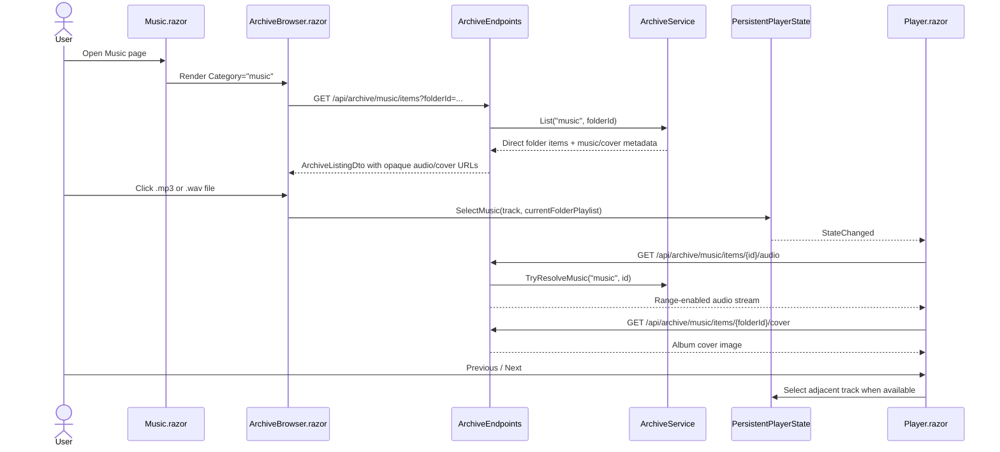

# Plan: Music Folder Playback

## Table of Contents

- [Summary](#summary)
- [Technical Approach](#technical-approach)
- [Component Breakdown](#component-breakdown)
- [Dependencies](#dependencies)
- [External / Vendor Documentation Evidence](#external--vendor-documentation-evidence)
- [Flow](#flow)
- [Risk Assessment](#risk-assessment)

## Summary

Implement direct `.mp3`/`.wav` playback for the Music archive category by extending the existing archive listing, opaque endpoint, persistent player, and shared media-control patterns. The feature treats the current Music folder as a non-recursive playlist and uses the first direct `.png`/`.jpg`/`.jpeg` image in that folder as album art.

## Technical Approach

Extend the existing archive-service pattern rather than introducing a separate music library root. `WebApp/WebApp/Services/ArchiveService.cs` already owns category resolution, containment checks, symlink skipping, item IDs, and listing order; it should also classify playable music for the `music` category and resolve music streams/covers through server-only physical paths. `WebApp/WebApp/Endpoints/ArchiveEndpoints.cs` already maps browser-safe archive endpoints and range-enabled video streams; add audio and cover endpoints beside those routes, returning `Results.Stream`/`Results.File` with validated content types and `enableRangeProcessing: true` for audio.

The browser-facing contract should stay in `WebApp/WebApp.Client/Models/ArchiveItemDto.cs` or a small companion DTO in the same folder. Add fields that describe music playback without exposing paths: `IsMusic`, `AudioUrl`, `AlbumCoverUrl`, and enough current-folder playlist data for the client to move previous/next among direct music files. If a dedicated playlist DTO is clearer, keep it browser-safe and populated by `ArchiveEndpoints`.

`WebApp/WebApp.Client/Components/ArchiveBrowser.razor` should continue opening folders on folder click. For playable music files, it should render the folder cover image when available, select the clicked item into `PersistentPlayerState`, and pass the direct music items from the current listing as the active playlist. Non-music archive files keep their current generic file card behavior.

`WebApp/WebApp.Client/Services/PersistentPlayerState.cs` currently stores a selected `VideoItemDto` plus stream base path. Extend it with a small media-kind model so video selection remains unchanged while music selection carries the selected track, playlist, album cover URL, and audio stream base path. High-level UI continues to depend on `PersistentPlayerState`, not on archive filesystem details.

`WebApp/WebApp.Client/Components/Player.razor` should branch by persistent media kind. Video mode keeps the existing `<video>` element, drag/crop, saturation, subtitles, A/B loop, and Save Cut behavior. Music mode should render an `<audio>` element wired to the same `MediaPlayerState` synchronization commands through `videoEditor.js` media helpers, show album art in the small footer side preview, center the cover in Fill-tab mode, and display current track metadata in the footer copy.

`WebApp/WebApp.Client/Components/MediaPlayerControls.razor` should keep the shared timeline and standard media controls, while adding optional previous/next track callbacks and flags. When music mode supplies those callbacks, render icon-only Bootstrap buttons using `bi-chevron-compact-left` and `bi-chevron-compact-right`, disabling them at playlist boundaries. Hide video-only groups for subtitles, A/B markers, Save Cut, and saturation/crop interaction when the player is in audio mode.

No new runtime packages, frontend frameworks, FFmpeg tasks, or background services are needed. Existing JavaScript media helpers already target an element reference and should work for `<audio>` if kept generic; if names such as `playVideo` remain, the implementation may either reuse them carefully or rename/add thin wrappers while preserving video behavior.

## Component Breakdown

**Existing files to modify:**

- `WebApp/WebApp/Services/IArchiveService.cs` - add music and cover resolution methods that return internal archive entries without exposing paths.
- `WebApp/WebApp/Services/ArchiveService.cs` - add `.mp3`/`.wav` classification for the `music` category, cover discovery for direct child `.png`/`.jpg`/`.jpeg`, and contained-path validation for audio/cover lookups.
- `WebApp/WebApp/Endpoints/ArchiveEndpoints.cs` - add opaque audio stream and album cover endpoints; include music fields in listing DTOs.
- `WebApp/WebApp.Client/Models/ArchiveItemDto.cs` - add browser-safe music fields for selection, playback, and cover display.
- `WebApp/WebApp.Client/Services/PersistentPlayerState.cs` - add audio media selection and current-folder playlist state while preserving existing video APIs.
- `WebApp/WebApp.Client/Components/ArchiveBrowser.razor` - render music cards with album cover art and select direct-folder music tracks into the persistent player.
- `WebApp/WebApp.Client/Components/Player.razor` - add audio rendering mode with cover art in footer and Fill-tab views.
- `WebApp/WebApp.Client/Components/MediaPlayerControls.razor` - add optional previous/next track controls and hide video-only controls in audio mode.
- `WebApp/WebApp.Client/Components/MediaPlayerControls.razor.css` - adjust only control geometry needed for the added icon buttons or audio-mode responsive states.
- `WebApp/WebApp/wwwroot/app.css` - add shared album-cover/player visual rules only if Bootstrap utilities and component-scoped CSS are insufficient.
- `WebApp/WebApp.Client/wwwroot/js/videoEditor.js` - add or generalize media helper functions if the current names/behavior are too video-specific for `<audio>`.
- `WebApp.Tests/Services/ArchiveServiceTests.cs` - verify music classification, non-recursive playlist inputs, and first-cover selection.
- `WebApp.Tests/Endpoints/ArchiveEndpointsTests.cs` - verify audio stream range support, cover endpoint content types, and no physical path exposure.
- `WebApp.Tests/Client/PersistentPlayerStateTests.cs` - verify music selection, playlist boundaries, and unchanged video selection behavior.
- `WebApp.Tests/Client/MediaPlayerStateTests.cs` - add coverage only if previous/next state affects reusable player state.

**New files to create:**

- Optional `WebApp/WebApp.Client/Models/MusicTrackDto.cs` - browser-safe playlist item if adding several music fields to `ArchiveItemDto` becomes noisy.
- Optional `WebApp/WebApp/Models/ArchiveAlbumCoverInfo.cs` - internal server-owned cover metadata if a tuple would obscure content type/path validation.

## Dependencies

- Existing Docker Compose-only run/test workflow through `make docker-run`, `make dotnet ARGS="build"`, and `make test`.
- Existing `ArchiveRootOptions` root, with the `Music` category mapped to the `Music` folder under the archive root.
- Browser support for HTML5 `<audio>` playback of `.mp3` and `.wav`.
- Existing Bootstrap Icons CDN or local fallback behavior for icon display.

## External / Vendor Documentation Evidence

- Microsoft Learn, "How to create responses in Minimal API apps" (`https://learn.microsoft.com/aspnet/core/fundamentals/minimal-apis/responses?view=aspnetcore-10.0#file-result-return-values`) - file results support range requests; setting `enableRangeProcessing` to `true` lets media clients request byte ranges for seeking and partial playback.
- Microsoft Learn, `Results.File` API (`https://learn.microsoft.com/dotnet/api/microsoft.aspnetcore.http.results.file?view=aspnetcore-10.0`) - `Results.File`/stream file results accept a stream, content type, and `enableRangeProcessing` flag, matching the existing archive video endpoint pattern.

Repository constraint: even though ASP.NET Core can serve physical/static files directly, this feature should preserve the existing explicit endpoint model so `/Music` contents and cover files are not exposed as static-file roots.

## Flow

## Risk Assessment

| Risk | Evidence | Mitigation |
| --- | --- | --- |
| Path exposure or unsafe cover streaming | Archive endpoints currently avoid exposing physical paths for videos, thumbnails, previews, and subtitles. | Resolve audio and covers only through `ArchiveService`; return opaque URLs only; add endpoint tests asserting response JSON/body does not contain the archive root. |
| Video player regression | `Player.razor` and `MediaPlayerControls.razor` are shared by all existing video workflows. | Branch by media kind with unchanged video defaults; add persistent-state tests and markup assertions for video-only controls. |
| Audio playlist includes unintended files | User requested only direct current-folder `.mp3`/`.wav` files. | Build playlist from the current `ArchiveListingDto.Items`; do not enumerate recursively for playback. |
| Browser seeking behaves poorly for long audio | Existing video stream endpoint enables range processing. | Use the same range-enabled file response for audio and add a range-request integration test. |
| Album cover selection is surprising when multiple images exist | User requested simple first `.png/.jpg/.jpeg` file inside the folder. | Document and test deterministic ordering using the service's existing name ordering. |
