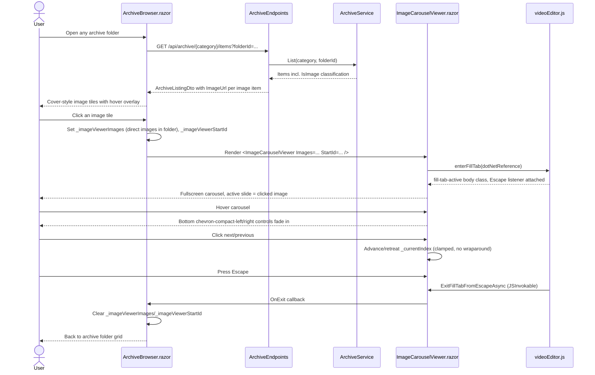

# Plan: Archive Image Viewer Carousel

## Table of Contents

- [Summary](#summary)
- [Technical Approach](#technical-approach)
- [Component Breakdown](#component-breakdown)
- [Dependencies](#dependencies)
- [External / Vendor Documentation Evidence](#external--vendor-documentation-evidence)
- [Flow](#flow)
- [Risk Assessment](#risk-assessment)

## Summary

Extend the existing archive classification/DTO/endpoint pattern used for music (`IsMusic`/`AudioUrl`) with a parallel, category-independent `IsImage`/`ImageUrl` classification for `.jpg`/`.jpeg`/`.png` files, render those files in `ArchiveBrowser.razor` as a cover-style tile matching the existing `archive-music-cover` pattern, and add a new self-contained fullscreen carousel component that reuses the Fill-tab chrome/JS interop from `Player.razor` and `videoEditor.js` without touching `PersistentPlayerState`.

## Technical Approach

**Server classification and streaming** follow the exact shape already established for music in `WebApp/WebApp/Models/ArchiveItemEntry.cs` and `WebApp/WebApp/Services/ArchiveService.cs`: add an `ImageExtensions` set (`.jpg`, `.jpeg`, `.png`) alongside the existing `VideoExtensions`/`MusicExtensions`, compute `IsImage` in both `BuildListing` and `CreateEntry` the same way `IsMusic` is computed today, and add `TryResolveImage(categoryKey, itemId, out ArchiveItemEntry? item)` to `IArchiveService`/`ArchiveService` mirroring `TryResolveMusic` exactly (resolve, check `Kind == File && IsImage`, swallow `ArchiveException`/IO exceptions the same way). Unlike `IsMusic` (scoped conceptually to the `music` category but structurally unrestricted by category already, since `ArchiveService` never gates classification by `category.Key`), `IsImage` is computed the same way for every category — no category-key branching is needed anywhere, so "any folder that has images" falls out of reusing the existing category-agnostic classification path as-is.

**Endpoint**: add `GET /api/archive/{category}/items/{id}/image` in `WebApp/WebApp/Endpoints/ArchiveEndpoints.cs`, implemented exactly like the existing `GetAlbumCover`/`StreamAudio` handlers — resolve via `TryResolveImage`, look up content type from the existing `ImageContentTypes` dictionary (already defined for album covers: `.png`→`image/png`, `.jpg`/`.jpeg`→`image/jpeg`), and return `Results.File(item.PhysicalPath, contentType, lastModified: item.LastWriteTimeUtc)`. No range processing is required (single-shot image load, not seekable media). This endpoint serves the original file for both the small grid tile (CSS-scaled) and the fullscreen carousel slide — no resize/derivative pipeline, consistent with the FFmpeg-authorization boundary in `AGENTS.md`, which only lists video-specific pipelines.

**DTO**: add `IsImage` and `ImageUrl` to `WebApp/WebApp.Client/Models/ArchiveItemDto.cs`, populated in every `ToDto(ArchiveItemEntry item, ...)` overload in `ArchiveEndpoints.cs` the same way `IsMusic`/`AudioUrl` are populated today (a small `ImageUrl(ArchiveItemEntry item)` helper mirroring the existing `AudioUrl`/`AlbumCoverUrl` helpers). Images do not participate in the thumbnail/hover-preview/subtitle coordinators (those stay gated on `item.IsVideo`), so no coordinator changes are needed.

**Grid rendering**: in `ArchiveBrowser.razor`, add an `item.IsImage` branch parallel to the existing `item.IsMusic` branch, reusing the same `ratio ratio-1x1` cover tile shape and the `archive-music-overlay`/`archive-music-card` hover-reveal CSS already defined in `ArchiveBrowser.razor.css` (renamed/generalized to a shared `archive-cover-overlay`/`archive-cover-card` selector reused by both music and image tiles, since the visual behavior — image fills tile, name/metadata overlay fades in on hover — is identical). The tile shows `` instead of the album-cover image, with a `bi-image` icon fallback when `ImageUrl` is null. Metadata overlay shows name + size + extension (images have no duration).

**Click behavior (no footer selection)**: extend `ActivateAsync` in `ArchiveBrowser.razor` with an `item.IsImage` branch that does not touch `PersistentPlayerState` at all (per FR6/FR12). Instead it sets two new private fields — `_imageViewerImages` (the direct-image subset of `_listing.Items`, in existing listing order) and `_imageViewerStartId` (the clicked item's ID) — which conditionally render a new `ImageCarouselViewer` component. This keeps `PersistentPlayerState`, `Player.razor`, and the persistent footer completely untouched, satisfying the requirement that images never populate the footer player and avoiding any risk of regressing video/music playback.

**Fullscreen carousel component**: add `WebApp/WebApp.Client/Components/ImageCarouselViewer.razor`, a small self-contained component (own `@code`, own scoped `.razor.css` only for the bottom-chevron overlay geometry Bootstrap can't express) that:
- Renders the same full-viewport dark Fill-tab container classes already used by `Player.razor`'s `EditorCssClass`/`PreviewStageCssClass` when `_fillTab.IsActive` (reusing a local `FillTabState` instance — the existing `WebApp/WebApp.Client/Models/FillTabState.cs` is generic enough to reuse as-is: `Select(id)` then `Enter()` on `OnAfterRenderAsync`/`OnInitialized`).
- Calls the existing `videoEditor.js` `enterFillTab(dotNetReference)`/`exitFillTab()` JS interop unchanged (it only toggles a `fill-tab-active` body class and an Escape listener — nothing video-specific), so Escape-to-exit works identically to the video/music Fill-tab.
- Renders a Bootstrap 5.3 Carousel (`
`, no `data-bs-touch`-disabling needed but `data-bs-interval="false"` on the outer carousel div to disable autoplay) with one `carousel-item` per image in `Images`, `active` on the item matching `StartId`, and no `.carousel-indicators` markup and no default `.carousel-control-prev`/`.carousel-control-next` Bootstrap arrow buttons (those are opt-in markup, so simply omitting them means Bootstrap renders none).
- Renders its own bottom-center-positioned custom prev/next buttons using `bi-chevron-compact-left`/`bi-chevron-compact-right`, calling the Bootstrap Carousel JS instance's `prev()`/`next()` methods via a tiny new `videoEditor.js` (or a new `imageCarousel.js`) export, e.g. `carouselPrev(element)`/`carouselNext(element)` using `bootstrap.Carousel.getOrCreateInstance(element)`, OR — simpler and more idiomatic per FR10's no-wraparound rule — skip the Bootstrap Carousel JS navigation API entirely and drive the `active` carousel-item class purely from C# state (`_currentIndex`), letting Blazor re-render which `carousel-item` has the `active` class. Bootstrap's carousel CSS only needs the `active` class present to show a slide; JS is only required for animated sliding/indicators/swipe, none of which this feature requires. This keeps the whole feature interop-free beyond the already-shared `enterFillTab`/`exitFillTab` calls, and makes the no-wraparound prev/next boundary trivial to express as a C# `disabled` binding, exactly like `CanSelectPreviousTrack`/`CanSelectNextTrack` do for music today.
- Reuses the same controls-visibility timer pattern as `Player.razor` (`_controlsVisible`, `ArmControlsHideTimer`/`HideControlsAfterDelayAsync`/`CancelControlsHideTimer` with the same `ControlHideDelay` of 1 second, triggered by `@onmouseenter`/`@onmouseleave`/`@onpointerdown` on the carousel viewport). This logic is small (about 30 lines) and tied tightly to `Player.razor`'s own fields/lifecycle; duplicating it locally in the new component is preferred over extracting a shared base class, since `Player.razor` already carries video/saturation/drag concerns unrelated to images and forcing a shared abstraction now would entangle two independently-evolving components for a 30-line timer. If a third fullscreen surface needs the same pattern later, that is the trigger point to extract it.

No changes to `Player.razor`, `MediaPlayerControls.razor`, `PersistentPlayerState.cs`, or `MediaPlayerState.cs` are required — this feature is additive and fully isolated to the archive-image path.

## Component Breakdown

**Existing files to modify:**

- `WebApp/WebApp/Models/ArchiveItemEntry.cs` - add `IsImage` field, mirroring `IsMusic`.
- `WebApp/WebApp/Services/IArchiveService.cs` - add `TryResolveImage(string categoryKey, string itemId, out ArchiveItemEntry? item)`.
- `WebApp/WebApp/Services/ArchiveService.cs` - add `ImageExtensions`, compute `IsImage` in `BuildListing`/`CreateEntry`, implement `TryResolveImage` mirroring `TryResolveMusic`.
- `WebApp/WebApp/Endpoints/ArchiveEndpoints.cs` - add `GET /api/archive/{category}/items/{id}/image` route + `GetImage` handler; add `ImageUrl(ArchiveItemEntry item)` helper; populate `IsImage`/`ImageUrl` in every `ToDto` overload.
- `WebApp/WebApp.Client/Models/ArchiveItemDto.cs` - add `IsImage` (bool, default false) and `ImageUrl` (string?, default null).
- `WebApp/WebApp.Client/Components/ArchiveBrowser.razor` - render image cover tiles, branch `ActivateAsync` for images to open the new carousel viewer instead of touching `PersistentPlayerState`, track `_imageViewerImages`/`_imageViewerStartId`/`_imageViewerActive` state, conditionally render `<ImageCarouselViewer>`.
- `WebApp/WebApp.Client/Components/ArchiveBrowser.razor.css` - generalize the `archive-music-overlay`/`archive-music-card` hover-reveal selectors to also match the new image tile class (or add matching sibling selectors), keeping the visual rule in one place.

**New files to create:**

- `WebApp/WebApp.Client/Components/ImageCarouselViewer.razor` - the fullscreen Fill-tab image carousel: Bootstrap Carousel markup driven by C# `active`-class state, bottom hover-revealed chevron controls, controls-visibility timer, `FillTabState` + `videoEditor.js` `enterFillTab`/`exitFillTab` interop, `[JSInvokable] ExitFillTabFromEscapeAsync` callback, and an `OnExit` `EventCallback` so `ArchiveBrowser.razor` can clear its local viewer state.
- `WebApp.Tests/Services/ArchiveServiceImageTests.cs` (or extend `ArchiveServiceTests.cs`) - verify `.jpg`/`.jpeg`/`.png` classify as `IsImage` in every category, `TryResolveImage` boundary/containment behavior.
- `WebApp.Tests/Endpoints/ArchiveEndpointsImageTests.cs` (or extend `ArchiveEndpointsTests.cs`) - verify the image endpoint serves correct content type, 404s for non-image/out-of-scope IDs, and listing DTOs expose `IsImage`/`ImageUrl` without physical paths.

## Dependencies

- Existing Docker Compose-only run/test workflow (`make docker-run`, `make dotnet ARGS="build"`, `make test`).
- Bootstrap 5.3.8 bundle JS already loaded globally in `WebApp/WebApp/Components/App.razor` (`bootstrap.bundle.min.js` via CDN) — required only for `enterFillTab`'s existing use of `document.body` classes; the carousel itself needs no Bootstrap JS since sliding/indicators/autoplay are unused.
- Bootstrap Icons 1.13.1 (`bi-chevron-compact-left`, `bi-chevron-compact-right`, `bi-image`) already used elsewhere in the app.
- Browser support for the existing `fill-tab-active` CSS state already exercised by video/music Fill-tab.

## External / Vendor Documentation Evidence

- Bootstrap 5.3 Carousel (`https://getbootstrap.com/docs/5.3/components/carousel/`) documents that a carousel requires only `.carousel`, `.carousel-inner`, and `.carousel-item` (with exactly one `.active` item) to render; `.carousel-indicators` and `.carousel-control-prev`/`.carousel-control-next` are optional markup blocks that Bootstrap does not inject automatically — omitting them, as this plan does, is sufficient to suppress the default dot indicators and default side arrows without any JS configuration. This confirms the plan's approach of controlling the active slide purely by toggling the `active` CSS class from Blazor state, with custom bottom chevron buttons replacing the default controls.
- Bootstrap 5.3 Carousel "Options" table (same page) documents `data-bs-interval="false"` on the outer `.carousel` element as the documented way to disable autoplay, confirming FR8's "no auto-advance" requirement can be met with a single data attribute rather than JS.
- Microsoft Learn, "ASP.NET Core Blazor event handling" (`https://learn.microsoft.com/aspnet/core/blazor/components/event-handling?view=aspnetcore-10.0`) confirms `@onmouseenter`/`@onmouseleave`/`@onpointerdown` event binding, matching the reused controls-visibility pattern from `Player.razor`.
- Microsoft Learn, "How to create responses in Minimal API apps" (`https://learn.microsoft.com/aspnet/core/fundamentals/minimal-apis/responses?view=aspnetcore-10.0`) confirms `Results.File` with a `lastModified` parameter is the documented pattern already used by `GetAlbumCover`, reused unchanged for the new image endpoint.

## Flow

## Risk Assessment

| Risk | Evidence | Mitigation |
| --- | --- | --- |
| Physical path exposure through the new image endpoint | Existing archive endpoints already resolve strictly through `ContainedPath`/`ResolveItem`. | Implement `TryResolveImage` identically to `TryResolveMusic`/`TryResolveVideo`; add an endpoint test asserting the JSON listing and image response never contain the archive root path. |
| Large-image grid tiles cause slow folder loads | Original files are served unresized per this plan's explicit non-goal on new resize pipelines. | Accepted for this spec; CSS `object-fit-cover` on a fixed-size tile still avoids layout thrash even if bytes are large. |
| Duplicating the controls-visibility timer diverges from `Player.razor`'s behavior over time | `Player.razor` already owns a very similar `_controlsVisible`/`ArmControlsHideTimer` pattern. | Keep the duplicated logic intentionally small and mirror the exact `ControlHideDelay` constant/behavior; note in code that a third consumer should trigger extraction into a shared state class. |
| Carousel `active`-class-only approach diverges from idiomatic Bootstrap carousel usage (no slide animation) | Bootstrap's documented carousel relies on its JS for animated transitions; toggling `active` via Blazor skips that. | Acceptable given FR11 excludes any specific animation requirement; if the user wants Bootstrap's native slide animation later, swap the click handlers to call `bootstrap.Carousel.getOrCreateInstance(el).to(index)` instead of manual class toggling — no markup changes needed. |
| Image classification with no category gate unexpectedly surfaces images in categories where the operator did not intend an image-browsing experience (e.g. `documents`, `downloads`) | The user explicitly confirmed image detection should be global across all categories, mirroring the "any folder that has images" requirement. | Documented explicitly in Requirements.md/FR1 as intentional; no per-category allowlist is introduced. |
