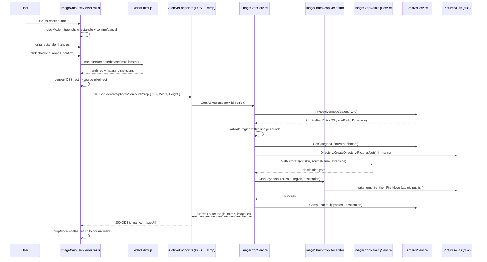

# Plan: Image Cutter (crop tool for the archive image viewer)

## Table of Contents

- [Summary](#summary)
- [Technical Approach](#technical-approach)
- [Component Breakdown](#component-breakdown)
- [Dependencies](#dependencies)
- [External / Vendor Documentation Evidence](#external--vendor-documentation-evidence)
- [Flow](#flow)
- [Risk Assessment](#risk-assessment)

## Summary

Add a rectangle crop tool to `ImageCarouselViewer.razor` that posts a pixel-space crop region to a new synchronous backend endpoint, which crops the source image with `SixLabors.ImageSharp` and writes the result into `Pictures/cuts/` using the same naming convention as `CutNamingService`. Add a read-only "ImageCutter" gallery page mirroring `VideoCut.razor`, reachable from a new tile on `Utilities.razor`.

## Technical Approach

This extends two existing patterns already proven in the codebase rather than introducing new ones:

1. **The "cut" naming/atomic-publish pattern** used by `WebApp/WebApp/Services/CutNamingService.cs` and `WebApp/WebApp/Services/FfmpegCutGenerator.cs` for `VideoCut`: derive a prefix from the first two words of the source file name, scan the destination directory for a `{prefix} {counter:0000}` pattern, write to a temp file, then `File.Move` into place only once the write succeeds. A new `ImageCropNamingService` and `ImageSharpCropGenerator` copy this exact shape for still images (extension-aware instead of hardcoded `.mp4`).
2. **The archive item resolution/DTO pattern** used by `WebApp/WebApp/Services/ArchiveService.cs` (`TryResolveImage`, content-derived `ComputeId`, `ImageUrl` builder) and `WebApp/WebApp/Endpoints/ArchiveEndpoints.cs` (`GetImage`). The crop endpoint resolves the source image the same way `GetImage` does — by category key + id, re-derived server-side — and the resulting cropped file becomes a normal archive item once it exists on disk under `Pictures/cuts/`, discoverable through the *existing* `GET /api/archive/{category}/items?folderId=...` listing endpoint. No parallel "cut library" scanning service (like `VideoCutService`) is needed, because `ArchiveService` already knows how to list any folder — the new code only needs to (a) know the physical root of the `photos` category and (b) compute the id of the `cuts` folder so the gallery page can ask for it.

Unlike `VideoCut`, this feature is **synchronous, no queue/worker**: cropping a still image with ImageSharp takes milliseconds, so `CreateCutAsync`'s job-queue/background-worker/polling machinery (`ICutJobQueue`, `CutBackgroundWorker`) would add complexity with no benefit. The crop endpoint does the work in the request and returns the result directly (or a 400/404 error), matching FR8.

**Responsibility split (SOLID / testability):**
- `IArchiveService` gains two small, focused public members — `GetCategoryRootPath(categoryKey)` and `ComputeItemId(categoryKey, physicalPath)` — thin public wrappers around logic (`GetCategoryRoot`, `ComputeId`) that already exists privately in `ArchiveService.cs:502` and `:540`. This is additive surface, not a redesign: `ArchiveService` still owns all filesystem/category knowledge.
- A new `IImageCropGenerator` (implemented by `ImageSharpCropGenerator`) owns only the pixel operation (load → crop → save), so it can be unit-tested against a temp file without touching HTTP or the archive service, mirroring how `ICutGenerator`/`FfmpegCutGenerator` is isolated from `VideoEndpoints`.
- A new `ImageCropNamingService` owns only naming/counter logic, unit-testable the same way `CutNamingServiceTests` presumably already tests `CutNamingService` (mirrors an existing pattern in `WebApp.Tests/Services/`).
- A new `IImageCropService` (implemented by `ImageCropService`) is the orchestrator: resolves the source image via `IArchiveService`, validates the region, ensures `cuts/` exists, calls the naming service, calls the generator, and returns a DTO. This keeps `ArchiveEndpoints.cs`'s new handler a thin `ExecuteAsync`-style wrapper, consistent with every other handler in that file.

**Frontend:** `ImageCarouselViewer.razor` already renders `` via `@ref`-less binding but has an `ElementReference _viewport` and existing `measureAndCaptureElement`/`releasePointer` JS interop for pan (in `wwwroot/js/videoEditor.js`). The crop overlay reuses the same pointer-capture idiom for dragging the rectangle's body and its resize handles, entirely in C# state (`_cropRect` in image-relative CSS percentages), so no new pointer-tracking JS is strictly required for interaction. One new JS helper, `measureRenderedImage(imgElement)`, is added to `videoEditor.js` to return `{renderedWidth, renderedHeight, naturalWidth, naturalHeight}` for the currently displayed `` — needed once, at crop-confirm time, to convert the on-screen crop rectangle (CSS pixels within the rendered ``) into source-image pixel coordinates sent to the backend. This keeps the crop math (percentage-of-rendered-size × natural-size) in C#, consistent with how `ImageStyle`/pan math already lives in C# rather than JS.

Cut mode disables the existing pan/zoom pointer handlers (`StartPanAsync`/`MovePan`/`EndPanAsync`) by short-circuiting them while `_cropMode` is true, the same way those handlers already short-circuit when `_zoom <= ZoomDefault`.

## Component Breakdown

**Existing files to modify:**

- `WebApp/WebApp.Client/Components/ImageCarouselViewer.razor` — add scissors toggle button to the toolbar; add crop-rectangle overlay markup (body + 8 resize handles) rendered only when `_cropMode` is true; add confirm/cancel buttons positioned above the rectangle; add `_cropMode`, `_cropRect` (a simple `record CropRect(double XPercent, double YPercent, double WidthPercent, double HeightPercent)`) state and drag handlers; suspend `StartPanAsync`/`MovePan`/`EndPanAsync` while `_cropMode` is active; inject `HttpClient`; add `ConfirmCropAsync`/`CancelCrop`/`EnterCropMode` methods; add an inline error message area for FR10.
- `WebApp/WebApp.Client/wwwroot/js/videoEditor.js` — add `measureRenderedImage(imgElement)` export returning rendered vs. natural pixel dimensions, alongside the existing `measureAndCaptureElement`.
- `WebApp/WebApp/Services/ArchiveService.cs` and `WebApp/WebApp/Services/IArchiveService.cs` — add `string GetCategoryRootPath(string categoryKey)` and `string ComputeItemId(string categoryKey, string physicalPath)` as thin public wrappers over the existing private `GetCategoryRoot`/`ComputeId` methods.
- `WebApp/WebApp/Endpoints/ArchiveEndpoints.cs` — add `MapPost("/api/archive/{category}/items/{id}/crop", CreateCropAsync)` and its handler, following the file's existing `ExecuteAsync(...)`/exception-mapping pattern; add the `ImageCropRequest`/`ImageCropResponse` records near the bottom of the file (mirroring `VideoCutRequest`/`VideoCutResponse` at the bottom of `VideoEndpoints.cs`).
- `WebApp/WebApp/Program.cs` — register `builder.Services.AddSingleton<ImageCropNamingService>();`, `builder.Services.AddSingleton<IImageCropGenerator, ImageSharpCropGenerator>();`, `builder.Services.AddSingleton<IImageCropService, ImageCropService>();` alongside the existing `IVideoCutService`/`CutNamingService`/`ICutGenerator` registrations (no new `IOptions<...>` section needed — the crop feature reuses `ArchiveRootOptions`, already registered).
- `WebApp/WebApp.Client/Pages/Utilities.razor` — add a new `<a class="card utility-tile ...">` tile with icon `<i class="bi bi-bounding-box-circles"></i>` and label "ImageCutter", linking to `/utilities/image-cutter`.
- `WebApp/WebApp/WebApp.csproj` — add `<PackageReference Include="SixLabors.ImageSharp" Version="<latest stable>" />`.

**New files to create:**

- `WebApp/WebApp/Services/IImageCropGenerator.cs` / `ImageSharpCropGenerator.cs` — loads the source image with ImageSharp, validates the requested `Rectangle` is within `Image.Identify(path).Width/Height`, crops (`image.Mutate(x => x.Crop(rect))`), saves to a temp file in the destination directory, then atomically `File.Move`s into place (mirrors `FfmpegCutGenerator`'s temp-then-move pattern).
- `WebApp/WebApp/Services/ImageCropNamingService.cs` — copy of `CutNamingService`'s prefix/counter logic, parameterized by output directory (the `Pictures/cuts` path resolved via `IArchiveService.GetCategoryRootPath`) and scanning for the source's own extension (`.jpg`/`.jpeg`/`.png`) instead of a hardcoded `.mp4`.
- `WebApp/WebApp/Services/IImageCropService.cs` / `ImageCropService.cs` — orchestrator: `Task<ImageCropOutcome> CropAsync(string categoryKey, string itemId, int x, int y, int width, int height, CancellationToken ct)`; resolves the image via `IArchiveService.TryResolveImage`, ensures `Pictures/cuts` exists (`Directory.CreateDirectory`), delegates naming + generation, and returns either a success outcome (new item id via `ComputeItemId`, name, image URL) or a typed failure (not-found / out-of-bounds / write-failed) for the endpoint to map to the right HTTP status.
- `WebApp/WebApp.Client/Pages/UtilitiesPages/ImageCutter.razor` — `@page "/utilities/image-cutter"`, mirrors `VideoCut.razor`'s layout (breadcrumb, header with `bi-bounding-box-circles` icon, alert explaining crops are created from the image viewer) but with a plain image grid instead of `VideoGrid` (no polling needed — synchronous save means the gallery only needs to reload after a crop is saved, or simply on page load/manual refresh, since there is no background job to await). Loads via `Http.GetFromJsonAsync<ArchiveListingDto>($"api/archive/photos/items?folderId={cutsFolderId}")` after resolving `cutsFolderId` once (e.g. via a small dedicated `GET api/archive/photos/cuts-folder-id` helper endpoint, or simpler: extend `IImageCropService`/endpoint to expose the folder id directly so the client never has to compute a SHA256 itself). Clicking a grid item opens it in `ImageCarouselViewer`, following the exact same pattern `ArchiveBrowser.razor:260` already uses (build an `_imageViewerImages`/`_imageViewerStartId` pair from the currently loaded listing and render `<ImageCarouselViewer Images="_imageViewerImages" StartId="_imageViewerStartId" OnExit="CloseImageViewer" />`), so a saved crop can be viewed, zoomed, or re-cropped exactly like any other archive image — no special-cased read-only view.
- `WebApp.Tests/Services/ImageCropNamingServiceTests.cs`, `WebApp.Tests/Services/ImageSharpCropGeneratorTests.cs`, `WebApp.Tests/Endpoints/ArchiveEndpointsCropTests.cs` (or wherever this repo's existing `CutNamingService`/`VideoEndpoints` tests live — mirror those files' location and fixture patterns).

## Dependencies

- `SixLabors.ImageSharp` NuGet package added to `WebApp/WebApp.csproj` — fully managed, no native/OS dependency, no Docker image change required.
- No new configuration section, environment variable, or infrastructure — reuses the already-registered `ArchiveRootOptions`.
- Requires the `photos` category's physical folder (`Pictures`) to be writable by the app process, which is already a precondition for the existing folder-create/rename/move/trash archive operations.

## External / Vendor Documentation Evidence

- ImageSharp is a third-party OSS library (Six Labors), not a Microsoft/vendor-documented technology, so the Microsoft Learn MCP tool does not apply here.
- ImageSharp's commercial licensing (Six Labors Split License) allows free use for open-source and small-revenue commercial products; since this is a self-hosted personal archive app with no redistribution, standard usage applies. ⚠️ TODO: confirm current ImageSharp license terms at implementation time (six labors periodically updates pricing tiers) before pinning a version in the `.csproj`.

## Flow

## Risk Assessment

| Risk | Evidence | Mitigation |
| --- | --- | --- |
| Converting on-screen (CSS, zoomed/panned) rectangle coordinates to correct source-pixel coordinates could be off, silently cropping the wrong region | `ImageStyle` in `ImageCarouselViewer.razor:154` applies `transform: translate(...) scale(...)` for pan/zoom; crop mode must either reset zoom/pan to 1:1 before allowing crop, or account for the transform in the CSS→pixel conversion | Simplify: force `_zoom = ZoomDefault`, `_panX = _panY = 0` on entering crop mode (crop always operates on the untransformed, "fit" rendering of the image), removing the transform variable entirely from the coordinate math |
| Concurrent modification of the source file between resolving it and reading it for crop (e.g. user renames/deletes/moves it via the archive browser mid-crop) | `FfmpegCutGenerator.SourceMatches` guards against this for videos by comparing captured file size/last-write-time | `ImageCropService` re-reads `File.Exists`/size just before generating and returns a typed "source changed" failure (mapped to 409 or 404) rather than cropping stale/missing data |
| `Pictures/cuts` growing unbounded with no cleanup path (crops are permanent, no delete UI per Out of Scope) | Mirrors `VideoCutOptions.Path`'s same lack of a retention policy today | Accepted risk, consistent with existing `VideoCut` behavior; users can delete via the normal archive browser's trash action since `Pictures/cuts` is a normal folder |
| Adding a new NuGet dependency increases build/publish size and introduces a new licensing surface | No image library currently referenced in `WebApp/WebApp.csproj` | Confirmed via discovery that ImageSharp is a pure NuGet reference with no Docker/infra change; license terms noted as a TODO above |
