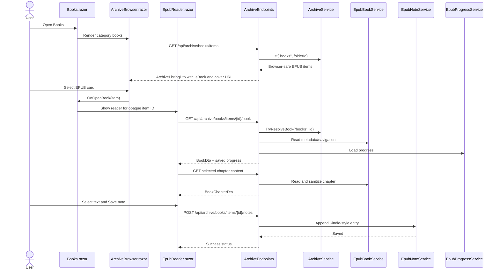

# Plan: EPUB Book Reader

## Table of Contents

- [Summary](#summary)
- [Technical Approach](#technical-approach)
- [Component Breakdown](#component-breakdown)
- [Dependencies](#dependencies)
- [External / Vendor Documentation Evidence](#external--vendor-documentation-evidence)
- [Flow](#flow)
- [Risk Assessment](#risk-assessment)

## Summary

Implement EPUB-only reading in the existing Books archive flow by extending `ArchiveService` classification, adding focused server services/endpoints for EPUB parsing, notes, and progress, and rendering a Blazor reader surface that reuses the existing player/carousel toolbar language and design tokens.

## Technical Approach

The feature extends the current archive pattern used by `ArchiveBrowser.razor`, `ArchiveService`, and `ArchiveEndpoints`: the server resolves archive item IDs, validates category and extension, performs all filesystem and EPUB parsing work, and returns browser-safe DTOs. `Books.razor` remains a client-owned route under Interactive WebAssembly and continues to compose the archive browser, but EPUB activation opens a reader rather than the persistent media player.

Server ownership stays narrow:

- `ArchiveService` gains `.epub` classification for the Books category and a `TryResolveBook` method parallel to `TryResolveVideo`, `TryResolveMusic`, and `TryResolveImage`.
- A new `IEpubBookService` reads a resolved `ArchiveItemEntry` using `VersOne.Epub`, extracts metadata, cover bytes, navigation, reading order, and sanitized chapter content. It should cache parsed output by item ID plus size/last-write timestamp if needed, but the first implementation can parse on demand if performance is acceptable for local EPUBs.
- A new HTML sanitizer component owns publisher-content cleanup. It should preserve basic semantic formatting such as headings, paragraphs, emphasis, block quotes, lists, anchors without unsafe targets, and inline images only if they can be served through a safe server-owned resource endpoint. Scripts, event attributes, iframes, forms, remote resources, and publisher CSS that conflicts with app themes must be stripped.
- A new `IEpubNoteService` appends notes atomically to `${ArchiveRoot}/Books/Notes/pereneArchiveBookNotes.txt`, creating the folder and file as needed. It owns Kindle-style text formatting and timestamp localization/formatting.
- A new `IEpubProgressService` persists per-book progress to a lightweight local file under `Books/Notes`, using a stable private key derived from archive category, item ID, size, and last-write timestamp. It stores chapter index and reader position, not paths.
- `ArchiveEndpoints` maps book endpoints under the existing archive namespace, for example `/api/archive/books/items/{id}/book`, `/cover`, `/chapters/{chapterId}`, `/notes`, and `/progress`. All routes must reject non-book files, stale IDs, path-shaped IDs, and unsupported categories with `404` or controlled validation responses.

Client ownership stays in Blazor components:

- `ArchiveItemDto` gains EPUB-facing fields such as `IsBook`, `BookCoverUrl`, `BookTitle`, and `BookAuthor` where listing data can be provided cheaply.
- `ArchiveBrowser.razor` renders EPUBs as tall book-cover cards, modeled after the existing music cover card but using a portrait ratio and book metadata.
- `Books.razor` wires an EPUB activation callback into the archive browser and hosts a new `EpubReader.razor` overlay/detail component.
- `EpubReader.razor` owns visible reader state: selected chapter, table-of-contents visibility, font size, font family, local light/dark reader mode, selected text state, copy/save actions, loading/error states, and progress save/restore.
- A focused JS module such as `wwwroot/js/ebookReader.js` may be added only for DOM selection, clipboard, scroll-position capture/restore, and reader-specific keyboard hooks. This follows the existing `videoEditor.js` pattern: JS performs browser operations that Blazor cannot do cleanly, while application rules remain in C#.
- Component CSS should be isolated to `EpubReader.razor.css` only for reader-specific full-tab/overlay geometry, scroll surface, text selection affordances, and responsive table-of-contents behavior. Standard controls, spacing, cards, forms, buttons, dropdowns, and alerts use Bootstrap utilities and global app tokens from `WebApp/WebApp/wwwroot/app.css`.

This design keeps provider-specific EPUB logic behind server services and keeps the client free of filesystem access. The UI extends existing archive and fullscreen-viewer behavior instead of introducing a new frontend framework or a detached reader app.

## Component Breakdown

**Existing files to modify:**

- `WebApp/WebApp/WebApp.csproj` — add `VersOne.Epub` and `HtmlAgilityPack` package references for server-side EPUB parsing and sanitization/extraction helpers.
- `WebApp/WebApp.Client/Models/ArchiveItemDto.cs` — add browser-safe book metadata and cover fields.
- `WebApp/WebApp/Models/ArchiveItemEntry.cs` — add `IsBook` and optional EPUB cover identity fields if needed.
- `WebApp/WebApp/Services/IArchiveService.cs` — add `TryResolveBook`.
- `WebApp/WebApp/Services/ArchiveService.cs` — classify `.epub` only in `books`, resolve book files safely, and avoid treating `Books/Notes` helper files as reader content.
- `WebApp/WebApp/Endpoints/ArchiveEndpoints.cs` — add EPUB metadata/chapter/cover/note/progress endpoints and map book DTO fields in listings.
- `WebApp/WebApp/Program.cs` — register EPUB reader, note, progress, and sanitizer services.
- `WebApp/WebApp.Client/Components/ArchiveBrowser.razor` — add book-card rendering and a book activation callback.
- `WebApp/WebApp.Client/Components/ArchiveBrowser.razor.css` — add portrait cover-card behavior only where Bootstrap utilities are insufficient.
- `WebApp/WebApp.Client/Pages/Books.razor` — host the reader and pass book activation state.
- `WebApp/WebApp/wwwroot/app.css` — add only shared reader tokens or Bootstrap variable mappings if they are broadly reusable.
- `docker-compose.yml` and `docker-compose.test.yml` — verify the existing writable `ArchiveRoot` bind mount covers `${ArchiveRoot}/Books/Notes`; update only if current mounts do not permit note/progress file writes.
- `WebApp.Tests/Endpoints/ArchiveEndpointsTests.cs` — cover EPUB endpoint privacy, note append, progress persistence, and rejection cases.
- `WebApp.Tests/Services/ArchiveServiceTests.cs` — cover EPUB classification and `Books/Notes` behavior.

**New files to create:**

- `WebApp/WebApp.Client/Components/EpubReader.razor` — main reader surface.
- `WebApp/WebApp.Client/Components/EpubReader.razor.css` — reader-specific layout and selection styling.
- `WebApp/WebApp.Client/Models/BookDto.cs` — browser-safe book metadata and table-of-contents root.
- `WebApp/WebApp.Client/Models/BookChapterDto.cs` — browser-safe chapter content response.
- `WebApp/WebApp.Client/Models/BookNavigationItemDto.cs` — nested table-of-contents item.
- `WebApp/WebApp.Client/Models/BookNoteRequest.cs` — selected text, chapter, generated offsets, and optional note text.
- `WebApp/WebApp.Client/Models/BookProgressDto.cs` — chapter and scroll/progress fields.
- `WebApp/WebApp/Services/IEpubBookService.cs` — parsing/read contract.
- `WebApp/WebApp/Services/EpubBookService.cs` — `VersOne.Epub` implementation.
- `WebApp/WebApp/Services/IEpubContentSanitizer.cs` — sanitizer contract.
- `WebApp/WebApp/Services/EpubContentSanitizer.cs` — safe HTML allowlist implementation.
- `WebApp/WebApp/Services/IEpubNoteService.cs` — clipping append contract.
- `WebApp/WebApp/Services/EpubNoteService.cs` — Kindle-style append implementation.
- `WebApp/WebApp/Services/IEpubProgressService.cs` — progress contract.
- `WebApp/WebApp/Services/EpubProgressService.cs` — lightweight progress file implementation.
- `WebApp/WebApp/wwwroot/js/ebookReader.js` — DOM selection, clipboard, and scroll-position interop.
- `WebApp.Tests/Services/EpubBookServiceTests.cs` — EPUB parse and sanitization behavior with fixtures.
- `WebApp.Tests/Services/EpubNoteServiceTests.cs` — Kindle-style append behavior.
- `WebApp.Tests/Services/EpubProgressServiceTests.cs` — lightweight progress read/write behavior.

## Dependencies

- `VersOne.Epub` NuGet package in the server project for EPUB metadata, navigation, reading order, and cover extraction.
- `HtmlAgilityPack` NuGet package in the server project to parse and sanitize EPUB HTML into app-controlled readable markup.
- Existing writable `ArchiveRoot:Path`, which must allow creating `${ArchiveRoot}/Books/Notes/pereneArchiveBookNotes.txt` and the progress file.
- Existing Docker Compose and Makefile workflows: `make dotnet ARGS="build"` and `make test`.
- Browser Clipboard API access through JS interop for copy-selection. Save-note must still work when clipboard permission is unavailable.

## External / Vendor Documentation Evidence

- EpubReader getting started: https://os.vers.one/EpubReader/getting-started/index.html. The documentation shows installing `VersOne.Epub`, using `EpubReader.ReadBook(...)`, reading `Title`, `Author`, `Navigation`, and `ReadingOrder`, and pairing with `HtmlAgilityPack` to extract text from chapter HTML. This supports a server-side EPUB parsing service that reads metadata, index, and chapter content.
- EpubReader GitHub README: https://github.com/vers-one/epubreader. The project describes EpubReader as a .NET library for reading EPUB files, supporting EPUB 2 and EPUB 3 standards and .NET Standard/.NET 5+ runtimes, which fits the repository's `net10.0` server project.
- Microsoft Learn, Blazor JS interop: https://learn.microsoft.com/aspnet/core/blazor/javascript-interoperability/call-javascript-from-dotnet?view=aspnetcore-10.0. The guidance confirms `ElementReference` can be passed to JS and JS interop calls should be asynchronous, matching the existing component pattern for browser-only DOM behavior.
- Microsoft Learn, Blazor event handling: https://learn.microsoft.com/aspnet/core/blazor/components/event-handling?view=aspnetcore-10.0. The guidance supports normal Blazor event callbacks and event propagation controls for toolbar and reader interactions.
- Microsoft Learn, Blazor JS interop guidance: https://learn.microsoft.com/aspnet/core/blazor/javascript-interoperability/?view=aspnetcore-10.0#avoid-inline-event-handlers. The guidance recommends avoiding inline JavaScript event handlers, matching this repo's existing module-based JS pattern.

## Flow

## Risk Assessment

| Risk | Evidence | Mitigation |
| --- | --- | --- |
| EPUB HTML may contain active or hostile markup. | EPUB files are user-owned archive data and chapter content will render in the browser. | Sanitize server-side with an allowlist, remove scripts/event attributes/forms/iframes/remote resources, and test malicious samples. |
| Physical archive paths could leak through EPUB endpoints or note/progress errors. | Existing app explicitly avoids exposing physical/root-relative paths. | Resolve through `ArchiveService.TryResolveBook`, return browser-safe DTOs, and assert responses do not contain archive root paths. |
| Large EPUBs may be slow if fully parsed on every chapter request. | `EpubReader.ReadBook` loads book data; local archives can contain large files. | Start with item timestamp-aware caching if measurements show repeated parsing cost, and keep cache private to server memory. |
| Generated locations may not match Kindle exactly. | EPUB has no native Kindle location numbers. | Use parse-friendly Kindle clipping structure with stable generated chapter/text offsets and document the limitation. |
| Notes/progress writes could corrupt under simultaneous requests. | Multiple save-note/progress calls can target the same shared files. | Serialize writes per service instance and use append/write-through patterns with temp files for progress. |
| Publisher styling may clash with app light/dark themes. | EPUB HTML often contains inline styles and CSS. | Strip or constrain publisher CSS; apply app-owned reader classes and design tokens. |
