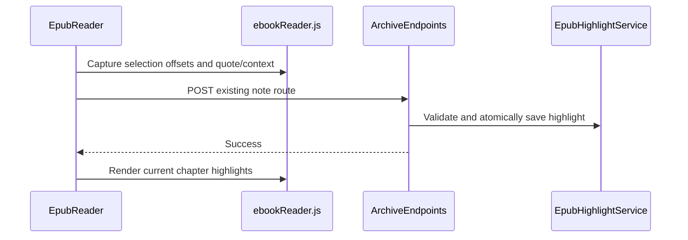

# Plan: EPUB Saved Highlights

## Summary

Add server-owned structured highlight persistence alongside, not inside, the existing Kindle-style notes text export, then render returned ranges in `EpubReader.razor` using its existing isolated JS module.

## Technical Approach

Add browser-safe highlight DTOs and extend `BookNoteRequest` with normalized chapter-text offsets plus quote/context. `ebookReader.js` will convert a reader-owned DOM selection to chapter text offsets; `EpubReader.razor` posts these with its existing Save Note flow and, after chapter HTML is rendered, asks the module to wrap returned saved ranges with a dedicated highlight element. It must never mutate EPUB source or depend on visual pagination positions.

Create `IEpubHighlightService`/`EpubHighlightService` under `WebApp/WebApp/Services`, following `EpubProgressService`: a private SHA-256 key derived from category, opaque ID, size, and timestamp scopes entries to the exact book version; a semaphore serializes writes; temp-file-then-move atomically publishes `Books/Notes/pereneArchiveBookHighlights.json`. The endpoint validates offset bounds and exact normalized chapter quote via `IEpubBookService` before recording the highlight and appending the existing note. On partial write failure, it must return a controlled error and avoid a false success.

`ArchiveEndpoints` gains browser-safe highlight read behavior for a resolved book ID and extends the existing note route. `EpubReader.razor` loads the current book’s highlight records and applies only the current chapter’s records after content rendering. `EpubReader.razor.css` supplies the yellow visual treatment, retaining reader light/dark contrast and non-color semantic Save Note status.

The approach uses the existing Blazor module and `ElementReference` boundary; Microsoft Learn documents isolated asynchronous JS interop and element references. [Microsoft Learn](https://learn.microsoft.com/en-us/aspnet/core/blazor/javascript-interoperability/call-javascript-from-dotnet?view=aspnetcore-10.0) The W3C annotation model identifies Text Position and Text Quote selectors as applicable to EPUB, supporting stored offsets plus quote/context resilience. [W3C Web Annotation](https://www.w3.org/TR/annotation-model/)

## Component Breakdown

**Modify:**

- `WebApp.Client/Models/BookNoteRequest.cs` and `BookChapterDto.cs` — range and highlight DTOs.
- `WebApp/Endpoints/ArchiveEndpoints.cs` — validated save and resolved highlight read endpoint.
- `WebApp/Program.cs` — highlight-service registration.
- `WebApp.Client/Components/EpubReader.razor`, `.razor.css`, and `wwwroot/js/ebookReader.js` — selection offsets, chapter highlight application, and yellow styling.
- `WebApp.Tests/Services/EpubNoteServiceTests.cs` and `Endpoints/ArchiveEndpointsTests.cs` — existing-contract regression coverage.

**Create:**

- `WebApp/Services/IEpubHighlightService.cs` and `EpubHighlightService.cs` — scoped highlight persistence.
- `WebApp.Tests/Services/EpubHighlightServiceTests.cs` — persistence/version/malformed-file coverage.

## Flow

## Risks

| Risk | Mitigation |
| --- | --- |
| HTML nodes split a selection unpredictably. | Calculate offsets from normalized chapter text and validate on the server. |
| EPUB changes invalidate a saved range. | Version-scoped private key prevents reuse across size/timestamp changes. |
| Invalid JSON breaks reading. | Return no highlights and preserve chapter rendering. |
