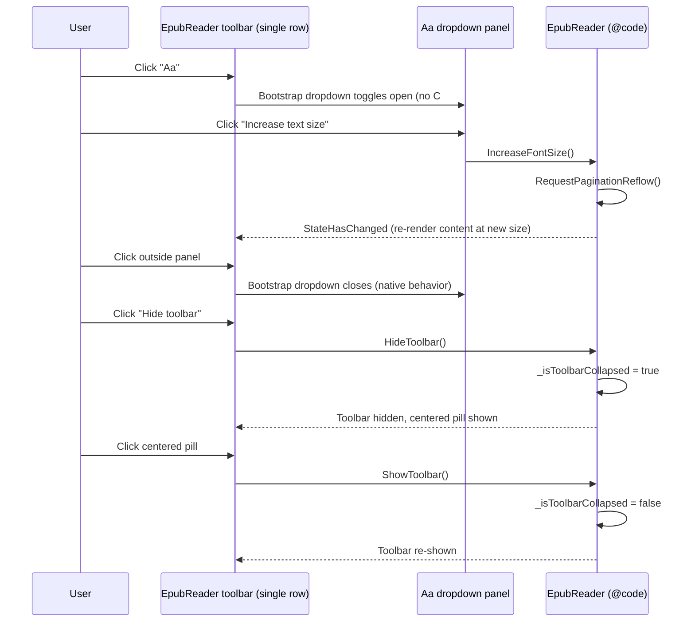

# Plan: EPUB Reader Toolbar Consolidation

## Table of Contents

- [Plan: EPUB Reader Toolbar Consolidation](#plan-epub-reader-toolbar-consolidation)
  - [Summary](#summary)
  - [Technical Approach](#technical-approach)
  - [Component Breakdown](#component-breakdown)
  - [Dependencies](#dependencies)
  - [External / Vendor Documentation Evidence](#external--vendor-documentation-evidence)
  - [Flow](#flow)
  - [Risk Assessment](#risk-assessment)

## Summary

Restructure `EpubReader.razor`'s two stacked toolbar rows into one consolidated row, moving the five text-styling controls into a Bootstrap dropdown panel behind a single "Aa" button, replacing the close (X) icon with a back-arrow icon on the same `CloseAsync` handler, adding two disabled placeholder buttons (Search, Notes), and swapping the collapsed-toolbar reveal control for a centered pill — all using existing Bootstrap Icons/utilities and the component's existing `reader-light`/`reader-dark` CSS custom properties, per the discovery decisions: **layout adapted from the mockup, styling stays Bootstrap-native; no new progress bar; reveal control becomes a centered pill; Search/Notes render disabled.**

## Technical Approach

This is a markup (`.razor`) and CSS-isolation (`.razor.css`) restructuring only — no C# code-behind logic changes. Every existing `@onclick`, `@onchange`, `disabled`, and `aria-*` binding named in Requirements.md FR2-FR10 is moved into new markup positions verbatim; no new fields, methods, or JS interop calls are introduced except a Bootstrap-native dropdown (data attributes only, no new JS module).

- **Follows existing pattern:** The repo's Design System contract (`AGENTS.md` → Design System) mandates Bootstrap 5.3.8 components/utilities and Bootstrap Icons at `currentColor` over hand-authored SVGs or bespoke palettes, and reserves component-scoped CSS for behavior Bootstrap cannot express. The reference mockup's custom gold/ink theme and inline SVGs are therefore **not** ported; only its structural idea (one row, grouped "Aa" panel, hide/reveal affordances, placeholder icons) is adapted. This resolves the repo-vs-reference conflict in favor of the repo's established constraint, per discovery answer "Adopt layout only."
- **Aa panel implementation:** Bootstrap's native dropdown component (`data-bs-toggle="dropdown"` on the "Aa" button, `dropdown-menu`/`dropdown-menu-end` on the panel container) is used instead of hand-rolled open/close state or click-outside JS. `bootstrap.bundle.min.js` (already loaded in `WebApp/WebApp/Components/App.razor:30`, includes Popper) drives show/hide/outside-click/Escape behavior natively, so no new `_isAaPanelOpen` field or JS interop is needed — this keeps the panel's Blazor footprint at zero extra render state, consistent with the existing component's preference for JS-module interop (`ebookReader.js`) only for behavior Bootstrap/Blazor cannot provide (pagination, tap navigation, selection).
- **Icon-only controls:** Bootstrap Icons (`bi-arrow-left`, `bi-fonts`, `bi-search`, `bi-bookmark-star`, `bi-chevron-bar-up`, `bi-chevron-bar-down`) replace the mockup's inline SVGs, matching the existing `bi-list-ul`, `bi-chevron-left/right`, `bi-dash-lg`/`bi-plus-lg`, `bi-brightness-high`/`bi-moon-stars`, and `bi-x-lg` icons already used in this file, so the icon vocabulary stays internally consistent.
- **Disabled placeholders:** Search and Notes buttons get the standard Bootstrap `disabled` attribute plus `title`/`aria-label` text indicating "coming soon," matching how other controls in this component (e.g. chapter prev/next) already express disabled state via a boolean `disabled="@(...)"` expression — here the expression is simply `disabled="true"` (a literal, since no feature flag exists yet).
- **Reveal pill:** The existing `epub-reader-toolbar-show-button` CSS class and Razor conditional block (`EpubReader.razor:8-17`) are kept structurally (same `_isToolbarCollapsed` conditional, same `ShowToolbar` binding) but restyled in `EpubReader.razor.css` from an absolutely-positioned top-right square button to a small pill centered via `left: 50%; transform: translateX(-50%);`, reusing the existing `.epub-reader-toolbar-show-button` selector rather than adding a new one.
- **Testability:** Because no new C# state or handlers are introduced, existing behavior remains covered by whatever manual/automated coverage already exercises `CloseAsync`, `HideToolbar`/`ShowToolbar`, `DecreaseFontSize`/`IncreaseFontSize`, `OnFontFamilyChanged`, `OnLineHeightChanged`, `DecreaseTextWidth`/`IncreaseTextWidth`, and `ToggleReaderMode`. This plan does not add any new testable unit of C# logic.

## Component Breakdown

**Existing files to modify:**

- `WebApp/WebApp.Client/Components/EpubReader.razor` — collapse the two `<header class="epub-reader-toolbar">` blocks (lines 20-137) into one; replace the close button markup (lines 116-122) with a back-arrow button on the same `CloseAsync` binding; wrap the font-size/font-family/line-height/text-width/reading-mode controls (lines 53-114) inside a new `dropdown`-based "Aa" panel; add two disabled placeholder buttons (Search, Notes); move the hide-toolbar button (lines 130-136) into the consolidated row and swap its icon; update the collapsed-state reveal button block (lines 8-17) to the pill markup/icon. No `@code` block changes.
- `WebApp/WebApp.Client/Components/EpubReader.razor.css` — add/adjust rules for the consolidated single-row toolbar layout, the "Aa" dropdown panel sizing (reusing `--bs-tertiary-bg`/`--bs-border-color`/reader-light/reader-dark tokens already defined at lines 12-54), and restyle `.epub-reader-toolbar-show-button` (lines 62-69) from top-right square to centered pill. No new color tokens.

**New files to create:**

- None required.

## Dependencies

- `bootstrap.bundle.min.js` (already a pinned CDN dependency in `WebApp/WebApp/Components/App.razor:30`) for native dropdown behavior — no version change, no new dependency.
- Bootstrap Icons 1.13.1 (already a pinned CDN dependency) for all new/replaced icons — no version change.

## External / Vendor Documentation Evidence

- Not applicable for a new vendor-technology decision — this plan reuses Bootstrap's already-approved, already-loaded dropdown component and icon set exactly as documented at https://getbootstrap.com/docs/5.3/components/dropdowns/ and https://icons.getbootstrap.com, per the existing repo-wide contract already recorded in `AGENTS.md` (Design System section) and the prior `Specs/20260827194328-perene-tech-design-system-refactor/` spec. No new Microsoft/.NET/Blazor API decision is introduced (no new JS interop, no new render mode, no new component lifecycle), so no additional Microsoft Learn MCP lookup is required beyond what that prior spec already established.

## Flow

## Risk Assessment

| Risk | Evidence | Mitigation |
| --- | --- | --- |
| Bootstrap's native dropdown (Popper-positioned) could clip or overflow on narrow/touch viewports where this component already has bespoke responsive rules (`EpubReader.razor.css:227-242`). | The existing `@media (max-width: 47.98rem)` block already special-cases this component's mobile layout (TOC drawer, progress-value sizing). | Add an equivalent narrow-viewport rule constraining the Aa dropdown's width/position (e.g. `dropdown-menu-end` plus a max-width) inside the same media block, verified manually at the documented breakpoint. |
| Consolidating two rows into one could cause the single row to wrap unpredictably with many controls (back, TOC, prev/next, title, search, notes, Aa, hide) on small screens, hiding the title or crowding controls. | `EpubReader.razor:49-51` already truncates the title with `text-truncate flex-grow-1 min-w-0`, implying title space is already a known constraint. | Keep `flex-wrap` on the single row (as today) and verify manually at the existing breakpoint that title truncation and control wrapping remain usable, per Validation.md manual steps. |
| Moving `_statusMessage` out of its own dedicated row (previously always full-width under the header row) could make save/copy feedback less visible once merged into the single toolbar row. | `EpubReader.razor:126-129` currently renders `_statusMessage` in the secondary row with `role="status" aria-live="polite"`. | Keep the status message's `aria-live="polite"` semantics wherever it is placed in the consolidated row (or immediately below it) so assistive tech announcements are unaffected regardless of visual position; verify manually by triggering a note save. |
