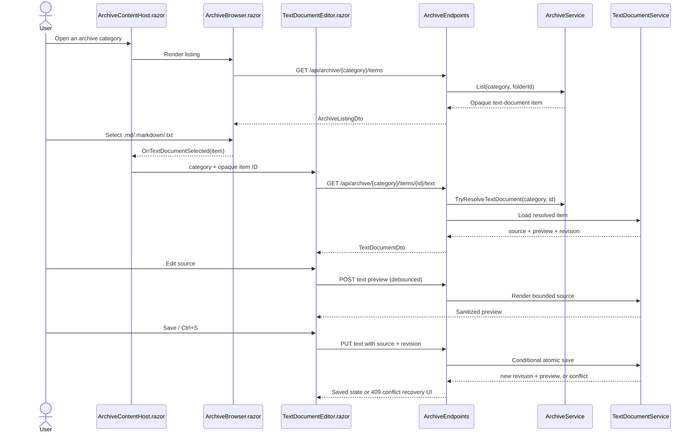

# Plan: Inline Markdown and Text Editor

## Table of Contents

- [Summary](#summary)
- [Technical Approach](#technical-approach)
- [Component Breakdown](#component-breakdown)
- [Dependencies](#dependencies)
- [External / Vendor Documentation Evidence](#external--vendor-documentation-evidence)
- [Flow](#flow)
- [Risk Assessment](#risk-assessment)

## Summary

Extend the existing archive listing/activation pattern so `.md`, `.markdown`, and `.txt` items in every category open a reusable, inline Blazor editing workspace instead of a media viewer. The server continues to resolve opaque IDs and own file I/O, preview sanitization, revisions, and atomic writes; the client owns page-local editor state, responsive layout, and explicit-save interaction.

## Technical Approach

### Archive and server boundary

Extend the established `ArchiveService` classification model rather than create a second file browser. `ArchiveItemEntry` gains `IsTextDocument` and a document-kind value derived solely from an explicit `.md`, `.markdown`, `.txt` extension allowlist. `IArchiveService` gains `TryResolveTextDocument`, parallel to `TryResolveVideo`, `TryResolveMusic`, `TryResolveImage`, and `TryResolveBook`. It uses the existing category resolution, opaque ID lookup, reparse-point rejection, and canonical containment checks, so the capability applies to every category and nested folder without accepting paths from the browser.

Introduce a focused `ITextDocumentService`/`TextDocumentService` that accepts only a resolved `ArchiveItemEntry`. It owns:

- bounded UTF-8 reads (including explicit rejection of unsupported/binary or oversized input);
- a browser-safe revision value derived from the file state at load time;
- Markdown rendering through a server-side CommonMark-compatible parser configured with the approved extensions and raw HTML disabled;
- a final generated-HTML allowlist using the existing `HtmlAgilityPack` dependency: semantic formatting only, no `img`, no style/event attributes, no scripts/forms/iframes, and `<a>` only when the absolute URL is `https`;
- plain-text preview generation using encoded text and whitespace-preserving markup rather than Markdown conversion;
- revision comparison immediately before save, and a contained temp-file plus atomic replacement write flow.

`ArchiveEndpoints` remains the thin HTTP boundary. It maps text-document routes alongside the existing archive routes, resolves only through `TryResolveTextDocument`, applies request limits, and returns controlled status responses: `404` for unsupported/stale items, `400` for invalid text/request data, `413` for too-large bodies/source, and `409` for revision conflicts. It must not return physical paths or exception text that contains them. A load response contains `Name`, `DocumentKind`, `Source`, `Revision`, and safe rendered preview; preview requests return the current sanitized preview for the submitted bounded source; save requests return the new revision and preview after successful replacement.

The editor preview is intentionally server-side. The client therefore never parses potentially hostile source into browser markup and the server has one enforced Markdown/link policy. The preview request is debounced and canceled from the component; a monotonically increasing client request token prevents an older response from replacing a newer preview.

### Client page and component composition

`ArchiveBrowser.razor` gains an `OnTextDocumentSelected` callback, a document visual state, and activation branch. It remains responsible for listing/navigation and delegates selection; it does not load or save text content.

Create a reusable `TextDocumentEditor.razor` client component with editor state scoped to one selected archive category/item ID. Its Bootstrap toolbar includes Back, document name/type, dirty/saved status, Reload, Copy draft after a conflict, and the single principal Save action. A `textarea` receives normal Blazor input; its `@onkeydown` handler recognizes Ctrl+S/Cmd+S, prevents the browser save shortcut, and invokes the same guarded save operation. This avoids a new JS module for a behavior Blazor can own.

Use Bootstrap `d-flex flex-column flex-lg-row` and pane wrappers for the requested source-left/preview-right desktop layout and source-above-preview mobile layout. Isolated `TextDocumentEditor.razor.css` is limited to editor-specific equal-height panes, independent scrolling, monospace source presentation, and `white-space: pre-wrap` behavior. Standard toolbar, alerts, buttons, spacing, responsive direction, and colors come from Bootstrap and the global tokens in `WebApp/WebApp/wwwroot/app.css`.

All existing archive pages use `ArchiveBrowser`, not only `Documents.razor`; therefore they must each host the page-local selected document state and the inline editor. Extracting a small reusable host component is preferable to duplicating state across `Home.razor`, `Videos.razor`, `Photos.razor`, `Music.razor`, `Documents.razor`, `Books.razor`, `Downloads.razor`, `Shared.razor`, `Family.razor`, and `Trash.razor`. The host composes `ArchiveBrowser` and `TextDocumentEditor`, supplies the category/title/icon parameters already used by each page, and preserves the normal page header and content-container placement. `Books.razor` must continue to layer its existing `EpubReader` behavior without treating EPUBs as text documents.

On Back, a dirty document requires confirmation. On conflict, retain the draft in component memory and disable another save until the user explicitly reloads the disk version or copies the draft. No automatic overwrite or autosave is allowed.

### Testing and principles

The high-level endpoint code depends on `IArchiveService` and `ITextDocumentService`, not direct filesystem calls. `TextDocumentService` has small read/render/save operations that can be direct-tested with temporary archive fixtures; `ArchiveService` retains classification/resolution responsibility. This follows existing endpoint/service tests and keeps policy decisions unit-testable. `WebApplicationFactory` endpoint tests prove the real route, JSON status, privacy boundary, and on-disk result.

## Component Breakdown

**Existing files to modify:**

- `WebApp/WebApp/WebApp.csproj` — add one server-only CommonMark-compatible Markdown parser package; retain the already installed `HtmlAgilityPack` for final preview sanitization.
- `WebApp/WebApp/Program.cs` — register `ITextDocumentService` and its implementation.
- `WebApp/WebApp/Models/ArchiveItemEntry.cs` — add archive-internal text-document classification data.
- `WebApp/WebApp/Services/IArchiveService.cs` — add safe text-document resolution.
- `WebApp/WebApp/Services/ArchiveService.cs` — classify the explicit extensions in every category and implement the resolver with current containment rules.
- `WebApp/WebApp/Endpoints/ArchiveEndpoints.cs` — map/load/preview/save text-document endpoints and map text metadata into listing DTOs.
- `WebApp/WebApp.Client/Models/ArchiveItemDto.cs` — expose only browser-safe text-document state/kind required for card selection.
- `WebApp/WebApp.Client/Components/ArchiveBrowser.razor` — render document cards and dispatch text-document activation without altering existing media flows.
- `WebApp/WebApp.Client/Components/ArchiveBrowser.razor.css` — add only any document-card exception Bootstrap cannot express.
- `WebApp/WebApp.Client/Pages/Home.razor`, `Videos.razor`, `Photos.razor`, `Music.razor`, `Documents.razor`, `Books.razor`, `Downloads.razor`, `Shared.razor`, `Family.razor`, and `Trash.razor` — adopt the reusable archive/editor host while preserving their present titles and special EPUB composition.
- `WebApp/WebApp/wwwroot/app.css` — add shared document-workspace token mappings only if scoped CSS cannot reuse existing tokens.
- `WebApp.Tests/Services/ArchiveServiceTests.cs` — cover classification and `TryResolveTextDocument` across categories and rejection cases.
- `WebApp.Tests/Endpoints/ArchiveEndpointsTests.cs` — cover opaque endpoint behavior, safe preview/link output, revision conflict, atomic save outcome, size/error cases, and no path leakage.

**New files to create:**

- `WebApp/WebApp.Client/Components/ArchiveContentHost.razor` — reusable page-local host that switches between `ArchiveBrowser` and editor content without leaving the normal page container.
- `WebApp/WebApp.Client/Components/TextDocumentEditor.razor` — source/preview workspace, explicit save, keyboard shortcut, dirty/conflict/reload state.
- `WebApp/WebApp.Client/Components/TextDocumentEditor.razor.css` — nonstandard editor pane/scroll/whitespace rules.
- `WebApp/WebApp.Client/Models/TextDocumentDto.cs` — safe load/save response contract.
- `WebApp/WebApp.Client/Models/TextDocumentPreviewRequest.cs` — bounded preview request contract.
- `WebApp/WebApp.Client/Models/TextDocumentSaveRequest.cs` — source plus optimistic-concurrency revision request contract.
- `WebApp/WebApp.Client/Models/TextDocumentKind.cs` — Markdown/plain-text browser-safe enum.
- `WebApp/WebApp/Services/ITextDocumentService.cs` — focused read/render/conditional-save contract.
- `WebApp/WebApp/Services/TextDocumentService.cs` — contained file I/O, UTF-8/size policy, Markdown/plain preview, sanitization, revisions, atomic writes.
- `WebApp.Tests/Services/TextDocumentServiceTests.cs` — rendering/sanitization/link policy, encoding, bounds, revision, and write tests.
- `WebApp.Tests/Client/TextDocumentEditorStateTests.cs` — pure client-state tests if state is factored from the component, following existing client model test conventions.

## Dependencies

- Existing writable `ArchiveRoot:Path`; unlike the read-only video root, it already supports archive rename/move/folder mutations and therefore can host conditional text saves.
- Existing Docker Compose/Makefile workflow only: `make dotnet ARGS="build"` and `make test`.
- One server-only, actively maintained Markdown parser compatible with .NET 10 and CommonMark extensions. The implementation must pin a verified version in `WebApp.csproj`; no client parser, JavaScript editor framework, CDN asset, database, or background service is needed.
- Existing `HtmlAgilityPack` package for a defense-in-depth generated-HTML allowlist.

## External / Vendor Documentation Evidence

- [Prevent Cross-Site Scripting (XSS) in ASP.NET Core](https://learn.microsoft.com/aspnet/core/security/cross-site-scripting?view=aspnetcore-10.0) — Microsoft Learn states that user-controlled content must be encoded or sanitized at output, warns against raw `HtmlString`, and specifically identifies Markdown with a parser that strips embedded HTML as a safer rich-input approach. This supports server-side parsing with raw HTML disabled and a final allowlist before rendering the generated preview.
- [Threat mitigation guidance for ASP.NET Core Blazor interactive server-side rendering](https://learn.microsoft.com/aspnet/core/blazor/security/interactive-server-side-rendering?view=aspnetcore-10.0) — Microsoft Learn requires validation of event/JS inputs, prevention of unbounded memory/resource allocation, protection against duplicate dispatches, cancellation of work when components are disposed, and recommends CSP consideration. This supports bounded source endpoints, debounced/cancellable preview calls, guarded Save, and server-side validation. Although this app uses Interactive WebAssembly, the endpoint and browser-input safety principles still apply; the project’s established client/server split and LAN host-header constraints remain authoritative.

## Flow

## Risk Assessment

| Risk | Evidence | Mitigation |
| --- | --- | --- |
| Archive text can contain hostile markup or unsafe URLs. | Markdown is user-owned archive data, and preview requires HTML rendering. | Disable raw HTML, sanitize generated output, permit only semantic tags and HTTPS anchors, remove images and every active/embed attribute/tag, and test malicious fixtures. |
| A client could overwrite an external NAS edit. | Archive files can change outside the browser and IDs alone do not represent content revision. | Return a revision at load; compare just before write; return 409 and retain the client draft on mismatch. |
| Large/binary files could exhaust server/client resources or corrupt text. | Every category can contain arbitrary files and the editor returns source to WebAssembly. | Explicit extension allowlist, bounded read/request sizes, strict UTF-8 validation, cancellation, and 413/400 controlled responses. |
| Path disclosure or traversal could bypass the archive privacy boundary. | The app’s primary archive constraint forbids browser-visible paths. | Reuse `ArchiveService` opaque-ID resolution, canonical containment and reparse-point rules; never accept a path/name in document I/O requests; test response bodies/log-safe errors. |
| Preview requests can race during typing. | Debounced asynchronous responses can return out of order. | Cancel pending work and only apply the response associated with the latest editor revision/request token. |
| Repeating host state in every page would regress special media behavior. | All category pages currently directly compose `ArchiveBrowser`; Books also hosts `EpubReader`. | Introduce a small reusable archive content host and preserve specialized callbacks/layers; test existing media activation regression paths. |
