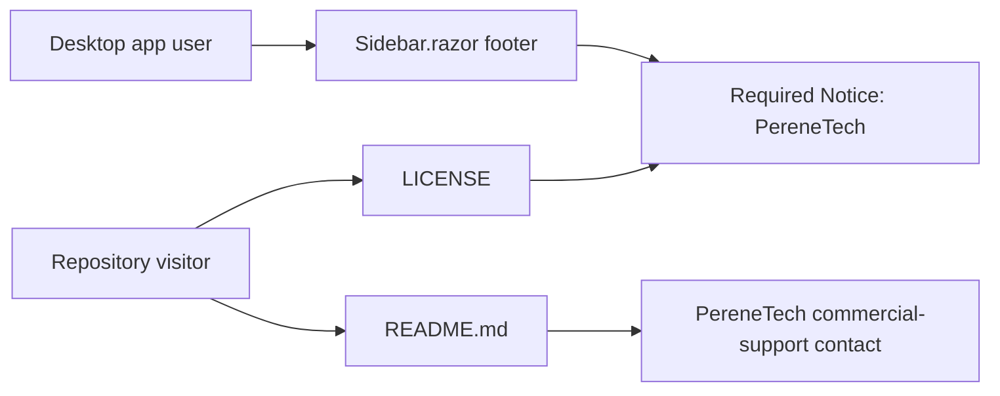

# Plan: PereneTech Licensing and Credit

## Table of Contents

- [Summary](#summary)
- [Technical Approach](#technical-approach)
- [Component Breakdown](#component-breakdown)
- [Dependencies](#dependencies)
- [External Documentation Evidence](#external-documentation-evidence)
- [Flow](#flow)
- [Risk Assessment](#risk-assessment)

## Summary

Add a standard source-available noncommercial software license with an immutable PereneTech credit, document the route to a separately negotiated commercial agreement, and add the same credit to the existing desktop sidebar footer. The UI extends the client-owned Bootstrap shell without adding application state.

## Technical Approach

Place the official PolyForm Noncommercial License 1.0.0 in root `LICENSE` and prefix it with the license-defined `Required Notice` for PereneTech. Update the repository README with a focused Commercial Licensing and Support section, including the supplied contact email.

Extend `WebApp/WebApp.Client/Layout/Sidebar.razor`, which already owns desktop sidebar footer composition, with a small muted copyright line in its existing footer container. The existing Bootstrap utility-based layout is preserved; no new CSS is needed. Because the client shell has `prerender: false`, its sidebar markup is absent from the server document response; add a focused source assertion to the existing `WebApp.Tests/Client/ThemeBootstrapTests.cs` instead of a `WebApplicationFactory` HTML assertion.

## Component Breakdown

**Existing files to modify:**

- `README.md` — add licensing and PereneTech commercial-support information.
- `WebApp/WebApp.Client/Layout/Sidebar.razor` — render the PereneTech credit in the desktop footer.
- `WebApp.Tests/Client/ThemeBootstrapTests.cs` — assert the shell response contains the credit.

**New files to create:**

- `LICENSE` — PolyForm Noncommercial License 1.0.0 with a PereneTech required notice.

## Dependencies

- PolyForm Noncommercial License 1.0.0 standard text.
- Existing Bootstrap 5.3.8 utilities and the project’s Docker Compose test target.

## External Documentation Evidence

- [PolyForm Noncommercial License 1.0.0](https://polyformproject.org/licenses/noncommercial/1.0.0) permits noncommercial use, changes, and distribution and requires recipients to receive any `Required Notice:` line supplied by the licensor. It is the governing license text to copy without alteration.
- Not applicable for Microsoft-specific guidance: this is a static Razor markup and documentation change with no framework/API decision.

## Flow

## Risk Assessment

| Risk | Evidence | Mitigation |
| --- | --- | --- |
| License text is accidentally altered | PolyForm license terms are standardized legal text. | Copy the official text verbatim and keep the project-specific notice outside it. |
| Footer change displaces controls | The footer currently contains privacy status, theme toggle, and storage meter. | Add a small line inside the same flex container without removing or reordering existing controls. |
| Support terms are mistaken for a binding agreement | Repository documentation is not a customer contract. | State that commercial use and support require a separate written agreement. |
