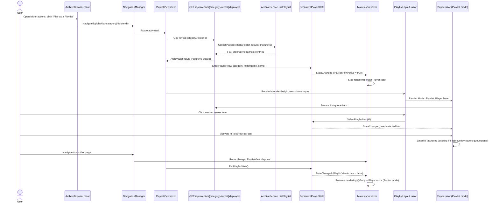

# Plan: Folder Playlist View

## Table of Contents

- [Summary](#summary)
- [Technical Approach](#technical-approach)
- [Component Breakdown](#component-breakdown)
- [Dependencies](#dependencies)
- [External / Vendor Documentation Evidence](#external--vendor-documentation-evidence)
- [Flow](#flow)
- [Risk Assessment](#risk-assessment)

## Summary

Add a folder-level "Play as a Playlist" action that routes to a new client-only page, which loads every video/music file found anywhere under the folder (including subfolders) through a new recursive server endpoint and drives a generalized, mixed-media queue in `PersistentPlayerState`. The player itself gains an in-page "playlist" presentation mode, with a bounded-height layout (matching `TextDocumentEditor.razor`'s pattern) so the same `Player.razor` instance renders inline beside an internally-scrolling queue panel instead of being duplicated or overflowing the page, and the existing Fill-tab overlay (`Specs/20260827113116-fill-tab-video-mode/`) is reused unchanged as the "fit" control.

## Technical Approach

**Server: recursive playable-media detection.** `WebApp/WebApp/Services/ArchiveService.cs`'s `BuildListing` already classifies each child as `IsVideo`/`IsMusic` using the existing `VideoExtensions`/`MusicExtensions` sets while enumerating a folder's direct children (`WebApp/WebApp/Services/ArchiveService.cs:333-408`). For folder children, add a `HasPlayableMediaRecursive` scan using `Directory.EnumerateFiles(path, "*", SearchOption.AllDirectories)` that short-circuits at the first entry whose extension is in `VideoExtensions` or `MusicExtensions`, and store the result as `HasPlayableMedia` on `WebApp/WebApp/Models/ArchiveItemEntry.cs`. This mirrors the same unrestricted `SearchOption.AllDirectories` pattern `ResolveItem` already uses elsewhere in this file, and never returns a path — only a boolean. Wire the flag through `WebApp/WebApp/Endpoints/ArchiveEndpoints.cs`'s existing entry-to-DTO mapping into a new `HasPlayableMedia` field on `WebApp/WebApp.Client/Models/ArchiveItemDto.cs`, matching how `IsVideo`/`IsMusic`/`IsImage`/`IsBook` are already surfaced.

**New recursive playlist endpoint.** The playlist page needs every video/music file anywhere under the chosen folder, not just its direct children, so it cannot reuse the existing non-recursive `GET /api/archive/{category}/items?folderId=...` listing. Add `IArchiveService.ListPlaylist(categoryKey, folderId)` / `ArchiveService.ListPlaylist`, backed by a new recursive `CollectPlayableMedia(category, folder, results)` helper that walks the folder tree depth-first (skipping reparse points, respecting the same containment rules as `BuildListing`), resolving each direct child folder's per-folder album cover via the existing `FindAlbumCover` helper so nested album folders keep correct cover art, and returns a flat, ordered `ArchiveListing` whose `Items` contains only video/music files. Map a new `GET /api/archive/{category}/items/{id}/playlist` endpoint (`WebApp/WebApp/Endpoints/ArchiveEndpoints.cs`) onto it, reusing the existing `ToDtoAsync(ArchiveListing, ...)` thumbnail/hover-preview/subtitle/metadata reconciliation so returned items get the same thumbnail/album-cover/stream URL treatment as any other listing.

**Generalize the playlist model in `PersistentPlayerState`.** Today `WebApp/WebApp.Client/Services/PersistentPlayerState.cs` only tracks a music-only `MusicPlaylist` of `MusicTrackDto`. Rename the concept to a general ordered queue capable of holding both video and music entries: extend `WebApp/WebApp.Client/Models/MusicTrackDto.cs` (or introduce a small `PlaylistTrackDto` beside it) with a `MediaKind` (`Video`/`Music`) and keep the existing per-item `StreamBasePath` field, which already generalizes cleanly to archive video items (`api/archive/{category}/items`) the same way it does for music (`api/archive/{category}/items` + `/audio` suffix trimmed). Add `PersistentPlayerState.Playlist` (replacing/wrapping the current `MusicPlaylist`), `HasPlaylist`, `PlaylistFolderName`, `PlaylistViewActive`, and `EnterPlaylistView(...)`/`ExitPlaylistView()`/`SelectPlaylistItem(id)` members, while keeping `SelectMusic(...)` as a thin wrapper over the general queue so `Music.razor`'s existing non-recursive music-only playlist behavior is unchanged (`Specs/20260908143416-music-folder-playback/`). `CanSelectPreviousTrack`/`CanSelectNextTrack` become driven by `HasPlaylist` and current index instead of `IsMusic` specifically, so both music-only and mixed playlists get the same previous/next semantics.

**Player auto-advance and presentation mode.** `WebApp/WebApp.Client/Components/Player.razor`'s `HandleEndedAsync` currently auto-advances only `if (PlayerState.IsMusic && PlayerState.CanSelectNextTrack)` (`WebApp/WebApp.Client/Components/Player.razor:497-504`); generalize the condition to `PlayerState.HasPlaylist && PlayerState.CanSelectNextTrack` so a video item ending inside a playlist also auto-advances, matching FR7. Add a `[Parameter] public PlayerPresentationMode Mode { get; set; } = PlayerPresentationMode.Footer;` (a small new enum: `Footer`, `Playlist`) that only changes the CSS classes already computed in `EditorCssClass`/`PreviewStageCssClass`/`MediaRowCssClass`/`VideoViewportCssClass` (`WebApp/WebApp.Client/Components/Player.razor:225-243`): `Playlist` mode renders in normal document flow (no `position-fixed`) so it can sit inside a two-column layout, while `Footer` mode keeps today's fixed-bottom bar. Fill-tab (`_fillTab.IsActive`) stays completely orthogonal — its markup and CSS already ignore footer/playlist chrome and cover the whole viewport, so entering Fill-tab from playlist mode automatically covers the queue panel with no additional code, satisfying the "fit hides the playlist" requirement for free. `MediaPlayerControls.razor`'s previous/next chevrons switch from an `IsMusicMode` gate to a `HasPlaylist` gate (renamed parameter) so they also appear for mixed/video playlists; per-item control visibility (crop/saturation/subtitles) stays keyed off the *current selected item's* media kind exactly as today, not off playlist mode.

**New playlist route and layout, single shared player instance.** Add `WebApp/WebApp.Client/Pages/PlaylistView.razor` at `@page "/playlist/{Category}/{FolderId}"`, following the existing routed-page pattern (`Videos.razor`, `Music.razor`, etc.) and the client-owned routing boundary in `AGENTS.md`. On `OnParametersSetAsync`, it calls the new `GET /api/archive/{category}/items/{id}/playlist` endpoint and calls `PlayerState.EnterPlaylistView(category, folderName, listing.Items)`; on `Dispose`, it calls `PlayerState.ExitPlaylistView()`. The page itself renders only loading/empty/error states — the actual player+queue layout is a self-contained `WebApp/WebApp.Client/Components/PlaylistLayout.razor` rendered directly by `PlaylistView.razor`. `MainLayout.razor` needs only one small change to guarantee a single mounted player: it renders its persistent footer `<Player PlayerState="PlayerState" Mode="PlayerPresentationMode.Footer" />` only when `PlayerState.Selected is not null && !PlayerState.PlaylistViewActive`, so while the playlist route's own `<Player Mode="PlayerPresentationMode.Playlist" />` (inside `PlaylistLayout.razor`) is mounted, the footer instance is not. Leaving the playlist route disposes `PlaylistView`/`PlaylistLayout`/its embedded `Player`, `ExitPlaylistView()` clears `PlaylistViewActive`, and `MainLayout.razor` resumes rendering the footer-mode `Player`; because playback intent (play/pause, volume, rate) is state the *new* Player instance re-applies from `PlayerState` on mount (`ApplyPlayerPreferencesAsync`), the footer player resumes the same selection — exact in-flight currentTime continuity across that specific transition is accepted as a known limitation (see Risk Assessment), consistent with the Out of Scope note.

`PlaylistLayout.razor` renders a Bootstrap responsive two-column region (`flex-column flex-lg-row`, matching the responsive utility-first rule in `AGENTS.md`) bounded to the height of its content container: following the same `min-height: 0`/`flex: 1 1 auto` chain `WebApp/WebApp.Client/Components/TextDocumentEditor.razor.css` already uses to keep a two-pane editor within its parent's height and scroll internally instead of scrolling the whole page, `PlaylistLayout.razor`'s root, its player column, and its queue panel all propagate `height: 100%`/`min-height: 0` down from `<main>` (itself already `flex-fill min-h-0` in `MainLayout.razor`) at the `lg` breakpoint and above; below it, the two columns stack with a `min-height: 50vh` floor on the video area and ordinary page-level scrolling, consistent with `Specs/20260907221305-unified-archive-browser/`'s existing mobile-responsiveness precedent. The left/top column contains the embedded `Player.razor` (now-playing info + controls already built into `Player.razor`'s non-fixed markup, itself restructured with the same flex-grow/min-height chain so its video area fills the remaining space instead of a fixed `.ratio` box) and the right/bottom `queue panel` — a `list-group`-based ordered list of the current `PersistentPlayerState.Playlist`, each item showing position number, a 16:9 thumbnail (`ThumbnailUrl`) or square album cover (`AlbumCoverUrl`) reusing the existing `ArchiveBrowser.razor` tile image patterns, title, and formatted duration (`MediaPlayerState.FormatTime`), with the active item visually marked via a `list-group-item-active`/`border-primary` style consistent with `ArchiveBrowser.razor`'s existing "Selected" badge treatment, and its own `flex-grow-1 min-height-0 overflow-y-auto` scroll region (mirroring `.text-document-preview`) so a long queue scrolls internally rather than growing the page. Clicking a queue item calls `PlayerState.SelectPlaylistItem(id)`.

**Folder action entry point.** `WebApp/WebApp.Client/Components/ArchiveBrowser.razor`'s existing per-item dropdown (`WebApp/WebApp.Client/Components/ArchiveBrowser.razor:97-143`) gets one more `<li>` for folder items where `item.HasPlayableMedia` is true, using Bootstrap Icons `bi-collection-play` and `@onclick="() => PlayAsPlaylist(item)"` that calls `NavigationManager.NavigateTo($"/playlist/{Uri.EscapeDataString(Category)}/{Uri.EscapeDataString(item.Id)}")`, following the same escaping already used for other archive URLs in `ArchiveEndpoints.cs`.

## Component Breakdown

**Existing files to modify:**

- `WebApp/WebApp/Models/ArchiveItemEntry.cs` - add `HasPlayableMedia` (server-internal, boolean only).
- `WebApp/WebApp/Services/IArchiveService.cs` - add `ListPlaylist(categoryKey, folderId)`.
- `WebApp/WebApp/Services/ArchiveService.cs` - compute recursive `HasPlayableMedia` for folder children; add `ListPlaylist`/`CollectPlayableMedia` for the recursive queue.
- `WebApp/WebApp/Endpoints/ArchiveEndpoints.cs` - map `HasPlayableMedia` into `ArchiveItemDto`; add `GET /api/archive/{category}/items/{id}/playlist`.
- `WebApp/WebApp.Client/Models/ArchiveItemDto.cs` - add `bool HasPlayableMedia = false`.
- `WebApp/WebApp.Client/Models/MusicTrackDto.cs` - replaced by `PlaylistTrackDto` (see New files) with a `MediaKind` field so the same record can represent a video or music queue entry.
- `WebApp/WebApp.Client/Services/PersistentPlayerState.cs` - generalize `MusicPlaylist` into a mixed-kind `Playlist`, add `HasPlaylist`, `PlaylistViewActive`, `PlaylistFolderName`, `EnterPlaylistView`, `ExitPlaylistView`, `SelectPlaylistItem`; keep `SelectMusic` as a compatible wrapper.
- `WebApp/WebApp.Client/Components/Player.razor` - add `PlayerPresentationMode` parameter driving layout CSS; generalize `HandleEndedAsync` auto-advance from `IsMusic` to `HasPlaylist`; restructure the playlist-mode viewport/controls to a bounded-height flex chain instead of a fixed-aspect-ratio box.
- `WebApp/WebApp.Client/Components/Player.razor.css` - add the non-fixed "playlist" layout rules that Bootstrap utilities cannot express (bounded/mobile-floor video height).
- `WebApp/WebApp.Client/Components/MediaPlayerControls.razor` - add a `HasPlaylist` parameter for the previous/next gate, alongside the existing `IsMusicMode` gate for per-item control visibility.
- `WebApp/WebApp.Client/Layout/MainLayout.razor` - render the footer `Player.razor` only when `PlayerState.Selected is not null && !PlayerState.PlaylistViewActive`, so it never coexists with the playlist route's own embedded `Player`.
- `WebApp/WebApp.Client/Components/ArchiveBrowser.razor` - add the "Play as a Playlist" dropdown action for folder items with `HasPlayableMedia`, navigating to the new route.
- `WebApp.Tests/Services/ArchiveServiceTests.cs` - cover recursive `HasPlayableMedia` (mixed/video-only/music-only/no-media/nested-only-media folders) and `ListPlaylist` queue construction/ordering.
- `WebApp.Tests/Endpoints/ArchiveEndpointsTests.cs` - cover `HasPlayableMedia` and the new `/playlist` endpoint surfaced in JSON without path leakage.
- `WebApp.Tests/Client/PersistentPlayerStateTests.cs` - cover `EnterPlaylistView`/`ExitPlaylistView`/`SelectPlaylistItem`, mixed-kind previous/next, and unchanged music-only behavior.

**New files to create:**

- `WebApp/WebApp.Client/Pages/PlaylistView.razor` - routed page at `/playlist/{Category}/{FolderId}` that loads the recursive playlist endpoint and drives `PersistentPlayerState.EnterPlaylistView`/`ExitPlaylistView`.
- `WebApp/WebApp.Client/Components/PlaylistLayout.razor` - the bounded-height, two-column player+queue-panel layout rendered by `PlaylistView.razor`.
- `WebApp/WebApp.Client/Components/PlaylistLayout.razor.css` - narrowly scoped CSS only for geometry Bootstrap utilities cannot express (height chain at the `lg` breakpoint, queue panel scroll region, active-item marker).
- `WebApp/WebApp.Client/Models/PlayerPresentationMode.cs` - small `Footer`/`Playlist` enum consumed by `Player.razor`.
- `WebApp/WebApp.Client/Models/PlaylistTrackDto.cs` - browser-safe mixed video/music queue entry (`MediaKind`, `SourceUrl`, `StreamBasePath`, thumbnail/cover, duration), replacing `MusicTrackDto`.

## Dependencies

- New recursive listing endpoint `GET /api/archive/{category}/items/{id}/playlist` and its opaque ID/thumbnail/cover/stream URL fields, reusing the existing thumbnail/hover-preview/subtitle/metadata coordinators.
- Existing `PersistentPlayerState`, `Player.razor`, `MediaPlayerControls.razor`, `FillTabState`, and `videoEditor.js` interop from `Specs/20260907201715-persistent-footer-player/` and `Specs/20260827113116-fill-tab-video-mode/`.
- Existing thumbnail/hover-preview/album-cover pipelines for queue panel imagery; no new FFmpeg work.
- Bootstrap 5.3.8 `list-group`/responsive flex utilities and Bootstrap Icons 1.13.1 (`bi-collection-play`) already vendored in the project.

## External / Vendor Documentation Evidence

Not applicable to a new vendor-documented technology decision. This feature reuses already-verified ASP.NET Core minimal API, Blazor WebAssembly routing/state, and Bootstrap patterns documented in `Specs/20260907201715-persistent-footer-player/Plan.md` and `Specs/20260907221305-unified-archive-browser/`; no new Microsoft- or Bootstrap-specific API surface is introduced.

## Flow

## Risk Assessment

| Risk | Evidence | Mitigation |
| --- | --- | --- |
| Two `Player.razor` instances mount simultaneously, duplicating media playback | `MainLayout.razor` currently always renders the footer `Player.razor` outside `@Body` when a selection exists. | `MainLayout.razor` renders exactly one `Player.razor` at a time, chosen by `PlayerState.PlaylistViewActive`; `PlaylistLayout.razor` never coexists with the footer `Player.razor`. |
| Generalizing `MusicPlaylist` breaks existing music-only previous/next or auto-advance behavior | `Specs/20260908143416-music-folder-playback/` already ships tested music playlist behavior via `IsMusic`/`MusicPlaylist`. | Keep `SelectMusic` as a compatible wrapper over the generalized queue and add regression coverage in `PersistentPlayerStateTests.cs` asserting unchanged music-only semantics. |
| Exact playback position is not preserved across the specific playlist-route-exit -> footer-mode remount transition | The footer and playlist-mode players are the same component but a new instance is created when `MainLayout.razor` swaps which parent renders it, per Blazor component lifecycle. | Re-apply saved player preferences (`ApplyPlayerPreferencesAsync`) on mount as already done today; document the residual limitation explicitly in Requirements' Out of Scope rather than building custom time-preserving plumbing. |
| Recursive playable-media scan adds filesystem work to every folder listing | `BuildListing` already enumerates each folder once per request; this adds one recursive `SearchOption.AllDirectories` enumeration per folder child that is itself a folder. | Short-circuit at the first matching extension and skip it entirely for non-folder children; the existing `ResolveItem` method already performs unrestricted `AllDirectories` enumeration elsewhere in this service, so this follows an accepted existing cost profile rather than introducing a new one. |
| Physical paths leak through the new `HasPlayableMedia` flag, the `/playlist` endpoint, or queue metadata | Repository constraint: no physical/root-relative path may reach the browser. | `HasPlayableMedia` is a boolean computed server-side; the `/playlist` endpoint reuses the same `ToDtoAsync` mapping and opaque URL fields (`ThumbnailUrl`, `AlbumCoverUrl`, `AudioUrl`, stream endpoints) already proven path-safe by existing archive endpoint tests; a new endpoint test asserts the response body never contains the archive root. |
| Queue panel and playlist layout regress mobile responsiveness, or the bounded-height chain causes the whole page to scroll instead of internal panes | `Specs/20260907221305-unified-archive-browser/` already had to guard against overlap across breakpoints for archive cards; without a `min-height: 0`/`flex: 1 1 auto` chain, flex children default to their content's natural size and overflow their bounded ancestor. | Mirror `TextDocumentEditor.razor.css`'s proven `min-height: 0` + `flex: 1 1 auto` pattern through `PlaylistLayout.razor`, `Player.razor`'s playlist-mode viewport, and the queue list, gated to the `lg` breakpoint with a `min-height: 50vh` mobile floor; reuse existing Bootstrap responsive flex utilities and tile image patterns otherwise. |
