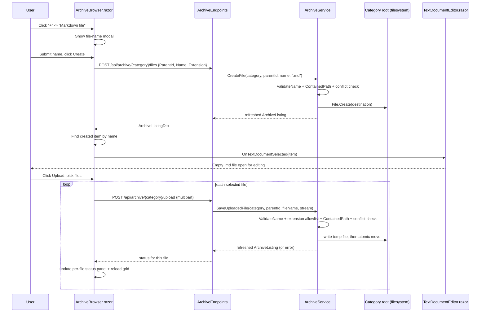

# Plan: Archive Create Menu and Upload

## Table of Contents

- [Summary](#summary)
- [Technical Approach](#technical-approach)
- [Component Breakdown](#component-breakdown)
- [Dependencies](#dependencies)
- [External / Vendor Documentation Evidence](#external--vendor-documentation-evidence)
- [Flow](#flow)
- [Risk Assessment](#risk-assessment)

## Summary

Extend the single "+" create button in `ArchiveBrowser.razor` into a Bootstrap dropdown (Folder / Text file / Markdown file) and add a sibling Upload button, backed by two new narrow `IArchiveService` methods (`CreateFile`, `SaveUploadedFile`) and two new minimal-API endpoints, reusing the exact validation/containment/conflict patterns `CreateFolder` already established.

## Technical Approach

**Server (`WebApp/WebApp/Services/ArchiveService.cs`, `WebApp/WebApp/Endpoints/ArchiveEndpoints.cs`)** — extend the existing service, don't introduce a new one. `ArchiveService.CreateFolder` (lines 64-82) is the template: resolve category → check `CanCreateFolder` → resolve parent folder → `ValidateName` → `ContainedPath` → conflict check via `File.Exists`/`Directory.Exists` → write → `BuildListing`. Two new methods follow the same shape:

- `CreateFile(categoryKey, parentId, name, extension)` — identical to `CreateFolder` except it appends the extension (`.txt` or `.md`, validated against a small fixed set, not user input) before the conflict check, and calls `File.Create(destination).Dispose()` instead of `Directory.CreateDirectory`.
- `SaveUploadedFile(categoryKey, parentId, fileName, Stream content)` — same category/name/containment/conflict checks, plus an extension check against the union of `VideoExtensions`, `MusicExtensions`, `ImageExtensions`, `BookExtensions`, `TextDocumentExtensions`, `PdfDocumentExtensions` (all already defined at the top of `ArchiveService.cs`), throwing `ArchiveValidationException` for an unsupported extension. Writes to a temp file in the same directory (`Path.Combine(parent.PhysicalPath, Path.GetRandomFileName())`) via `CopyToAsync`, then `File.Move(temp, destination)` for an atomic publish — the same temp-file-then-atomic-move pattern already used by `FfmpegThumbnailGenerator`, `FfmpegCutGenerator`, and `FfmpegCompositionGenerator` (per `AGENTS.md`'s Architecture Summary), applied here to a plain file copy instead of an FFmpeg output.

Both new methods are added to `IArchiveService` (`WebApp/WebApp/Services/IArchiveService.cs`) next to `CreateFolder`. `ArchiveEndpoints.MapArchiveEndpoints` gets two new routes following the exact `CreateFolder` handler shape (same `ToDtoAsync` pipeline, same DI parameters):

- `POST /api/archive/{category}/files` — JSON body `CreateFileRequest(string? ParentId, string Name, string Extension)` (new record in `WebApp.Client/Models/`, alongside `CreateFolderRequest`), returns the refreshed `ArchiveListingDto` exactly like `CreateFolder` does.
- `POST /api/archive/{category}/upload` — `IFormFile` multipart request (ASP.NET Core minimal API binds `IFormFile`/`IFormFileCollection` natively), reads `ParentId` from a query string or form field, calls `SaveUploadedFile` once per posted file, returns the refreshed `ArchiveListingDto`.

Existing exception-to-HTTP-status mapping (`ArchiveForbiddenException` → 403, `ArchiveConflictException` → 409, `ArchiveValidationException` → 400, per the `ExecuteAsync`/`ToDtoAsync` wrapper already used by every other archive mutation endpoint) is reused unchanged — no new error-handling path is introduced.

**Client (`WebApp/WebApp.Client/Components/ArchiveBrowser.razor`)** — the existing single "+" button (lines 51-62) becomes a `dropdown` wrapper (`btn-group`/`dropdown` Bootstrap pattern, matching the per-card `dropdown` already used for the three-dots actions menu at lines 113-173) with three `dropdown-item` entries: "New folder" (opens the existing `#{CreateModalId}` modal, unchanged), "Text file" and "Markdown file" (open a new, near-identical modal bound to a second `FileForm { Name, Extension }` model that posts to the new `POST /api/archive/{category}/files` endpoint). On success, `CreateFileAsync` mirrors `CreateFolderAsync`'s "find item by name in the refreshed listing" logic, then calls `OnTextDocumentSelected.InvokeAsync(createdFile)` — the same callback `ActivateAsync` already invokes for existing text documents — so `ArchiveContentHost.razor`'s existing `OpenTextDocument` wiring opens `TextDocumentEditor.razor` with no changes needed in `ArchiveContentHost.razor` itself.

A new Upload button sits next to the create dropdown, same `_listing?.CanCreateFolder == true` guard, using the Bootstrap Icons upload glyph (`<i class="bi bi-upload" aria-hidden="true"></i>`) to match the existing icon-only circular-button convention (`bi-plus` on the create button, `bi-three-dots-vertical` on the card actions menu), and rendering a visually hidden `<InputFile OnChange="OnFilesSelected" multiple />` (Blazor's built-in `InputFile` component, not a raw `<input type=file>` with JS interop — it already integrates with `IBrowserFile`/`BrowserFileStream` and needs no `bootstrapInterop.js` changes) triggered by a visible Bootstrap button via a `for`/label-click pattern or a forwarded `.click()` call. `OnFilesSelected` iterates the selected `IBrowserFile`s, uploads each sequentially through a small `MultipartFormDataContent` POST to `/api/archive/{category}/upload`, and tracks per-file state in a small `List<UploadStatus>` rendered as a dismissible Bootstrap list/toast-style panel (`Uploading`/`Done`/`Error` badges), reusing `_error`-style alert styling already present in the component. After each successful file, `LoadAsync(_listing?.CurrentFolderId, restartPolling: true, showLoading: false)` refreshes the grid, matching the refresh-after-mutation pattern `SendMutationAsync` already uses for rename/move/delete.

This keeps the client/server separation already documented in `AGENTS.md` ("the server owns filesystem/path/config logic, the client owns Razor components... Physical path manipulation stays confined to a server-only service") — all new path/extension/containment logic lives in `ArchiveService.cs`, none of it in Razor code-behind.

## Component Breakdown

**Existing files to modify:**

- `WebApp/WebApp/Services/IArchiveService.cs` — add `CreateFile` and `SaveUploadedFile` method signatures.
- `WebApp/WebApp/Services/ArchiveService.cs` — implement `CreateFile` and `SaveUploadedFile`, reusing `ValidateName`, `ContainedPath`, `Exists`, and the existing extension `HashSet`s.
- `WebApp/WebApp/Endpoints/ArchiveEndpoints.cs` — add `MapPost("/api/archive/{category}/files", CreateFile)` and `MapPost("/api/archive/{category}/upload", Upload)` handlers following the existing `CreateFolder` handler shape.
- `WebApp/WebApp.Client/Components/ArchiveBrowser.razor` — replace the single create button with a dropdown, add a second file-name modal for Text/Markdown creation, add the Upload button + `InputFile` + upload-status panel, add `CreateFileAsync`/`OnFilesSelected`/upload-status code-behind.
- `README.md` — add/adjust the `## Current Supported Features` row(s) for in-app file creation and upload, per the `AGENTS.md` constraint that every spec touching supported formats/features updates that table.

**New files to create:**

- `WebApp/WebApp.Client/Models/CreateFileRequest.cs` — `public sealed record CreateFileRequest(string? ParentId, string Name, string Extension);`
- `WebApp.Tests/Services/ArchiveServiceCreateFileTests.cs` (or extend an existing `ArchiveService` test file if one already covers `CreateFolder`) — unit tests for `CreateFile`/`SaveUploadedFile` validation paths.

## Dependencies

- No new NuGet packages: `IFormFile` multipart binding and Blazor's `InputFile` component are both built into ASP.NET Core / `Microsoft.AspNetCore.Components.Forms`, already referenced transitively by the existing Blazor Web App project.
- No new JS interop beyond what `bootstrapInterop.js` already provides for modal show/hide (reused as-is for the new Text/Markdown modal).
- Runtime dependency: the category's physical root directory must remain writable exactly as it already must be for `CreateFolder`/`Rename`/`Move`/`MoveToTrash` — no new volume or mount is introduced.

## External / Vendor Documentation Evidence

- Not applicable for the create-menu UI (pure Bootstrap dropdown/modal composition, already an approved pattern per `Specs/20260827194328-perene-tech-design-system-refactor/`).
- Verified via the Microsoft Learn MCP server before implementation:
  - [Parameter Binding in Minimal API apps](https://learn.microsoft.com/aspnet/core/fundamentals/minimal-apis/parameter-binding?view=aspnetcore-10.0#special-types) — confirms `IFormFile`/`IFormFileCollection` are supported minimal-API parameter types requiring `multipart/form-data` encoding, and that `IFormFile` parameter names must match the form field name while `IFormFileCollection` binds all uploaded files regardless of name (used here to accept one file per request under form field name `file`).
  - [Upload files in ASP.NET Core](https://learn.microsoft.com/aspnet/core/mvc/models/file-uploads?view=aspnetcore-10.0#file-upload-scenarios) — the canonical `foreach (var formFile in files) { ... Path.GetRandomFileName() ... CopyToAsync(stream) }` pattern is the basis for `SaveUploadedFile`'s temp-file-then-atomic-move implementation; also confirms Kestrel's default `MaxRequestBodySize` (~30,000,000 bytes) and `FormOptions.MultipartBodyLengthLimit` (~134,217,728 bytes) apply unless explicitly reconfigured, consistent with this spec's Out of Scope decision not to add new size configuration.
  - [Minimal APIs: IFormFile parameters require anti-forgery checks](https://learn.microsoft.com/aspnet/core/breaking-changes/8/antiforgery-checks?view=aspnetcore-10.0#recommended-action) and [Prevent Cross-Site Request Forgery (XSRF/CSRF) attacks in ASP.NET Core § Antiforgery with Minimal APIs](https://learn.microsoft.com/aspnet/core/security/anti-request-forgery?view=aspnetcore-10.0) — since ASP.NET Core 8, a minimal-API endpoint that binds `IFormFile`/`IFormFileCollection` requires antiforgery services/middleware to be configured, or the endpoint fails at request time. This app has no authentication/authorization layer and no cookie-based session (per `AGENTS.md`'s Constraints), so the documented opt-out condition applies directly: *"Endpoints secured with non-cookie-based authentication... or internal/infrastructure endpoints that do not rely on user cookies"* may safely call `.DisableAntiforgery()`. The new `POST /api/archive/{category}/upload` endpoint therefore calls `.DisableAntiforgery()` explicitly (the `POST /api/archive/{category}/files` JSON endpoint does not bind form data and needs no such call).
  - [ASP.NET Core Blazor file uploads](https://learn.microsoft.com/aspnet/core/blazor/file-uploads?view=aspnetcore-10.0) — confirms the `InputFile` component's `IBrowserFile.OpenReadStream(maxAllowedSize)` is the supported way to obtain a readable `Stream` per selected file for a client-side (WebAssembly) upload without buffering the whole file into a JS array buffer on Chromium/HTTP2/HTTPS, and that `multiple` on `<InputFile>` allows selecting several files at once with no cumulative-selection support (matches this spec's one-batch-per-pick requirement). `StreamContent(file.OpenReadStream(...))` inside `MultipartFormDataContent` is the documented client-side upload shape reused by `OnFilesSelected`.

## Flow

## Risk Assessment

| Risk | Evidence | Mitigation |
| --- | --- | --- |
| Upload could be used to write files outside the intended category root | `ArchiveService.ContainedPath` already exists and is used by every mutation (`CreateFolder`, `Rename`, `Move`) | Reuse `ContainedPath` unchanged for both new methods; add a unit test asserting a path-traversal-style name (`../../evil`) is rejected via `ValidateName`/`ContainedPath`, same as existing rename/move tests presumably cover. |
| Upload could be used to smuggle an unsupported/executable file type into the archive | Extension allowlists (`VideoExtensions`, `MusicExtensions`, etc.) already exist but are currently only used for *classification*, not *write validation* | `SaveUploadedFile` explicitly checks the file extension against the union of allowlists before writing; unsupported extensions throw `ArchiveValidationException` (400) before any bytes are written to a temp file. |
| Large uploads (e.g. multi-GB video) could exceed default ASP.NET Core request body size limits and fail with an unclear error | No current multipart/form endpoint exists in this codebase to compare against | Confirmed out of scope — no explicit max upload size is configured; default `Kestrel`/form-options limits apply as-is. If hit in manual testing, surface the existing framework error message in the per-file status panel rather than silently failing. |
| Partial/corrupt file left behind if an upload is interrupted mid-transfer | The thumbnail/cut/composition pipelines already solve this with temp-file-then-atomic-move | `SaveUploadedFile` writes to a temp file first and only `File.Move`s into the final visible path once the copy completes successfully; an interrupted copy leaves only an orphaned temp file, never a half-written file at the visible name. |
| Creating a `.txt`/`.md` file with a name that collides with `ReservedNames` (`CON`, `PRN`, etc.) or invalid characters | `ValidateName` already enforces this for folders and renames | `CreateFile` reuses `ValidateName` unchanged, so the same rejection behavior applies to file creation. |
