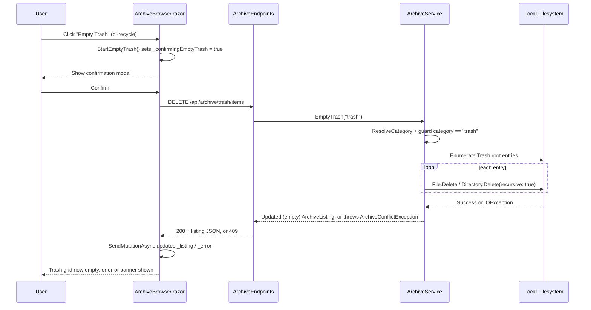

# Plan: Empty Trash (Permanent Delete)

## Table of Contents

- [Summary](#summary)
- [Technical Approach](#technical-approach)
- [Component Breakdown](#component-breakdown)
- [Dependencies](#dependencies)
- [External / Vendor Documentation Evidence](#external--vendor-documentation-evidence)
- [Flow](#flow)
- [Risk Assessment](#risk-assessment)

## Summary

Add an `EmptyTrash` capability to `IArchiveService`/`ArchiveService` that permanently deletes every entry at the Trash category root from disk, expose it via a new `DELETE /api/archive/trash/items` endpoint, and add an "Empty Trash" button (bi-recycle icon) plus a confirmation modal to `ArchiveBrowser.razor`, following the same layering and modal conventions already used for Rename/Move/Delete(-to-trash).

## Technical Approach

**Backend — extends the existing service layer pattern.** `ArchiveService` already owns all filesystem mutation logic behind `IArchiveService` (`WebApp/WebApp/Services/ArchiveService.cs`), with `ArchiveEndpoints.cs` acting as a thin HTTP adapter that calls the service and maps exceptions to results (see `MoveToTrash` at line 184 of `ArchiveEndpoints.cs` calling `archive.MoveToTrash(...)`). The new `EmptyTrash(string categoryKey)` method follows the same shape as `MoveToTrash`:

- Resolve the category via `ResolveCategory(categoryKey)`.
- Guard: if `category.Key != "trash"`, throw `ArchiveForbiddenException`, mirroring the inverse guard already in `MoveToTrash` (line 214) that forbids permanently deleting from non-trash categories. This keeps the "only Trash can be permanently destroyed" invariant enforced in one place per direction.
- Resolve the trash root via the existing private `GetCategoryRoot(category)` helper (line 796).
- Enumerate the immediate children of the trash root (`Directory.EnumerateFileSystemEntries(trashRoot)` — top-level only, since `MoveToTrash` always drops items flat into the trash root via `GetUniqueTrashPath`, line 841).
- All-or-nothing semantics (per discovery answer): first collect the full list of entries to delete, then delete them; if any `File.Delete`/`Directory.Delete(path, recursive: true)` call throws `IOException`/`UnauthorizedAccessException`, stop and rethrow as an `ArchiveConflictException` (existing exception type already mapped to HTTP 409 by `ExecuteAsync` in `ArchiveEndpoints.cs`) so partially-processed state is surfaced as a clear failure rather than silently swallowed. Per FR7, no attempt is made to roll back items already deleted before the failure — the operation is best described as "stop on first failure," which satisfies the user's all-or-nothing request in the sense that a failure is never reported as a full success and the operation does not proceed past the failing item.
- Return `BuildListing(category, CreateEntry(category, trashRoot))` (existing pattern used by `MoveToTrash`'s return value and other mutators) so the client gets a fresh, empty (or partially-emptied, on failure) Trash listing back.

**Endpoint** — add `endpoints.MapDelete("/api/archive/{category}/items", EmptyTrash)` in `ArchiveEndpoints.cs`, distinct from the existing `MapDelete("/api/archive/{category}/items/{id}", MoveToTrash)` (no `{id}` segment), so "delete the whole listing" and "move one item to trash" remain unambiguous routes. The handler follows the existing `MoveToTrash` handler shape: extract `category` from the route, call `archive.EmptyTrash(category)`, wrap in the shared `ExecuteAsync` helper used by every other endpoint for consistent exception-to-HTTP-status mapping.

**Frontend — extends `ArchiveBrowser.razor`'s existing modal-via-component-state pattern**, not Bootstrap's `data-bs-toggle`/`data-bs-target` attribute-driven modals (those are only used for the two "Create" modals with static content; Move/Rename/the-new-Empty-Trash-confirm all use a nullable state field + `@if` block, since they need to carry per-action context and be dismissed programmatically via `CancelDialogs()`).

- Add a private `bool _confirmingEmptyTrash` field.
- Add the "Empty Trash" button to the card-header toolbar area (same row as breadcrumb/search, next to where Create/Upload render for other categories), gated on `Category == "trash"`, using `<i class="bi bi-recycle" aria-hidden="true"></i>`, `disabled="@(_operationPending || _listing is null || _listing.Items.Count == 0)"` per the "always visible, disabled when empty" discovery answer.
- Add a confirmation modal block (same `modal fade show d-block` / `modal-backdrop fade show` markup as the existing Move/Rename modals) shown when `_confirmingEmptyTrash` is true, with a warning message ("This permanently deletes all items in Trash. This cannot be undone.") and Cancel/"Empty Trash" buttons.
- `StartEmptyTrash()` sets `_confirmingEmptyTrash = true` (and clears `_renaming`/`_moving`, matching `StartMove`'s pattern of resetting sibling dialog state).
- `EmptyTrashAsync()` calls `SendMutationAsync(() => Http.DeleteAsync($"api/archive/{Category}/items"))`, then closes the confirm modal — mirrors `DeleteAsync`/`RenameAsync`/`MoveAsync`, reusing `SendMutationAsync`'s existing error handling (`_error` alert) and listing-refresh logic so no new error-display code path is needed.
- `CancelDialogs()` is extended to also reset `_confirmingEmptyTrash = false`.

This keeps all new frontend logic inside the single existing `ArchiveBrowser.razor` component — no new component is introduced, matching how Move/Rename were implemented as inline modal state rather than extracted child components.

## Component Breakdown

**Existing files to modify:**

- `WebApp/WebApp/Services/IArchiveService.cs` — add `ArchiveListing EmptyTrash(string categoryKey);`.
- `WebApp/WebApp/Services/ArchiveService.cs` — implement `EmptyTrash`, reusing `ResolveCategory`, `GetCategoryRoot`, `BuildListing`, `CreateEntry`.
- `WebApp/WebApp/Endpoints/ArchiveEndpoints.cs` — register `MapDelete("/api/archive/{category}/items", EmptyTrash)` and add the `EmptyTrash` handler method next to `MoveToTrash`.
- `WebApp/WebApp.Client/Components/ArchiveBrowser.razor` — add the toolbar button, confirmation modal, `_confirmingEmptyTrash` field, `StartEmptyTrash()`, `EmptyTrashAsync()`, and extend `CancelDialogs()`.

**New files to create:**

- None required.

## Dependencies

- No new runtime packages, JS libraries, or infrastructure. Reuses `System.IO.Directory`/`File` APIs already used elsewhere in `ArchiveService.cs`, the existing `ExecuteAsync` exception-mapping helper in `ArchiveEndpoints.cs`, and Bootstrap classes already loaded for the Move/Rename modals.

## External / Vendor Documentation Evidence

- Not applicable — no vendor-documented technology decision is involved beyond standard .NET `System.IO` file deletion APIs and existing in-repo Bootstrap modal conventions.

## Flow

## Risk Assessment

| Risk | Evidence | Mitigation |
| --- | --- | --- |
| Permanent delete accidentally reachable from a non-trash category | `MoveToTrash` already had to add an explicit guard (line 214) because the same physical-delete primitives are shared code | `EmptyTrash` adds the mirror guard (`category.Key != "trash"` → `ArchiveForbiddenException`) before touching the filesystem |
| Route collision/ambiguity between "delete one item" and "empty all" | Existing `DELETE /api/archive/{category}/items/{id}` already means "move to trash" | New route omits `{id}` (`DELETE /api/archive/{category}/items`), routing frameworks distinguish by segment count, avoiding ambiguity |
| Partial deletion leaves Trash in a confusing half-empty state on failure | Files can be locked by another OS process (e.g. a video still open in a preview) | Stop-on-first-failure plus a reload of the actual on-disk listing after the attempt ensures the UI always reflects real state, never a false "fully emptied" success |
| User accidentally destroys data with no undo | This is the first permanent-delete path in the app; everything else only moves files | Mandatory confirmation modal (FR3) before any deletion occurs, with explicit "cannot be undone" wording |
