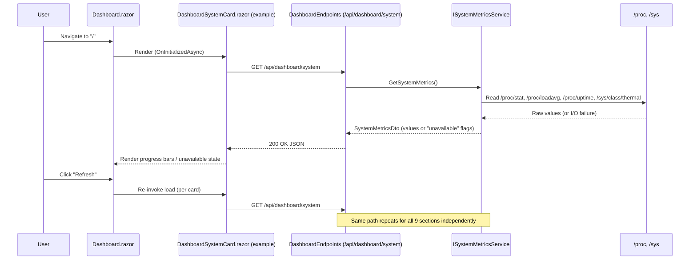

# Plan: System Dashboard (replaces History page)

## Table of Contents

- [Summary](#summary)
- [Technical Approach](#technical-approach)
- [Component Breakdown](#component-breakdown)
- [Dependencies](#dependencies)
- [External / Vendor Documentation Evidence](#external--vendor-documentation-evidence)
- [Flow](#flow)
- [Risk Assessment](#risk-assessment)

## Summary

Replace the `/` route's History content with a `Dashboard.razor` page composed of nine Bootstrap-card sections, backed by new minimal-API endpoint groups and interface-backed services that follow the existing `StorageEndpoints` → `IStorageUsageService` → `StorageMeter.razor` pattern already in the codebase.

## Technical Approach

The codebase's established pattern (`WebApp/WebApp/Endpoints/StorageEndpoints.cs` → `WebApp/WebApp/Services/StorageUsageService.cs` → `WebApp/WebApp.Client/Components/StorageMeter.razor`) is: a static `*Endpoints` class maps `MapGet`/etc. routes under `/api/...` to a thin handler that delegates to an interface-typed service registered as a DI singleton in `Program.cs`; the Blazor WASM client calls the endpoint via `HttpClient.GetFromJsonAsync<T>()` from `OnInitializedAsync`/a button handler, using a DTO record from `WebApp.Client.Models`. This plan extends that exact pattern for every new metrics domain rather than introducing a different shape (no SignalR, no background-to-client push — matches the "manual refresh only" decision).

**Server-side services** (each behind an interface, each independently callable, each catching expected I/O/permission/process failures and returning an "unavailable" DTO state instead of throwing — mirroring `StorageUsageService`'s existing `try/catch`):

- `ISystemMetricsService` — reads `/proc/stat` (CPU %), `/proc/loadavg` (load average), `/proc/uptime` (uptime), and best-effort `/sys/class/thermal/thermal_zone*/temp` (temperature). Backs FR4.
- Memory reuses `ISystemMetricsService` (reads `/proc/meminfo` for RAM/available/cache/swap) to avoid a redundant service for what is fundamentally the same `/proc` read surface. Backs FR5.
- `IStorageUsageService` (existing) is extended with a second method for recent read/write throughput (`/proc/diskstats` delta over a short sampling window) and a derived `StorageHealth` enum computed from free-space thresholds. Backs FR6.
- `INetworkMetricsService` — reads `/proc/net/dev` for per-interface RX/TX bytes and error/drop counters, aggregated into totals. Backs FR7.
- `IArchiveMetricsService` — wraps existing `IArchiveService` file counts, existing background job queues (`IThumbnailJobQueue`, `IHoverPreviewJobQueue`, `ISubtitleJobQueue`, `ICutJobQueue`, `ICompositionJobQueue` — all already registered in `Program.cs`) for queued/running counts, a lightweight recent-client-activity tracker (middleware recording distinct client identifiers seen on `/api/*` within a trailing window) as the "active users" proxy, and a count of live `ffmpeg`/`ffprobe` child processes. Backs FR8.
- `IDockerMetricsService` — lists sibling containers and their CPU/RAM/uptime/restart-count via the Docker Engine API over `/var/run/docker.sock`. Backs FR9. This is the one service requiring a new runtime dependency and an infrastructure change (see Dependencies and Open Questions in `Requirements.md`).
- `IHealthAggregationService` — composes Storage health, a simple app-responsiveness check, an ffmpeg/ffprobe "dependency present and runnable" probe, and a static "backups: not configured" status. Backs FR10.
- `IMetricsHistoryService` — an `IHostedService` (matching the existing `*BackgroundWorker` hosted-service pattern, e.g. `ThumbnailBackgroundWorker`) that samples CPU/RAM/network/disk/temperature on a fixed interval into a bounded in-memory ring buffer (e.g. last 15 samples), independent of whether the Dashboard page is open. Read via a synchronous snapshot method. Backs FR11.
- `IAlertEvaluationService` — pure function over the latest snapshot (current metrics + `IMetricsHistoryService`'s buffer) and a configurable threshold set (bound via `IOptions<AlertThresholdOptions>`, following the existing `AddOptions<...>().Bind(...).Validate(...)` convention in `Program.cs`), producing a list of `(Severity, Message)` alerts. Backs FR12.

**Endpoints**: one new `DashboardEndpoints.cs` mapping one `GET` per section (`/api/dashboard/system`, `/api/dashboard/memory`, `/api/dashboard/storage`, `/api/dashboard/network`, `/api/dashboard/archive`, `/api/dashboard/docker`, `/api/dashboard/health`, `/api/dashboard/history`, `/api/dashboard/alerts`) so the client fetches sections independently and a failure/timeout in one (e.g. Docker) never blocks the others from rendering — satisfying the "no new page-load blocking work" non-functional requirement.

**Client-side**: `Dashboard.razor` (new) replaces the body of `Home.razor`; nine child components (`DashboardSystemCard.razor`, `DashboardMemoryCard.razor`, `DashboardStorageCard.razor`, `DashboardNetworkCard.razor`, `DashboardArchiveCard.razor`, `DashboardDockerCard.razor`, `DashboardHealthCard.razor`, `DashboardHistoryCard.razor`, `DashboardAlertsCard.razor`) each own one `HttpClient.GetFromJsonAsync` call in `OnInitializedAsync`, matching `StorageMeter.razor`'s existing self-contained-fetch pattern rather than one monolithic page-level fetch. A single top-level "Refresh" button on `Dashboard.razor` re-triggers each child's load (via a `RefreshRequested` callback/parameter or a shared `EventCallback`), keeping FR13's manual-only refresh. Percentage values use Bootstrap's `progress`/`progress-bar` with `bg-success`/`bg-warning`/`bg-danger` selected from the FR14 thresholds (a small shared `ThresholdColor` helper avoids repeating the 70/90 logic across nine components — this is the one small shared utility justified because the same three-tier coloring rule is genuinely reused verbatim across all nine cards).

This keeps every provider-specific concern (proc-fs parsing, Docker socket calls, process enumeration) behind a narrow interface per FR/NFR's testability requirement, so unit tests can substitute fakes without touching the real OS/Docker.

## Component Breakdown

**Existing files to modify:**

- `WebApp/WebApp.Client/Pages/Home.razor` — remove `@page "/"` History rendering; replaced by `Dashboard.razor` owning that route (or `Home.razor` is repointed to render `<Dashboard />`; final file naming decided at implementation time, but the History `ArchiveContentHost` usage is removed either way).
- `WebApp/WebApp.Client/Layout/Sidebar.razor:68` — nav item label/icon changed from `"History"`/`bi-clock-history` to `"Dashboard"`/`bi-speedometer2`.
- `WebApp/WebApp.Client/Components/Player.razor:691-694` — remove the `"history" → "/"` entry from `CategoryRoutes` (falls back to `/{category}` per the existing `TryGetValue` fallback at line 709).
- `WebApp/WebApp/Services/StorageUsageService.cs` / `IStorageUsageService` — add a read/write-throughput + health method (FR6), or introduce a sibling method on the same interface to avoid a redundant near-duplicate service.
- `WebApp/WebApp/Program.cs` — register all new services/hosted service/options (`ISystemMetricsService`, `INetworkMetricsService`, `IArchiveMetricsService`, `IDockerMetricsService`, `IHealthAggregationService`, `IMetricsHistoryService` as `AddHostedService`, `IAlertEvaluationService`, `AlertThresholdOptions`) and `app.MapDashboardEndpoints()`, following the existing registration block's ordering/style.

**New files to create:**

- `WebApp/WebApp/Endpoints/DashboardEndpoints.cs` — the nine `/api/dashboard/*` `GET` routes.
- `WebApp/WebApp/Services/SystemMetricsService.cs` + `ISystemMetricsService.cs` — System + Memory sections (`/proc` reads).
- `WebApp/WebApp/Services/NetworkMetricsService.cs` + `INetworkMetricsService.cs` — Network section.
- `WebApp/WebApp/Services/ArchiveMetricsService.cs` + `IArchiveMetricsService.cs` — PereneArchive section.
- `WebApp/WebApp/Services/DockerMetricsService.cs` + `IDockerMetricsService.cs` — Docker section.
- `WebApp/WebApp/Services/HealthAggregationService.cs` + `IHealthAggregationService.cs` — Health section.
- `WebApp/WebApp/Services/MetricsHistoryBackgroundWorker.cs` + `IMetricsHistoryService.cs` — History section's sampling hosted service + buffer reader, named consistently with existing `*BackgroundWorker` classes (e.g. `ThumbnailBackgroundWorker`).
- `WebApp/WebApp/Services/AlertEvaluationService.cs` + `IAlertEvaluationService.cs` — Alerts section.
- `WebApp/WebApp/Configuration/AlertThresholdOptions.cs` — bound options for warning/critical thresholds, following `ArchiveRootOptions`'s existing options-class shape.
- `WebApp/WebApp.Client/Models/DashboardDtos.cs` (or one DTO file per section, matching how `StorageUsageDto` lives in `WebApp.Client.Models`) — response records for all nine endpoints.
- `WebApp/WebApp.Client/Pages/Dashboard.razor` — the new page (owns `@page "/"`, or is embedded by `Home.razor`).
- `WebApp/WebApp.Client/Components/Dashboard/DashboardSystemCard.razor`, `DashboardMemoryCard.razor`, `DashboardStorageCard.razor`, `DashboardNetworkCard.razor`, `DashboardArchiveCard.razor`, `DashboardDockerCard.razor`, `DashboardHealthCard.razor`, `DashboardHistoryCard.razor`, `DashboardAlertsCard.razor` — the nine section components.
- `WebApp/WebApp.Client/Components/Dashboard/ThresholdColor.cs` (or similar small static helper) — shared green/yellow/red mapping used by FR14 across cards.

## Dependencies

- **Docker Engine API client** (new NuGet package, e.g. `Docker.DotNet`) added to `WebApp/WebApp/WebApp.csproj` — required for FR9. No such package exists today (confirmed: `WebApp.csproj` currently references only `Microsoft.AspNetCore.Components.WebAssembly.Server`, `SixLabors.ImageSharp`, `VersOne.Epub`, `HtmlAgilityPack`, `Markdig`, `QuestPDF`).
- **`/var/run/docker.sock` mount** into the app container — required for FR9; must be added to `docker-compose.yml` (currently binds only the archive folder and source/bin/obj volumes, per `Dockerfile`/`docker-compose.yml`). This is a real security-surface increase (container gains visibility into the host's Docker daemon) — flagged in `Requirements.md` Open Questions for explicit confirmation before implementation.
- **`/proc` and `/sys` filesystem access** inside the container — CPU/memory/network reads (FR4/FR5/FR7) rely on the container's own `/proc`, which is available by default under standard Docker without extra mounts. Temperature (`/sys/class/thermal`) is host-hardware-scoped and may require an additional read-only bind mount from `docker-compose.yml`; if not mounted, FR4's temperature field reports "unavailable" per FR15 — no hard dependency, but flagged as an Open Question.
- No new frontend package: this spec is explicitly Bootstrap-only (already present via the project's existing styling), no chart library added.

## External / Vendor Documentation Evidence

Not applicable — this feature uses `/proc`/`/sys` Linux pseudo-filesystem reads (standard .NET `File.ReadAllText`/`StreamReader`, no vendor SDK) for System/Memory/Network/Storage, and the Docker Engine API for the Docker section. No official-docs MCP tool relevant to Linux `/proc` parsing or Docker Engine API was available in this session; if `Docker.DotNet` is chosen as the Docker client, verify its current API surface against its own repository/NuGet page during implementation rather than from memory, since it is a third-party (non-Microsoft) package outside this session's available docs tools.

## Flow

## Risk Assessment

| Risk | Evidence | Mitigation |
| --- | --- | --- |
| Docker socket mount widens the app container's privileges (can enumerate/inspect all host containers) | No `docker.sock` mount exists today (`docker-compose.yml`); adding one is a real security-surface change | Mount read-only where the Docker Engine API supports it; restrict `IDockerMetricsService` to list/stats/inspect calls only, never start/stop/exec (per NFR "least-privilege Docker access"); confirmed as an explicit Open Question before implementation |
| Temperature/thermal data likely unavailable inside a standard container without extra host mounts | Agent investigation found no existing hardware-sensor access anywhere in the codebase | FR15's "unavailable" state handles this gracefully instead of failing the whole System card |
| `/proc`/`/sys` parsing is Linux-specific; app currently only ships via a Linux-based Docker image (`Dockerfile` uses `mcr.microsoft.com/dotnet/sdk:10.0`) | Confirmed in `Dockerfile` | Scope this spec to the documented Docker deployment target; no Windows/macOS host fallback needed |
| In-memory `IMetricsHistoryService` buffer resets on app/container restart | New hosted service holds no persisted store (explicitly Out of Scope) | Acceptable for v1 per `Requirements.md` Out of Scope; documented so it isn't mistaken for a bug |
| Removing the History nav entry changes a user-visible entry point they may rely on | Confirmed via user decision in spec discovery ("Replace it entirely") | Player.razor's dangling `"history"` category-return mapping is cleaned up (FR3) so no broken navigation remains |
| Nine independent per-card HTTP calls on every page load increases request count vs. today's single History fetch | New design choice (Component Breakdown) | Each call is a small, fast local read (proc-fs or in-process counters); no network egress; matches the "no section blocks another" non-functional requirement more than a single aggregated call would |
